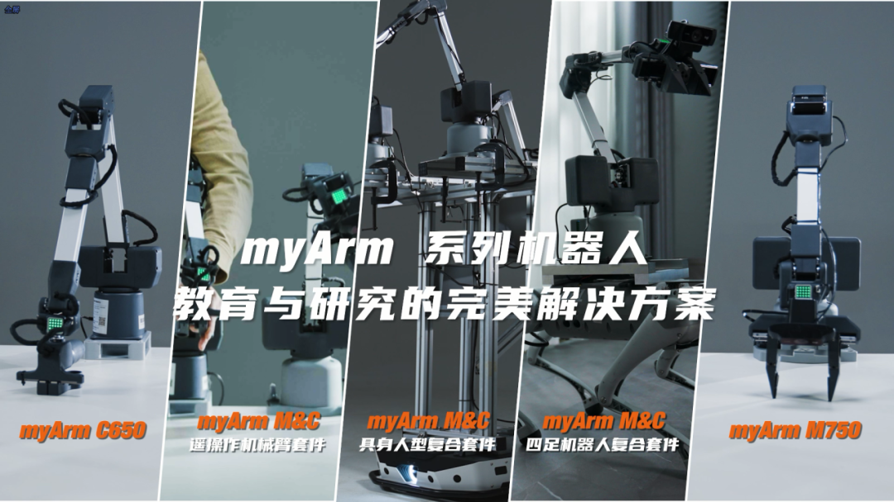
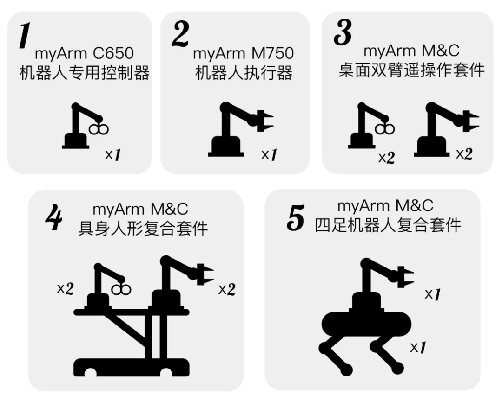

# myArm MC 系列机器人

在全球工业自动化和智能化加速发展的今天，机器人行业正经历着翻天覆地的变化。具身智能研究，作为人工智能领域的关键分支，正努力在精准动作控制、高层次自主决策能力以及自然人机交互体验上赋予机器人新的能力。

在此背景下，大象机器人 myArm M&C 系列应运而生，目的是为研究者和开发者提供一种强大且超高性价比的数据采集与执行的轻量化工具，以推进具身智能技术的革新及其应用。

### Gitbook 简介

myArm MC 系列产品旨在为科研、教育和商业展示等领域提供高度灵活且精确的运动控制解决方案。Gitbook 内容包含详细的用户文档、软件代码、固件更新、开发工具和应用示例，以支持用户从基本设置到高级应用开发的全过程。

### Gitbook 作用

- **代码托管**：为 myArm 系列产品提供持续的软件更新和版本控制。
- **文档分享**：提供从安装指南到高级功能实现的全面文档。
- **资源集成**：集成各类开发资源和工具，便于用户下载和应用。

### 产品包内容

---

1. **myArm Controller 650 机器人专用控制器**

   - **软件和固件**：包含用于机器人运动信息采集的专用软件和固件，支持高达 200Hz 的数据采样率。
   - **开发工具**：提供 Python 和 ROS 支持的开发工具，使设备适用于教育和科研场景。
   - **开发支持**：提供 API 和 SDK 以支持软件开发和系统集成。

2. **myArm Master 750 机器人执行器**

   - **控制软件**：配备高级运动控制验证软件，适用于复杂的科研任务和精准定位。
   - **定制固件**：专为高负载和精准操作设计的固件，提供稳定且高效的性能。
   - **开发支持**：提供 API 和 SDK 以支持软件开发和系统集成，完整的开发配件支持和功能扩展。

3. **M&C 套件**
   - **套件内容**：myArmM&C 桌面双臂遥操作套件、myArm M&C 具身人形复合套件、myArm M&C 四足机器人复合套件。
   - **集成解决方案**：为特定行业或应用设计的完整解决方案，包括软件、硬件和支持文档。
   - **控制工具**：包括用于综合控制多个机器人或设备的工具包，支持复杂的操作和配置。
   - **API 和 SDK**：完整的开发套件支持设备集成和功能扩展。

- 所有产品包均可通过 GitHub 仓库页面下载。用户可以选择适合自己的软件和工具包，以符合特定的需求和环境。

### 说明文档内容

---

1. **产品信息**：提供产品概述、设计意图、主要功能和应用场景。
2. **产品参数**：详细的技术规格，包括机械和电气特性。
3. **功能与应用**：详细介绍基础功能、软件使用方法和开发指南。
4. **支持与服务**：包括故障排除、服务条款以及联系方式。

### 产品说明书跳转链接

- **myArm Controller 650**：

  - [英文版本]()
  - [中文版本](myArm_Controller_650_docs/README.md)

- **myArm Master 750**：

  - [英文版本]()
  - [中文版本](myArm_Master_750_docs/README.md)

- **myArm M&C 遥操作机械臂套件**：

  - [英文版本]()
  - [中文版本](myArm_TowArm_Kit_docs/README.md)

- **myArm M&C 具身人型复合套件**：

  - [英文版本]()
  - [中文版本](myArm_Embodied_Humanoid_docs/README.md)

- **myArm M&C 四足机器人复合套件**：
  - [英文版本]()
  - [中文版本]()
