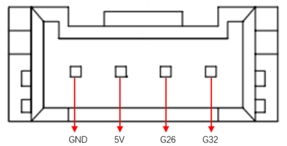

# Parameters of the bot

> In the first chapter, we explore the selling points of the product and its design philosophy, giving you a panoramic view of the high-level understanding of the product. Now, let's move on to the second chapter – Robot Parameter Description. This section will be the key to understanding the technical details of the product. A detailed understanding of these technical specifications will not only help you fully understand the advanced and practical nature of our products, but also ensure that you can use these technologies more effectively to meet your specific needs.

## 1.Robot Specifications

<!--  -->

| Specifications | Parameter |
| :----------- | :------------------ |
| DOF          | 6+1                 |
| Horizontal Reach | 650                 |
| Total span | 1300mm              |
| Tare weight | 1.8kg               |
| Power Specifications | 12V5A               |
| Repeatability | ±1mm                |
| Accuracy | 5 - 8mm             |
| Working load | -                   |
| Number of servos | 8                   |
| Servo Type | High-precision digital servo motor |
| Rotation capacity | +/- 180°            |
| End effector | Two-finger remote control + two-button control |
| USB connection | Type-C              |
| Atom end | 5*5 LED Light Matrix |
| Communication frame rate | >50Hz               |

## 2.Control core parameters

### Master Controller Spec Sheet

| **Indicators** | **Parameters** |
| :------- | :---------------------------------------------------------------- |
| **Master Control** | M5Stack-basic                                                     |
| **Main control model** | ESP32                                                             |
| **CPU**      | 240MHz dual core.   600 DMIPS、520KB SRAM。   Wi-Fi, dual-mode Bluetooth |
| **Bluetooth** | 2.4G/5G                                                           |
| **Wireless** | 2.4G 3D Antenna                                                   |
| **Input** | 1, 2, 3, 5, 18, 19, 21, 22, 23, 25, 26, 35, 36                    |
| **Output** | Shared with input |
| **LCD Display** | 2.0" @ 320*240 ILI9342C IPS panel, maximum brightness 853nit         |
| **Physical keys** | 

### Secondary Controller Spec Sheet

| **Indicators** | **Parameters** |
| :----------------- | :-------------------------------------------------------------- |
| **Auxiliary Control** | Atom                                                            |
| **Auxiliary Control Model** | ESP32                                              |
| **Auxiliary controller core parameters** | 240MHz dual-core.   600 DMIPS，520KB SRAM。   Wi-Fi, dual-mode Bluetooth |
| **Auxiliary controller flash** | 4MB                                                             |
| **LED Matrix** | 5*5 LED Light Matrix |
| **LCD Display** | 2.0"@320*240 ILI9342C IPS panel,  max brightness 853nit |
| **Type C** | *1                                                             |
| **Auxiliary Control Extended IO** | G19, G21, G22, G23, G25, G33                          |

---

## 3.Structural size parameters

> ！ This chapter is in millimeters of distance and degrees of angle.

### Product size and workspace

### Base installation dimensions

- The base needs to be flanged and can be fixed to the corresponding mounting base using M6 screws.
- Before use, please confirm that the installed base can bear 3 times the weight of the body to prevent damage to the product caused by loosening of the product due to the increase in movement speed during use.

Figure 1 Front view of the base

### End of arm

- The end of the arm is compatible with LEGO component holes and threaded holes.

### Products

<!-- [PDF Views](<../../resources/2-ProductFeature/320%202022款技术图示(1).pdf>) -->

### 3D Model Download

[C650 model download](https://download-elephantrobotics.oss-cn-shenzhen.aliyuncs.com/Product_3d_files/myArm300/%E5%A4%96%E5%8F%91_myarm%20C650.STEP)

<!-- Download link: [https://download.elephantrobotics.com/Product_3d_files/myCobot_320_M5_2022v1.2_230708.STEP](https://download.elephantrobotics.com/Product_3d_files/myCobot_320_M5_2022v1.2_230708.STEP) -->

<!-- <iframe
    src=""
    width="100%"
    height="600px"
    allowfullscreen="true"
    webkitallowfullscreen="true"
    mozallowfullscreen="true"
    frameborder="0">
</iframe> -->

# 4.Electrical Characteristic Parameters

## Overview of the base's electrical interfaces

  
Figure 4.1 Front view of the base

  
Figure 4.2 Left view of the base

  
Figure 4.3 Right view of the base

| No. | Interface name | Define | Features | Note |
| :--- | :--------------- | :--------- | :--------------- | :------------------ |
|  1 |      Functional interface group 1 | I/O interface |   GPIO pin |           |
| 2    | Screen | Show | Use | with buttons                     |
| 3    | Press | Press the key A | Use | with the display                     |
| 4    |                  | Press the B |                  |                     |
| 5    |                  | Press the C |                  |     |
 |6   |       Functional interface group 2 |  I/O interface | GPIO pin |    |
|7    | Reset button | System Reset | Reset the master | |
| 8   | Type C interface |    |It can be used to connect and communicate with the PC and update the firmware                     | |
| 9  |  Grove interface 1 |       |   |                     |
|10   | Functional interface group 3 |  I/O interface |   GPIO pin | |
| 11  |   Grove interface 2 |    ||                     |
|   |   Grove interface 3 |    ||                     |
| 12 |Power DC input interface | DC24V input | DC24V input |                     |

#### A. The following table describes the first interface of the functional interface group:
| Label | Type | Features|     Note |                 
| :--- | :--------------- | :--------- | :--------------- | 
|  18 |    I/O     |   GPIO18   |  Not available when using TF card |
|  19 |    I/O     |   GPIO19   |  Not available when using TF card | 
|  23 |    I/O     |   GPIO23   |  Not available when using TF card | 
|  22 |    I/O     |   GPIO22   |   |              
|  21 |    I/O     |   GPIO21   |   |   
|  GND|   P    |   GND  |   |   
|  3V3|    P    |   GPIO22   |   |   
|  5V |    P    |   DC 5V   |   |   

#### B. The definitions of each interface in function interface group 2 and function group 3 are the same, and the definition of interface is as follows:
| Label | Type | Features|     Note |                 
| :--- | :--------------- | :--------- | :--------------- | 
|  3 |    I/O     |   GPIO3   |  Not available when using TypeC or Grover 3 |
|  1 |    I/O     |   GPIO1   | Not available when using TypeC or Grover 3 | 
|  16 |    I/O     |   GPIO16   | Not supported at this time |
|  17 |    I/O     |   GPIO17   | Not supported at this time |        
|  2 |    I/O     |   GPIO2   |   |   
|  5 |    I/O     |   GPIO5   |     |
|  25 |    I/O     |   GPIO25   | Not supported at this time |
|  26 |    I/O     |   GPIO26   |  Not available when using Grover 2 | 
|  35 |    I/O     |   GPIO35   |  Not supported at this time  |            
|  36 |    I/O     |   GPIO36   | Not available when using Grover 2 |  
|  RST|  -    |  Controller reset  | Not supported at this time  | 
|  BAT|  -    |  	BTTERY  | Not supported at this time |
|  3V3|    P    |   GPIO22   |   |  
|  5V |    P    |   DC 5V   |   | 
|  GND|   P    |   GND  |   |   
 

> **Note**: I/O: This function signal contains a combination of input and output.

#### C.Grover interface: The following diagram shows the definition of the Grover interface:

  

Figure 4.4 Grover Interface 1 Definition Diagram

  

Figure 4.5 Grover Interface 2 Definition Diagram

  

Figure 4.6 Grover Interface 3 Definition Diagram

#### D. Screen: The screen is used to display the communication status of myArm and to move the robot to the starting point via a 2-inch IPS screen.

#### E. Keys A, B, and C are used to operate the screen in a coordinated manner.

#### F. Reset Button: Used to reset the main control system

#### G.Type C: The Type-C interface is used to connect and communicate with PCs and is available to developers.

## Electrical interface at the end of the robotic arm

#### 1. Introduction to the end of the robotic arm

A. The schematic diagram of the side interface at the end of the robotic arm is shown in the figure:

 

 

| No. | Interface name | Define | Features | Note |
| :--- | :--------------- | :--------- | :--------------- | :------------------ |
| 13   | End Atom | LED   | For 5X5 RGB LED (G27) display and key function (G39) ||
| 14   | Type C interface |    |It can be used to connect and communicate with the PC and update the firmware                     ||
| 15    | End Grove Interface |       |   | |
| 16  | End IO interface | End Tool IO Interface | Interact with external devices | Development and use |   
| 17  | Servo interface | Connect the servo | Connect an external device servo |                     |

#### 2. End interface description

A. The following table is the definition of the terminal IO port.

| Tag name | Signal name | Features | Note |
| ------ | ------ | ------------------------------- | ---- |
| 5V0    | 5V     | 5V Power Supply |      |
| GND    | GND    | Motherboard power signal ground |      |
| 3V3    | 3V3    | 3.3V Power Supply |      |
| G22    | G22    | 3.3V-OUT-PIN output/3.3V-INT input |      |
| G19    | G19    | 3.3V-OUT-PIN output/3.3V-INT input |      |
| G23    | G23    | 3.3V-OUT-PIN output/3.3V-INT input |      |
| G33    | G33    | 3.3V-OUT-PIN output/3.3V-INT input |      |

B. End Grove Interface: The Grove Interface 4 definition is shown in the image：

 

> 

C. Type C interface: It can be used to connect and communicate with the PC and update the firmware.

D. Atom: for 5X5 RGB LED (G27) display and key function (G39)

E. Servo interface: used for terminal expansion grippers, currently supporting the use of matching adaptive grippers.

# 5 Cartesian Coordinate System

## 5.1 Joint Coordinate System
The joint coordinate system is a coordinate system based on the rotation joints of the robot arm. The white dotted lines in the figure below represent the rotation axes of each joint, the red arrows represent the rotation directions of the joints, and q1-q6 represent the 1-6 joint coordinate systems.

 

## 5.2 Base Coordinate System

The base coordinate system is a coordinate system fixed at the bottom of the robot arm. Its origin and coordinate axis directions are determined when the kinematic algorithm is modeled. Generally, the origin is set at the center point of the base.

 

## 5.3 Tool Coordinate System

The tool coordinate system is a coordinate system fixed at the end of the robot arm. Its origin and coordinate axis direction are determined during kinematic algorithm modeling. Generally, the origin is set at the center point of the flange at the end of the robot arm.

 

## 5.4 Kinematic model
The figure below shows the kinematic model of the robot arm. The position shown is the zero point on the algorithm model

 

### 5.4.1 Zero point calibration
In the kinematic model, the actual zero point has some offset on joints 2 and 3. Considering the convenience of calibration, users can align the scale line when using zero point calibration, without aligning the actual zero point on the model.

 

### 5.4.2 MDH parameters

DH parameters are used to describe the relative relationship between adjacent links:

- a_i: along x_i: the distance from z_i to z_i+1

- alpha_i: around x_i: from z_i to z_i+1

- d_i: represents the distance from x_i-1 to x_i along z_i

- θ_i: around z_i: the angle from x_i-1 to x_i

### 5.4.3 MDH parameter list

| Joint | alpha_i-1 | a_i-1    | d     | theta   | offset |
| :--- | :---- | :--- | :---- | :------ | :----- |
| 1    | 0     | 0    | 154 | theta_1 | 0      |
| 2    | -PI/2  | 0    | 0     | theta_2 | -PI/2  |
| 3    | 0     | 308.3 | 0     | theta_3 | 0      |
| 4    | -PI/2     | 0 |327.9    | theta_4 | 0  |
| 5    | PI/2  | 0    | 0 | theta_5 | 0      |
| 6    | -PI/2 | 0    | 131.3  | theta_6 | PI      |
---

[← Previous chapter](../1-ProductIntroduction/1-ProductIntroduction.md) | [Next chapter →](../../3-BasicSettings/3-UserInstructions/3-UserInstructions.md)
