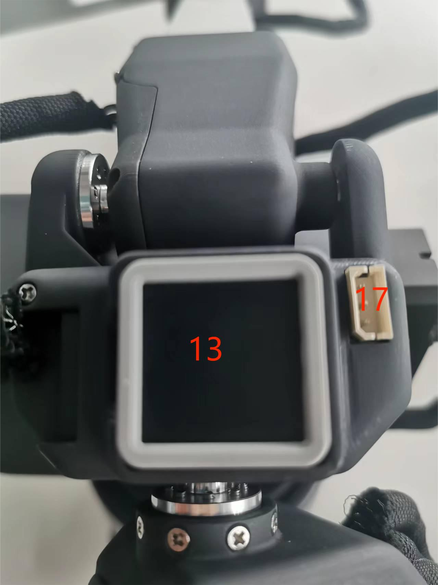

# 机器人参数说明

> 第一章中，我们探讨了产品的卖点及其设计理念，为您提供了对产品高层次理解的全景视角。现在，让我们进入第二章——机器人参数说明。这一章节将是您理解产品技术细节的关键。详细了解这些技术参数，不仅可以帮助您充分认识到我们产品的先进性和实用性，而且还能够确保您能够更有效地利用这些技术来满足您的具体需求。

## 1.机器人规格参数

<!--  -->

| 规格         | 参数                |
| :----------- | :------------------ |
| DOF          | 6+1                 |
| 水平伸展范围 | 650                 |
| 总跨度       | 1300mm              |
| 自重         | 1.8kg               |
| 电源规格     | 12V5A               |
| 重复定位精度 | ±1mm                |
| 精确度       | 5 - 8mm             |
| 工作载荷     | -                   |
| 舵机数量     | 8                   |
| 舵机类型     | 高精度数字伺服电机  |
| 旋转能力     | +/- 180°            |
| 末端执行器   | 双指遥控+双按钮控制 |
| USB 连接     | Type-C              |
| Atom 末端    | 5\*5 LED 灯矩阵     |
| 通讯帧率     | >50Hz               |

## 2.控制核心参数

### 主控制器规格表

| **指标** | **参数**                                                          |
| :------- | :---------------------------------------------------------------- |
| **主控制**   | M5Stack-basic                                                     |
| **主控型号** | ESP32                                                             |
| **CPU**      | 240MHz 双核心。  600 DMIPS、520KB SRAM。  Wi-Fi、双模式蓝牙 |
| **蓝牙**     | 2.4G/5G                                                           |
| **无线**     | 2.4G 3D Antenna                                                   |
| **输入**     | 1, 2, 3, 5, 18, 19, 21, 22, 23, 25, 26, 35, 36                    |
| **输出**     | 同输入共用                                                        |
| **LCD 显示器**         | 2.0" @ 320*240 ILI9342C IPS panel, maximum brightness 853nit         |
| **实体按键**           | 

### 辅助控制器规格表

| **指标**           | **参数**                                                        |
| :----------------- | :-------------------------------------------------------------- |
| **辅助控制**            | Atom                                                            |
| **辅助控制型号**        | ESP32                                                           |
| **辅助控制器核心参数**  | 240MHz 双核。  600 DMIPS，520KB SRAM。  Wi-Fi、双模式蓝牙 |
| **辅助控制器闪光灯**    | 4MB                                                             |
| **LED矩阵**         | 5*5 LED灯矩阵                                         |
| **LCD 显示**           | 2.0"@320\*240 ILI9342C IPS 面板，  最大亮度 853nit           |
| **C 型**                | \*1                                                             |
| **辅控扩展IO**      | G19, G21, G22, G23, G25, G33                          |
|

---

## 3.结构尺寸参数

> ！本章以毫米为距离单位，以度为角度单位。

### 产品尺寸和工作空间

### 底座安装尺寸

- 底座需采用法兰安装，可使用 M6 螺丝固定在对应的固定底座上。
- 使用前请确认安装的底座可以承受 3 倍于机身重量的承载，以防止使用过程中因运动速度提升导致产品固定松动而引起产品损坏。

图 1 底座正视图

### 手臂末端

- 机械臂的末端可与乐高组件孔和螺纹孔兼容。

### 产品展示

<!-- [PDF Views](<../../resources/2-ProductFeature/320%202022款技术图示(1).pdf>) -->

### 3D 模型下载

资料更新中...

<!-- Download link: [https://download.elephantrobotics.com/Product_3d_files/myCobot_320_M5_2022v1.2_230708.STEP](https://download.elephantrobotics.com/Product_3d_files/myCobot_320_M5_2022v1.2_230708.STEP) -->

<!-- <iframe
    src=""
    width="100%"
    height="600px"
    allowfullscreen="true"
    webkitallowfullscreen="true"
    mozallowfullscreen="true"
    frameborder="0">
</iframe> -->

# 4.电气特性参数

## 底座电气接口概述

  
图 4.1 底座正视图

  
图 4.2 底座左视图

  
图 4.3 底座右视图

| 序号 | 接口名称         | 定义       | 功能             | 备注                |
| :--- | :--------------- | :--------- | :--------------- | :------------------ |
|  1 |      功能接口组一      | I/O接口  |   GPIO引脚   |           |
| 2    | 屏幕             | 显示       | 与按钮一起使用   |                     |
| 3    | 按键             | 按键 A     | 与显示屏一起使用 |                     |
| 4    |                  | 按键 B     |                  |                     |
| 5    |                  | 按键 C     |                  |     |
 |6   |       功能接口组二        |  I/O接口  | GPIO引脚 |    |
|7    | 复位按钮            | 系统复位   | 使主控复位    | |
| 8   | Type C 接口        |    |可用于和 PC 端连接通讯，更新固件使用  |                     |
| 9  |  Grove 接口1           |       |   |                     |
|10   | 功能接口组三            |  I/O接口  |   GPIO引脚  | |
| 11  |   Grove 接口2   |    ||                     |
|   |   Grove 接口3   |    ||                     |
|12   |电源 DC 输入接口 | DC24V 输入 | DC24V 输入       |                     |

#### A.功能接口组一接口的定义如下表：
| 标签 | 类型         | 功能|     备注         |                 
| :--- | :--------------- | :--------- | :--------------- | 
|  18 |    I/O     |   GPIO18   |  在使用TF卡时不可用   |
|  19 |    I/O     |   GPIO19   |  在使用TF卡时不可用   | 
|  23 |    I/O     |   GPIO23   |  在使用TF卡时不可用   | 
|  22 |    I/O     |   GPIO22   |   |              
|  21 |    I/O     |   GPIO21   |   |   
|  GND|   P    |   GND  |   |   
|  3V3|    P    |   GPIO22   |   |   
|  5V |    P    |   DC 5V   |   |   

#### B.功能接口组二与功能组三各个接口定义一致，接口的定义如下表：
| 标签 | 类型         | 功能|     备注         |                 
| :--- | :--------------- | :--------- | :--------------- | 
|  3 |    I/O     |   GPIO3   |  在使用TypeC或Grover 3 时不可用   |
|  1 |    I/O     |   GPIO1   | 在使用TypeC或Grover 3 时不可用  | 
|  16 |    I/O     |   GPIO16   |  暂不支持  | 
|  17 |    I/O     |   GPIO17   |  暂不支持 |              
|  2 |    I/O     |   GPIO2   |   |   
|  5 |    I/O     |   GPIO5   |     |
|  25 |    I/O     |   GPIO25   | 暂不支持  | 
|  26 |    I/O     |   GPIO26   |  在使用 Grover 2 时不可用  | 
|  35 |    I/O     |   GPIO35   |  暂不支持 |              
|  36 |    I/O     |   GPIO36   | 在使用Grover 2 时不可用  |  
|  RST|  -    |  Controller reset  |  暂不支持 |   
|  BAT|  -    |  	BTTERY  |  暂不支持 | 
|  3V3|    P    |   GPIO22   |   |  
|  5V |    P    |   DC 5V   |   | 
|  GND|   P    |   GND  |   |   
 

> **注意**: I/O:该功能信号包含输入和输出组合。

#### C.Grover接口：Grover接口定义图如下：

  
图 4.4 Grover接口1定义图

  
图 4.5 Grover接口2定义图

  
图 4.6 Grover接口3定义图

#### D.屏幕 ：屏幕用于显示 myCobot 的通信状态，并通过 2 英寸 IPS 屏幕校准机器人移动到起点。

#### E.按键 A、按键 B 和按键 C 用于以协调的方式操作屏幕。

#### F.复位按钮 ：用于主控系统复位

#### G.Type C ：C 型接口用于与个人电脑连接和通信，可供开发人员使用。

## 机械臂末端电气接口

#### 1.机械臂末端介绍

A. 机械臂末端侧面接口示意如图  所示：

 

 

图 2-1 机械臂末端

| 序号 | 接口名称         | 定义       | 功能             | 备注                |
| :--- | :--------------- | :--------- | :--------------- | :------------------ |
| 13   | 末端 Atom        | LED   | 用于 5X5 RGB LED（G27）显示和按键功能（G39）          | |
| 14   | Type C 接口        |    |可用于和 PC 端连接通讯，更新固件使用  |                     |
| 15    | 末端 Grove 接口           |       |   |  |
| 16  | 末端 IO 接口         | 末端工具IO接口   | 与外部设备交互     | 开发使用            |   
| 17  | 舵机接口     | 连接舵机       | 连接外部设备舵机   |                     |

#### 2.末端接口说明

A. 如表为末端 IO 口的定义。

| 标签名 | 信号名 | 功能                            | 备注 |
| ------ | ------ | ------------------------------- | ---- |
| 5V0    | 5V     | 5V 电源                         |      |
| GND    | GND    | 主板电源信号地                  |      |
| 3V3    | 3V3    | 3.3V 电源                       |      |
| G22    | G22    | 3.3V-OUT-PIN 输出/3.3V-INT 输入 |      |
| G19    | G19    | 3.3V-OUT-PIN 输出/3.3V-INT 输入 |      |
| G23    | G23    | 3.3V-OUT-PIN 输出/3.3V-INT 输入 |      |
| G33    | G33    | 3.3V-OUT-PIN 输出/3.3V-INT 输入 |      |

B. 末端 Grove 接口：Grove 接口 4 定义如图所示

 

> 

C. Type C 接口：可用于和 PC 端连接通讯，更新固件使用。

D. Atom：用于 5X5 RGB LED（G27）显示和按键功能（G39）

E. 舵机接口：用于末端拓展夹爪时使用，当前支持配套的自适应夹爪使用。

---

[← 上一章](../1-ProductIntroduction/1-ProductIntroduction.md) | [下一章 →](../../3-BasicSettings/3-UserInstructions/3-UserInstructions.md)
