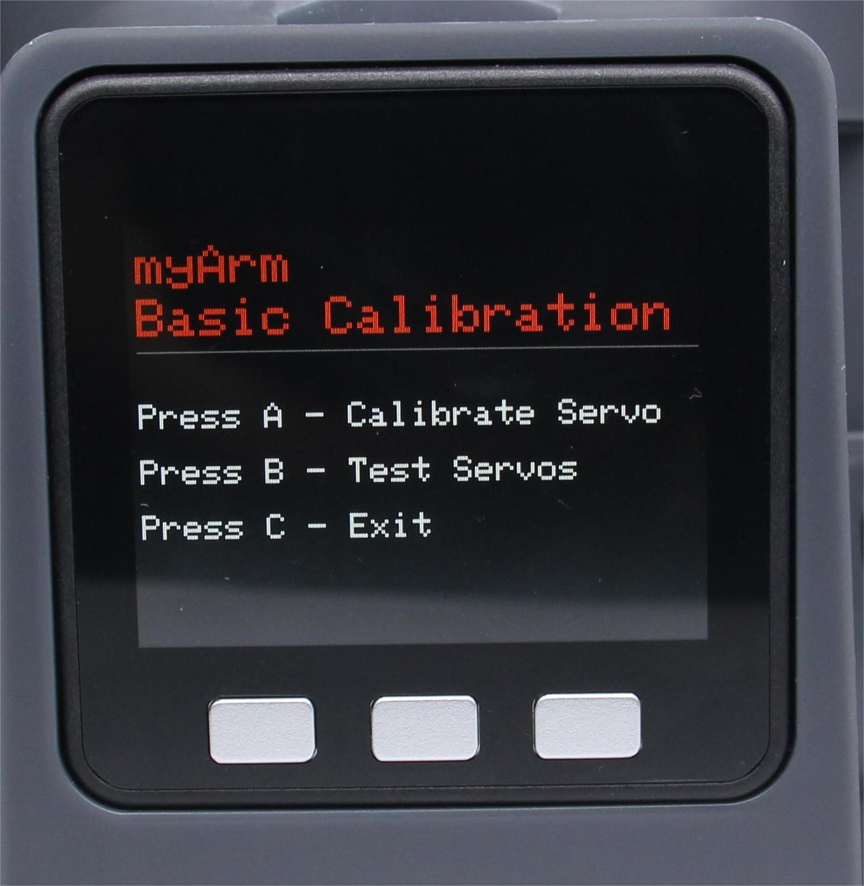
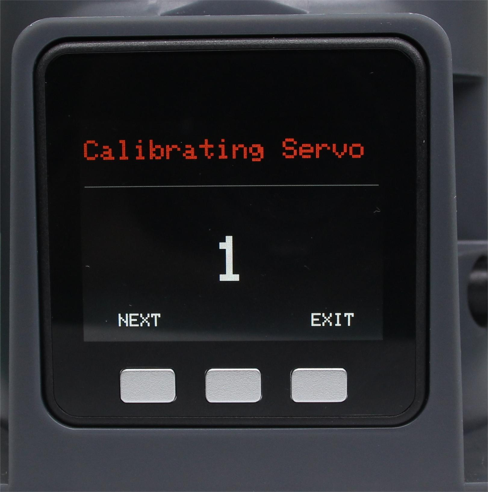
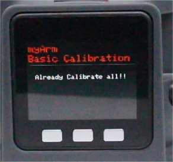
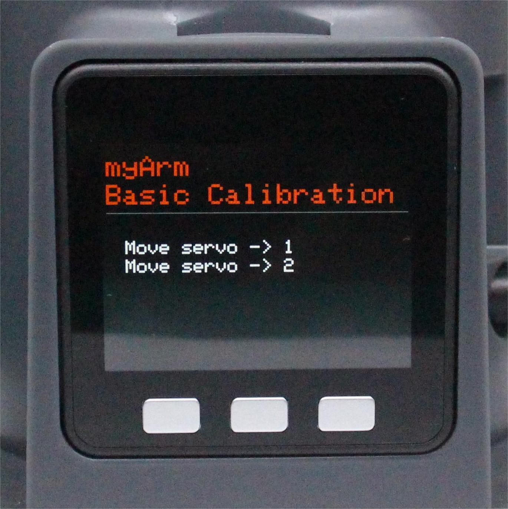

# Zero calibration

This was done before the default bot was delivered. There is no need to repeat the operation. Using this feature incorrectly may damage the bot. If your robot is working without abnormality, do not use it. Thank you for your cooperation.

Calibrating the robotic arm is the prerequisite for precise control of the robotic arm, while setting the joint zero point and initializing the motor potential are the basic tasks of subsequent advanced development.

In this chapter, we'll teach you how to calibrate robotic arms as well as test and validate joints. 

**Step 1**: Select Calibration, click OK to enter the zero calibration interface. 
 
**Step 2**: Press the A key to start calibrating the robotic arm. 

**Step 3**: First drag the robotic arm to bring the No. 1 joint to the zero position (zero tick alignment). 

**Step 4**: 按照屏幕提示的关节序号(1-7),拖动机械臂使每个关节到达零位（零位刻度线对齐）。 
**Step 4**: Follow the joint serial number (1-7) as prompted on the screen, drag the robotic arm to make each joint reach the zero position (zero tick alignment).

**Step 5**: Press NEXT in turn to enter the next motor calibration until Already Calibrate all appears!! , that is, the calibration is complete.

**Step 6**: Press EXIT to exit the calibration.

**Step 7**: Press the B key to test the zero position of each joint of the robotic arm, at this time, the robotic arm will perform a small movement near the zero position of each joint. The individual joints can only be tested with the test after the zero calibration has been completed.

**Step 8**: Press the C key to exit this feature.

[← Previous](./5.1.1-MinirobotGuide.md)| [Next →](./5.1.3-transponder.md)