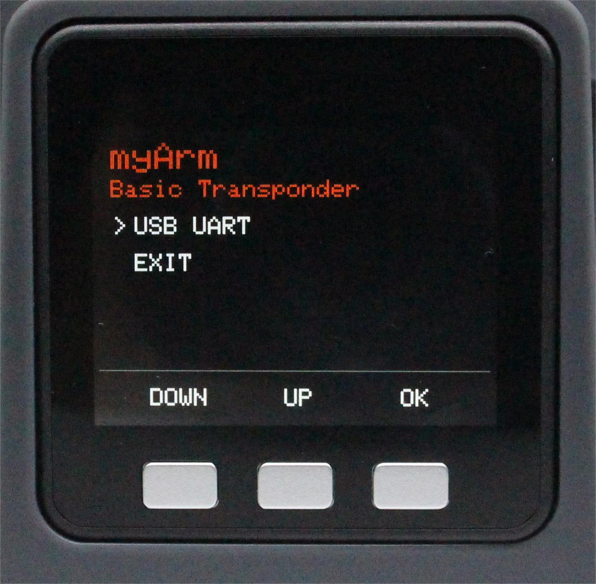

# Communication forwarding

This chapter describes how to use the extended development capabilities of the built-in software. This feature allows you to expand the connectivity options of your devices and supports different development environments and methods.

Currently, communication forwarding only supports USB communication.

**Step 1**: Confirm that Type-C is correctly connected to your device, select Transponder and click OK to enter the communication forwarding interface.

**Step 2**: Use the serial port connection, select the USB UART and click OK to enter the serial port interface. The serial interface detects the connection of the Atom (ok indicates that the connection is normal, otherwise no is displayed).

**Step 3**: Click Exit to exit this feature.

---

[← Previous page](./5.1.2-calibrate.md) | [Next page →](./5.1.4-information.md)