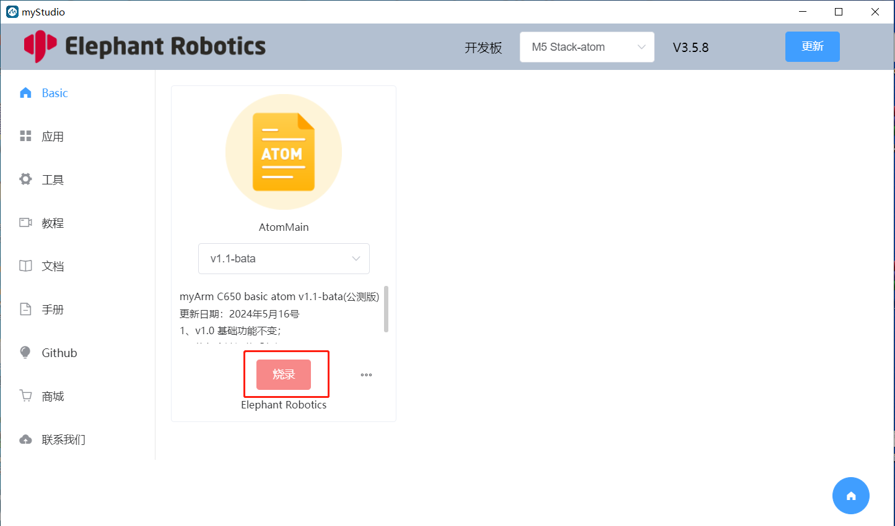

# 烧录和更新固件

**[myStudio 视频教程](https://www.bilibili.com/video/BV1Qr4y1N7B5/)**

## 烧录 Atom 固件

步骤一：连接电脑。用 Type-C 连接末端的 Atom。

第 2 步：选择机器人`myArm C650`，点击`登录`按钮

步骤 2：在`Board`栏中选择`ATOM`，Atom 固件将出现在侧边栏`Basic`中。 Atom 只有一个固件，只需点击`Download`即可。

第三步：下载完成后，点击`烧录`按钮开始烧录。

### 烧写 M5Stack-基础固件——minirobot

步骤 1：使用 Type-C 将 M5Stack-Basic 连接到 PC。

步骤 2：选择机器人`myArm C650`，然后单击“登录”按钮。

第三步：登录后，点击`Basic`，选择 `minirobot`，点击`下载`后点击`烧录`进行烧录。

---

[← 上一页](5.2.2-install_driver.md) | [下一节 →](../5.3-FirmwareVersionDescription/README.md)