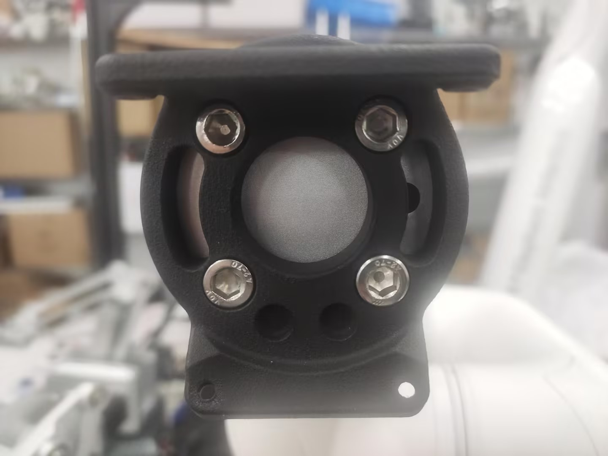
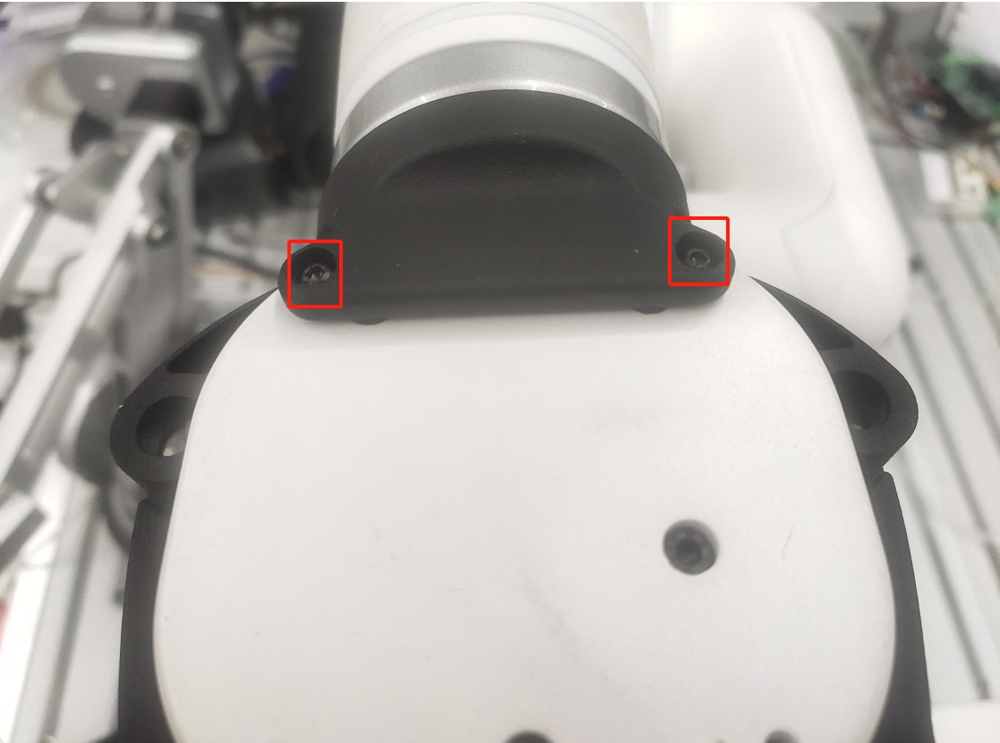
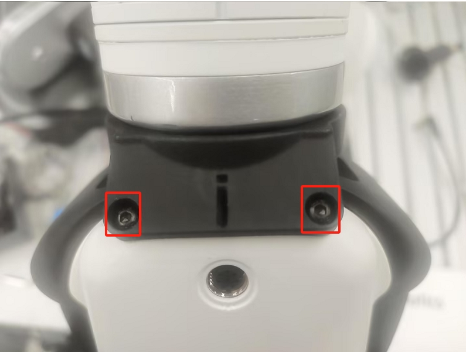
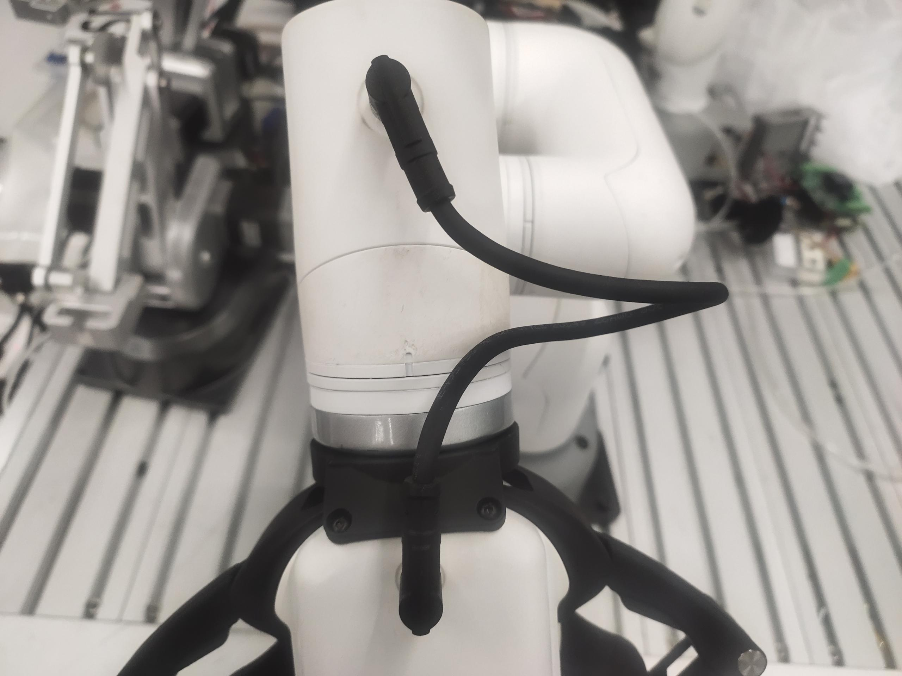
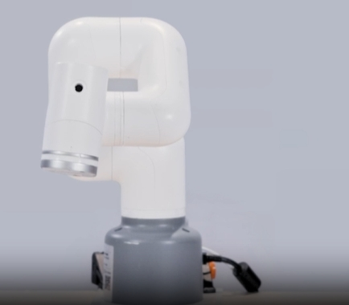
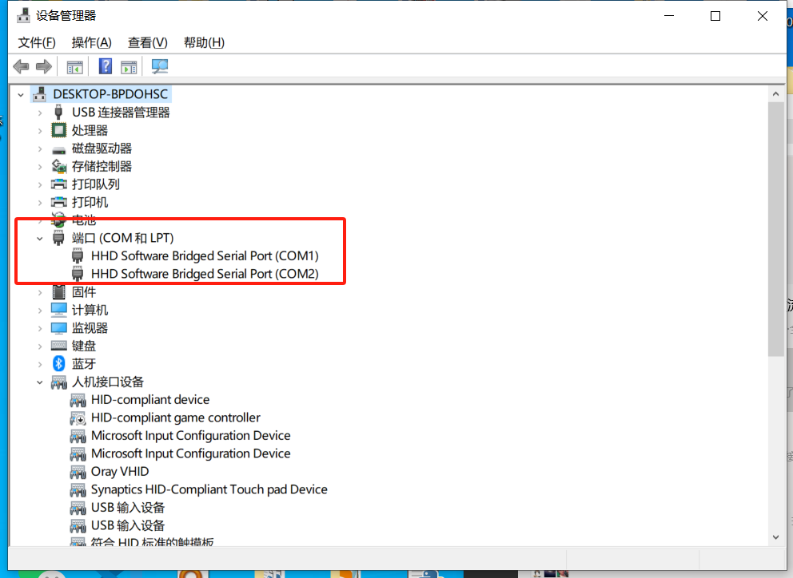

# C650&320M5遥操作案例


**功能**：C650遥控320M5抓取水果

## 1 夹爪安装

先将夹爪的法兰安装到320的末端上



然后将夹爪安装在夹爪的法兰上





然后用夹爪线将夹爪盒机械臂末端IO连接起来，连接时注意先将机械臂断电，避免热插补损坏夹爪



# 2 夹爪测试
```python
from pymycobot import MyCobot,utils
import time
arm=MyCobot(utils.get_port_list()[0])

if __name__=="__main__":
    arm.set_gripper_mode(0)e
    for i in range(2):
        arm.set_gripper_state(1,100)# 夹爪张开
        time.sleep(1)
        arm.set_gripper_state(0,100)# 夹爪闭合
        time.sleep(1)
```

# 3 准备工作

320机械臂在接入24V电源前，先将机械臂调成下图姿态，之后再接入24V电源和通信数据线，机械臂周围不要有杂物，避免发生碰撞



确保底C650和320M5的座屏幕显示ok


然后利用设备管理器确认好两个机械臂对应的串口号，可通过插拔USB数据线来确认串口号



在运行程序前，先手动将C650调整到下图姿态，再运行程序


## 4 案例程序
```python
from pymycobot import MyArmC,MyCobot
import time
arm=MyCobot("COM1")
c=MyArmC("COM2")
arm.set_fresh_mode(1)
time.sleep(0.3)
fact_angle = [0, 0, 0, 0, 0, 0]
arm.set_gripper_mode(0)

def jointlimit(angles):
  max = [170.0, 137.0, 142.0, 148.0, 169.0, 180.0]
  min = [-170.0, -137.0, -151.0, -148.0, -169.0, -180.0]
  for i in range(6):
    if(angles[i] > max[i]):
       angles[i] = max[i]
    if(angles[i] < min[i]):
       angles[i] = min[i]

while 1:
    angle=c.get_joints_angle()
    if len(angle)==7:
        fact_angle[0]=angle[0]
        fact_angle[1]=angle[1]
        fact_angle[2]=-angle[2]-100
        fact_angle[3]=-angle[4]+90
        fact_angle[4]=angle[3]+90
        fact_angle[5]=angle[5]
        for i in range(len(fact_angle)):
            fact_angle[i]=round(fact_angle[i],2)
        jointlimit(fact_angle)
        grip_value = int(-angle[6])
        if grip_value < 0:
            grip_value = 0
        if grip_value > 100:
            grip_value = 100
        arm.send_angles(fact_angle,100)
        arm.set_gripper_value(grip_value,100)
        time.sleep(0.03)
    else:
        print("None")
```

## 5 效果展示


