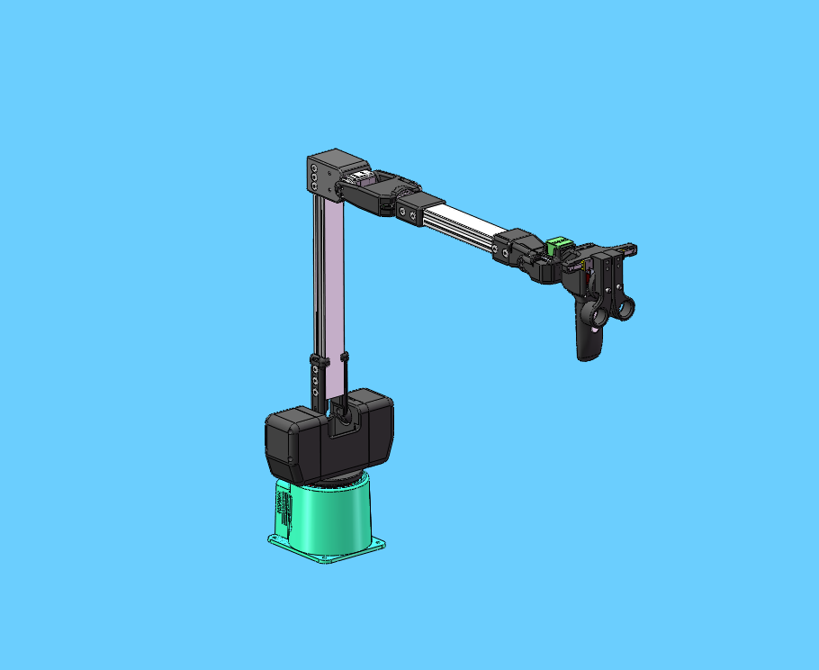

# C650&320M5 remote operation case

**Function**: C650 remote control 320M5 to grab fruit

## 1 Gripper installation

First install the flange of the gripper to the end of 320


Then install the gripper on the flange of the gripper


Then use the gripper cable to connect the gripper box to the end IO of the robot arm. When connecting, be sure to turn off the power of the robot arm first to avoid hot plugging and damage to the gripper


# 2 Gripper test
```python
from pymycobot import MyCobot,utils
import time
arm=MyCobot(utils.get_port_list()[0])

if __name__=="__main__":
    arm.set_gripper_mode(0)
    for i in range(2):
        arm.set_gripper_state(1,100)# Gripper open
        time.sleep(1)
        arm.set_gripper_state(0,100)# Gripper closed
        time.sleep(1)
```

# 3 Preparation

Before connecting the 320 robot arm to the 24V power supply, first adjust the robot arm to the posture shown in the figure below, then connect the 24V power supply and communication data cable. Keep the robot arm away from debris to avoid collision


Make sure the screens of the base C650 and 320M5 display OK


Then use the device manager to confirm the serial port numbers corresponding to the two robotic arms. You can confirm the serial port numbers by plugging and unplugging the USB data cable


Before running the program, manually adjust the C650 to the posture shown in the figure below, and then run the program



## 4 Example Program
```python
from pymycobot import MyArmC,MyCobot
import time
arm=MyCobot("COM1")
c=MyArmC("COM2")
arm.set_fresh_mode(1)
time.sleep(0.3)
fact_angle = [0, 0, 0, 0, 0, 0]
arm.set_gripper_mode(0)

def jointlimit(angles):
  max = [170.0, 137.0, 142.0, 148.0, 169.0, 180.0]
  min = [-170.0, -137.0, -151.0, -148.0, -169.0, -180.0]
  for i in range(6):
    if(angles[i] > max[i]):
       angles[i] = max[i]
    if(angles[i] < min[i]):
       angles[i] = min[i]

while 1:
    angle=c.get_joints_angle()
    if len(angle)==7:
        fact_angle[0]=angle[0]
        fact_angle[1]=angle[1]
        fact_angle[2]=-angle[2]-100
        fact_angle[3]=-angle[4]+90
        fact_angle[4]=angle[3]+90
        fact_angle[5]=angle[5]
        for i in range(len(fact_angle)):
            fact_angle[i]=round(fact_angle[i],2)
        jointlimit(fact_angle)
        grip_value = int(-angle[6])
        if grip_value < 0:
            grip_value = 0
        if grip_value > 100:
            grip_value = 100
        arm.send_angles(fact_angle,100)
        arm.set_gripper_value(grip_value,100)
        time.sleep(0.03)
    else:
        print("None")
```

## 5 Effect display

