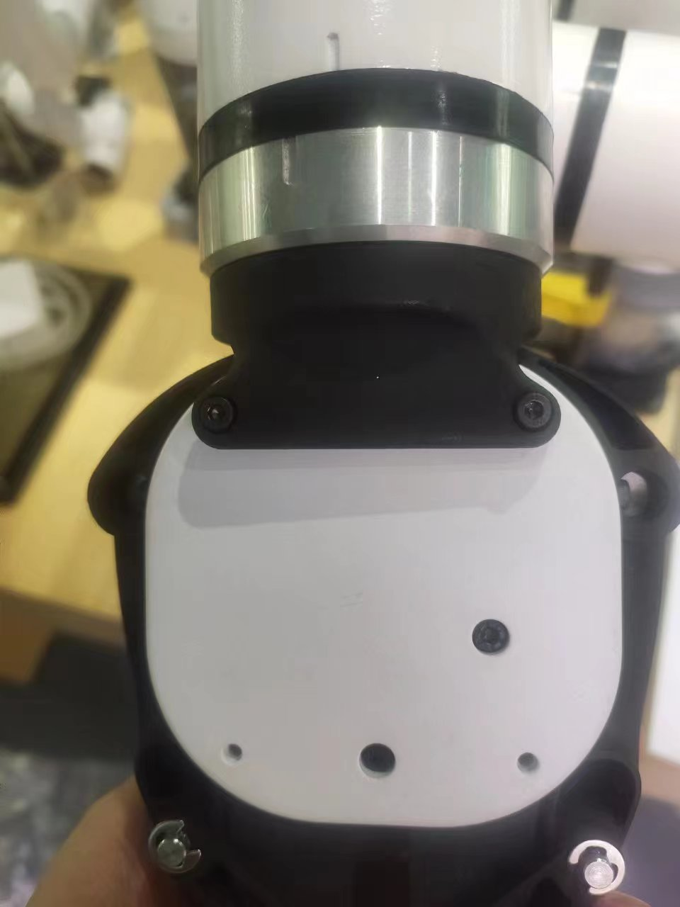
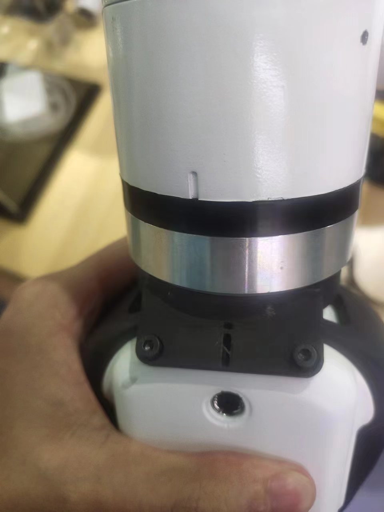
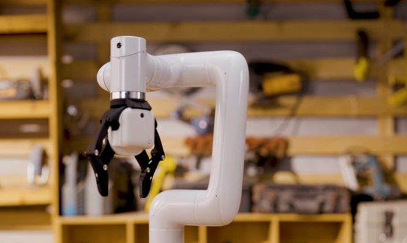
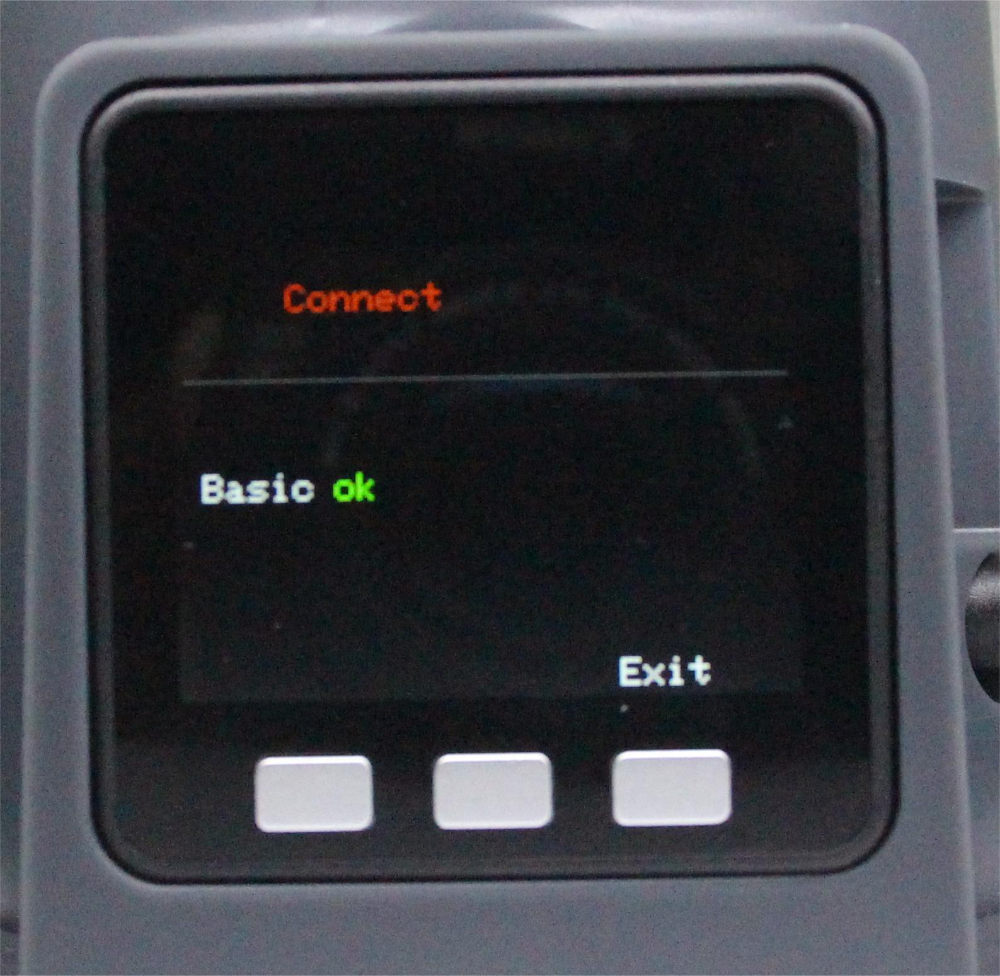
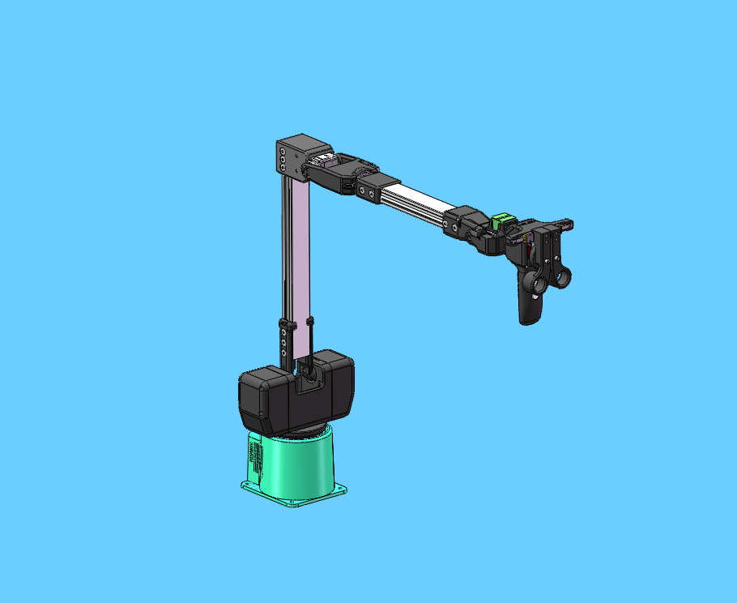

# C650&Pro630 remote operation case

**Function**: C650 remotely controls Pro630 to grab and stack wooden blocks

## 1 Clamp installation

First install the flange of the clamp to the end of 630


Then install the clamp on the flange of the clamp



<br/>


Then use the clamp cable to connect the clamp box and the end IO of the robot arm. When connecting, be sure to turn off the power of the robot arm first to avoid hot plugging and damage to the clamp


# 2 Gripper test

```python
from pymycobot import ElephantRobot
import time

elephant_client = ElephantRobot("192.168.1.127", 5001)# Change the ip to the real ip of the Pro630 Raspberry Pi
elephant_client.start_client()# Start the robot necessary instructions
time.sleep(1)
while elephant_client.state_check()==False:
    elephant_client.state_off()
    time.sleep(2)
    elephant_client.power_on()
    time.sleep(2)
    elephant_client.state_on()
    time.sleep(2)
elephant_client.set_gripper_mode(0)
time.sleep(1)
for i in range(2):
    elephant_client.set_gripper_state(0,100)#Gripper open
    time.sleep(1)
    elephant_client.set_gripper_state(1,100)# Gripper closed
    time.sleep(1)
```

# 3 Preparation
First adjust the robot arm to the posture shown in the figure below. There should be no debris around the robot arm to avoid collision


Make sure the bottom screen of C650 shows OK


Before running the program, manually adjust C650 to the posture shown in the figure below, and then run the program


## 4 Example program
```python
from pymycobot import ElephantRobot,MyArmC,utils
import time
arm=ElephantRobot("192.168.1.159",5001)# Change the ip to the real ip of the Pro630 Raspberry Pi
arm.start_client()# Start the robot necessary instructions
time.sleep(1)
while arm.state_check()==False:
    arm.state_off()
    time.sleep(2)
    arm.power_on()
    time.sleep(2)
    arm.state_on()
    time.sleep(2)
    print(arm.state_check())

arm.set_gripper_mode(0)
time.sleep(0.3)
c=MyArmC(utils.get_port_list()[0])
fact_angle = [0, 0, 0, 0, 0, 0]

def jointlimit(angles):
  max = [180.0, 90.0, 150.0, 80.0, 168.0, 175.0]
  min = [-180.0, -270, -150.0, -260.0, -168.0, -175.0]
  for i in range(6):
    if(angles[i] > max[i]):
       angles[i] = max[i]
    if(angles[i] < min[i]):
       angles[i] = min[i]
try:
    while 1:
        angle=c.get_joints_angle()
        if len(angle)==7:
            fact_angle[0]=angle[0]
            fact_angle[1]=-angle[1]-90
            fact_angle[2]=angle[2]+110
            fact_angle[4]=angle[3]-90
            fact_angle[5]=angle[5]
            if angle[4]<90:
                fact_angle[3]=90-angle[4]
                fact_angle[3]=-90-fact_angle[3]
            elif angle[4]>90:
                fact_angle[3]=90-angle[4]
                fact_angle[3]=-90+fact_angle[3]
            else:
                fact_angle[3]=-angle[4]
            for i in range(len(fact_angle)):
                fact_angle[i]=round(fact_angle[i],2)
            jointlimit(fact_angle)
            grip_value = int(-angle[6])
            if grip_value < 0:
                grip_value = 0
            if grip_value > 100:
                grip_value = 100
            arm.write_angles(fact_angle,5999)
            arm.set_gripper_value(grip_value,100)
            time.sleep(0.25)
        else:
            print("None")
except:
    arm.stop_client()
    print("end")
```

## 5 Effect display 
