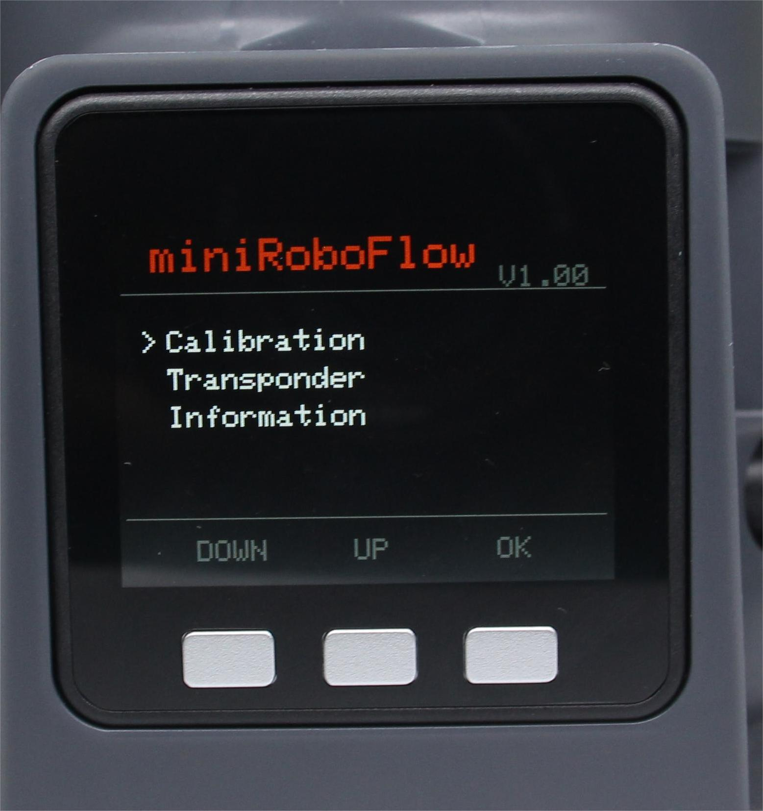
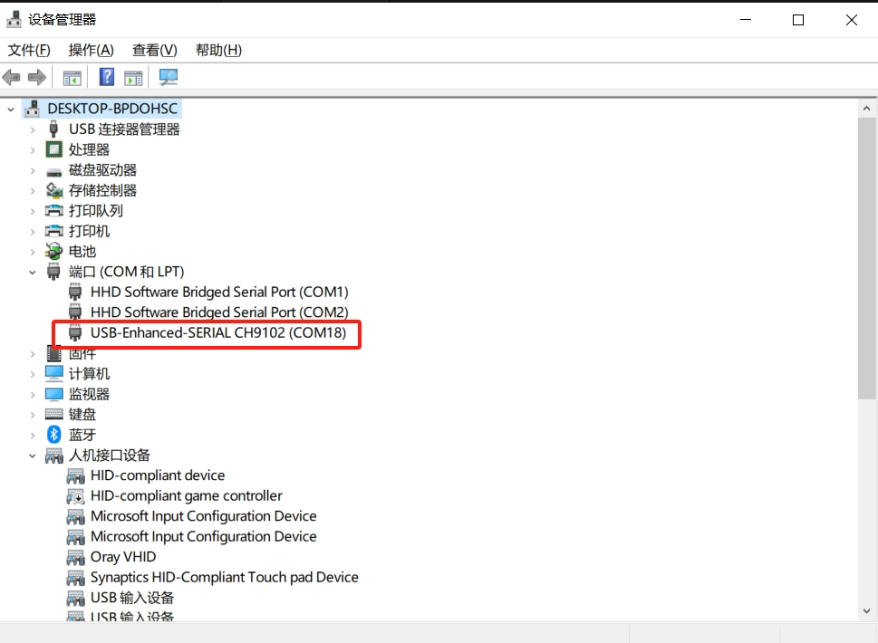

# python 实时获取角度信息及坐标信息案例

机械臂开机后，会自动进入串口通信模式，若是显示no,按照下面的操作重新进入串口通信模式即可


**Step 1**:确认12V适配器及Type-C正确连接你的设备，选中Transponder点击OK进入通信转发界面。


**Step 2**: 使用串口连接，选中USB UART点击OK进入串口界面。串口界面检测Atom的连接(ok表示连接正常，否则显示no)。


**注意**：若是显示no，尝试退出后再进入即可

**Step 3**：在设备管理器查看机械臂的串口号


## 1 获取所有关节角度
```python
from pymycobot import MyArmC
import time
arm=MyArmC("COM18")#填写实际的串口号
while 1:
    print("angles=",arm.get_joints_angle())
```

## 2 获取单个关节角度
```python
from pymycobot import MyArmC
import time
arm=MyArmC("COM18")#填写实际的串口号
while 1:
    #joint_id:1-7对应关节1-关节7
    print("angle=",arm.get_joint_angle(1))#获取关节1的角度
```

## 3 获取坐标信息
```python
from pymycobot import MyArmC
import time
arm=MyArmC("COM18")#填写实际的串口号
while 1:
    print("coords=",arm.get_joints_coord())
```
