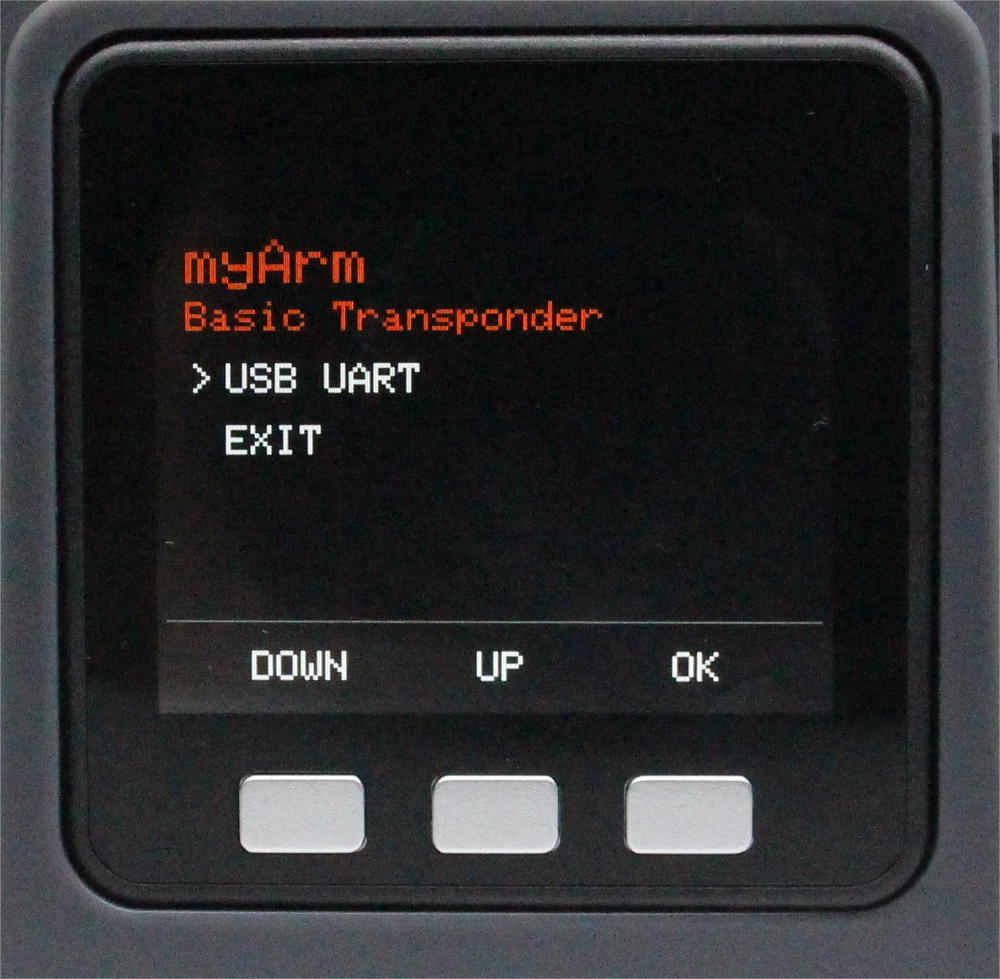

# Python example of getting angle information and coordinate information

After the robot is turned on, it will automatically enter the serial communication mode


Check the serial port number of the robot in the device manager


## 1 Get all joint angles
```python
from pymycobot import MyArmC
import time
arm=MyArmC("COM18")#Fill in the actual serial port number
while 1:
    print("angles=",arm.get_joints_angle())
```
**Running effect**:


## 2 Get a single joint angle
```python
from pymycobot import MyArmC
import time
arm=MyArmC("COM18")#Fill in the actual serial port number
while 1:
#joint_id:1-7 corresponds to joint 1-joint 7
    print("angle=",arm.get_joint_angle(1))#Get the angle of joint 1
```
**Running effect**:


## 3 Get coordinate information
```python
from pymycobot import MyArmC
import time
arm=MyArmC("COM18")#Fill in the actual serial port number
while 1:
    print("coords=",arm.get_joints_coord())
```
**Running effect**:


## Common Problems
After the program is executed, the command does not take effect and returns to none. First check whether the interface of the screen base is in the communication interface and whether the communication interface is OK. If it shows no, exit and return to the main interface first, and follow the following steps to re-enter the communication interface

**Step 1**: Confirm that the 12V adapter and Type-C are correctly connected to your device, select Transponder and click OK to enter the communication forwarding interface.


**Step 2**: Use the serial port connection, select USB UART and click OK to enter the serial port interface. The serial port interface detects the connection of Atom (ok means the connection is normal, otherwise it shows no).



<p>


**Note**: If it shows no, try to exit and then enter again