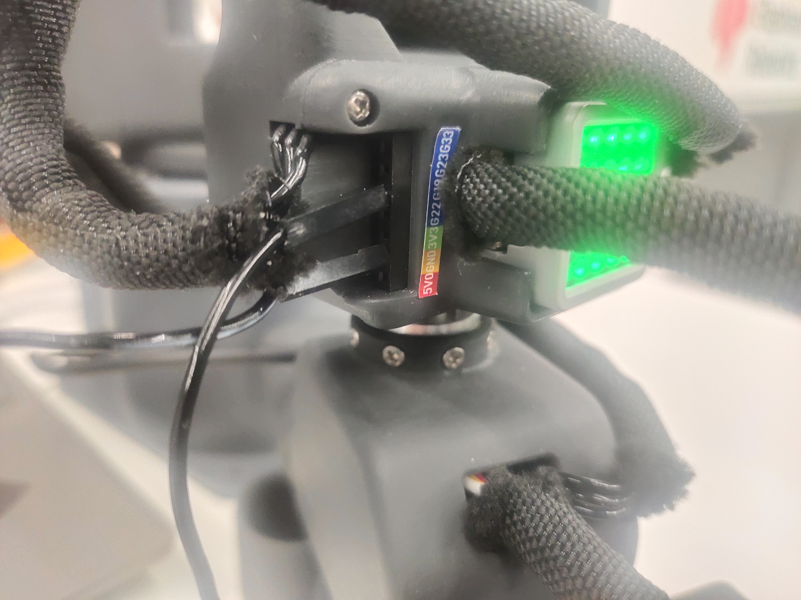

# python 获取IO输入状态案例
机械臂开机后，会自动进入串口通信模式


在设备管理器查看机械臂的串口号


## 1 获取底部IO1输入状态
将杜邦线一端插到3.3V，杜邦线的另一端插到GPIO35上，模拟按键按下的效果


```python
from pymycobot import MyArmC
import time
arm = MyArmC("COM18")#填写实际的串口号
while 1: 
    #当杜邦线接通时输出1,未接通输出0
    print("IO=",arm.get_master_in_io_state(1))
```
**运行效果**：


## 2 获取底部IO2输入状态
将杜邦线一端插到3.3V，杜邦线的另一端插到GPIO36上，模拟按键按下的效果


```python
from pymycobot import MyArmC
import time
arm = MyArmC("COM18")#填写实际的串口号
while 1: 
    #当杜邦线接通时输出1,未接通输出0
    print(arm.get_master_in_io_state(2))
```
**运行效果**：


## 3 获取末端IO1输入状态
将杜邦线一端插到GND，杜邦线的另一端插到GPIO19上，模拟按键按下的效果


```python
from pymycobot import MyArmC
import time
arm = MyArmC("COM18")#填写实际的串口号
while 1: 
    if arm.get_tool_in_io_state(1) is not None:  
        #当杜邦线未接通时输出1,接通时输出0
        print("IO=",arm.get_tool_in_io_state(1))
```
**运行效果**：


## 4 获取末端IO2输入状态
将杜邦线一端插到GND，杜邦线的另一端插到GPIO22上，模拟按键按下的效果


```python
from pymycobot import MyArmC
import time
arm = MyArmC("COM18")#填写实际的串口号
while 1: 
    if arm.get_tool_in_io_state(2) is not None:  
        #当杜邦线未接通时输出1,接通时输出0
        print("IO=",arm.get_tool_in_io_state(2))
```
**运行效果**：


## 常见问题
程序执行后，指令不生效，返回none现象，先检查屏幕底座的界面是否处于通信界面，且通信界面是否为OK，若显示no,先退出回到主界面，按照下面操作重新进入通信界面

**Step 1**:确认12V适配器及Type-C正确连接你的设备，选中Transponder点击OK进入通信转发界面。


**Step 2**: 使用串口连接，选中USB UART点击OK进入串口界面。串口界面检测Atom的连接(ok表示连接正常，否则显示no)。


<p>


**注意事项**：若是显示no，尝试重新退出后再进入即可
