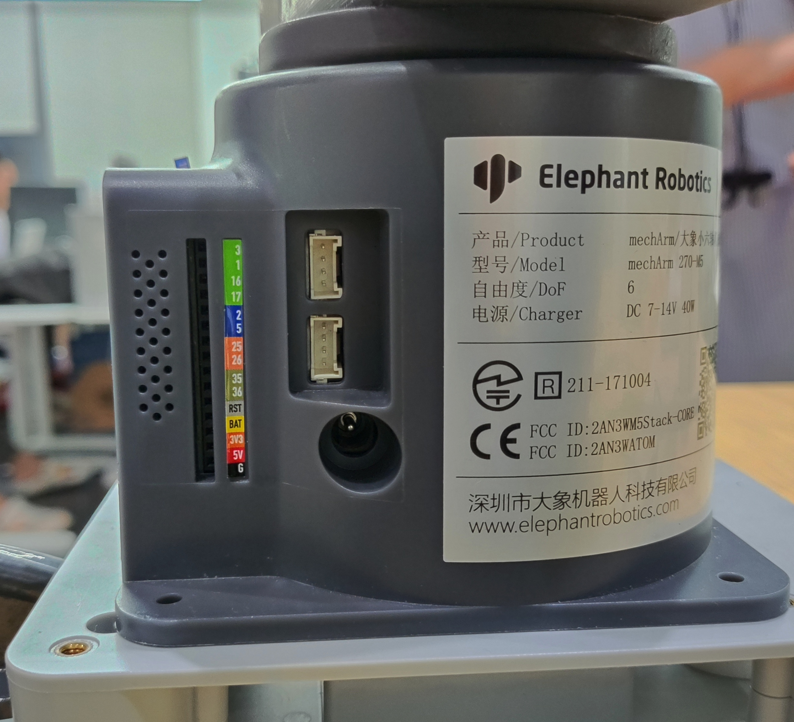
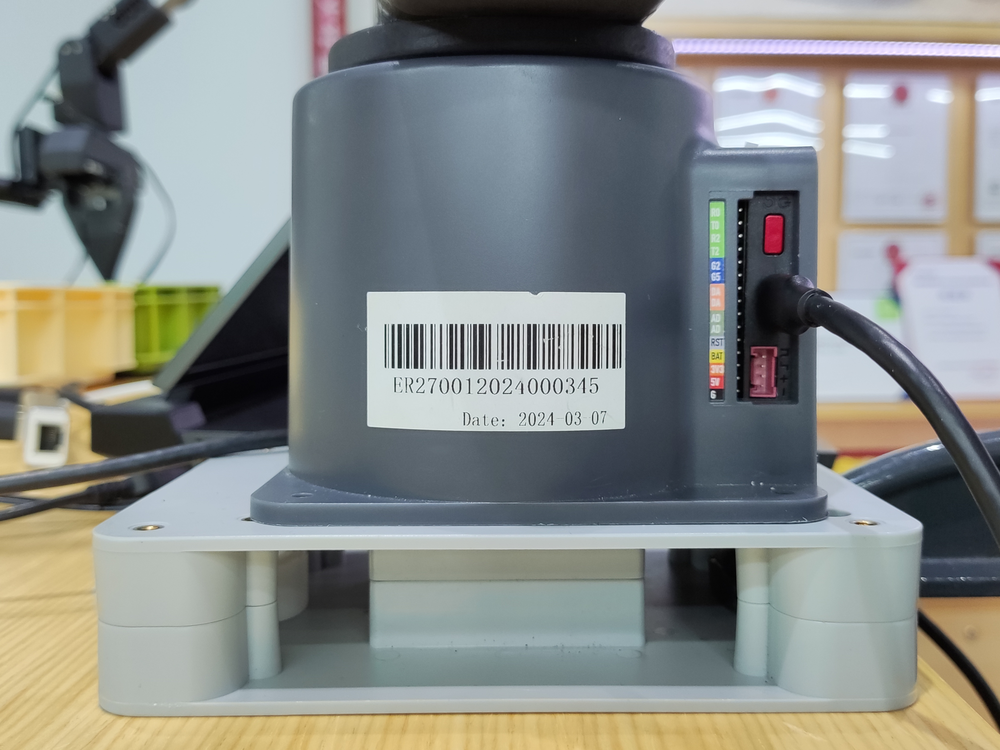

# 2 外部电缆连接

## 1 图文引导

操作前，请确认您已阅读**第 3 章安全说明**，以确保操作安全。同时，将电源适配器与机械臂连接，并将机械臂底座固定在桌面上。

myArm 必须使用外部电源供电，以提供足够的电力：

- 额定电压: 12V

- 额定电流: 5A

- 插头类型: DC 圆形接口

**请注意，不能只使用插入 TypeC 供电。** 请使用官方认可的电源，以免损坏机械臂。

用例图如下图所示：（请仔细对齐用例图，以便进行连接）

**Step 1:**

**Step 2:**

**Step 3:**

**Step 4:**

**Step 5:**

---

[← 上一页](1_StructuralInstallation.md) | [下一页 →](3_PowerOnStatusDisplay.md)
