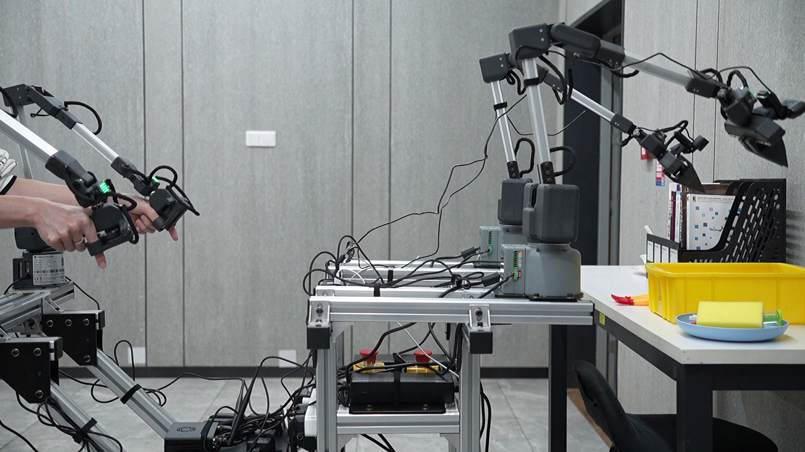

# Product Overview

#### myArm M&C Embodied Human Composite Kit

 

#### A human-shaped composite kit with four general-purpose intelligent six-DOF robotic arms

## Product introduction

myArm M&C Embodied Human Composite Kit is an innovative human robot platform launched by Shenzhen Elephant Robot Technology Co., LTD., designed for education, research and industrial applications. The suite's highly integrated composite design, combined with a human-shaped structure and adjustable joints, provides flexible motion control and precise task execution. Through embodied intelligence technology, the myArm M&C Embodied Human Composite Kit is not only capable of autonomously performing tasks, but also intelligently interacting, sensing and responding to the external environment in real time. Its modular design allows users to customize the hardware and software according to the needs, which greatly improves the scalability and flexibility of the application.

The precision control system of the myArm M&C Embodied Human Composite Kit ensures the high precision and stability of the robot in the execution of tasks, and is widely used in many fields such as industrial automation, robot education and research and development. Support ROS, Python and other development platforms, developers can easily carry out secondary development and application customization. myArm M&C Embodied Human Composite Kit not only provides a powerful hardware platform for the research and development of robotics technology, but also provides a highly potential solution for intelligent interaction and service robots, and is an ideal tool to explore future robot applications.

## Design Philosophy

The design concept of myArm M&C Embodied Human Composite Kit comes from the deep integration of human intelligence and machine intelligence, and is committed to creating a robot platform with high flexibility, precision and scalability. By combining the human-shaped structure and advanced embodied intelligent technology, the product not only focuses on the precision and stability of the mechanical structure, but also pays more attention to the perception and interaction ability of the robot, and strives to provide users with an intelligent, easy-to-use and powerful tool to promote the popularization and application of robot technology.

During the design process, the myArm M&C Embodied Human Composite Suite adheres to the principles of modularity and openness, allowing users to freely customize hardware and software configurations according to their needs. Through high-precision motion control and flexible operation mode, the product can adapt to a variety of complex application scenarios, from education and scientific research to industrial automation, from single task execution to intelligent interactive experience, myArm M&C Embodied Human composite kit can provide users with efficient, accurate and personalized solutions. Its strong compatibility and extensive development platform support give developers unlimited creative space and promote the development of robot technology in a more intelligent, open and practical direction.

## Design Goals

 

| **Design Goals**           | **Functional realisation**                                                                                                                                |
| ---------------------- | ------------------------------------------------------------------------------------------------------------------------------------------- |
| **Universal multifunctional platform**     | The MyARM Embodied Human Composite Kit is suitable for various application scenarios such as education, research and business display. Its six -degree of freedom and 750mm wingspan support to perform complex motion control in various working environments, such as precise positioning and path planning.  |
| **Scientific research and education support**     | The MyARM Embodied Human Composite Kit is suitable for machine learning and artificial intelligence research, which can perform high -precision experiments and technical demonstrations. It supports end -to -end data training and reproduction, and basic visual tasks, which is an ideal device in the laboratory. |
| **Programming and scalability**   | The highly programmer of the MyARM Embodied Human Composite Kit allows users to customize and programming according to emerging technology to meet future technical needs and achieve optimized operations and experimental results.                                     |
| **Technical innovation and knowledge spread** | In business display, the MyARM Embodied Human Composite Kit can be used as a platform carrier to show the latest scientific and technological achievements. It aims to improve the public's understanding and interest in science and technology and promote the transformation of scientific and technological innovation to commercialization.                       |

## Features

 

| **Feature description** | **content** |
|--------------------------|-------------------------------------------------------------------------------|
| **4 units 6 degrees of freedom modular design** | The perfect combination of flexibility and scalability is suitable for complex operations. |
| **Industrial -grade digital servo motor** | Ensure the precise control and long term stable operation of the robotic arm. |
| **High-precision encoder** | Provide accurate location, speed and acceleration information to optimize performance. |
| **Support multiple development environments** | Including Python and ROS to meet different development needs. |
| **Support localization dragging teaching** | Intuitive learning and operation methods do not rely on external devices. |
| **High-speed data interface** | Open a variety of state interfaces to support complex applications. |
| **Customized embedded software** | Provide user friendly operation interfaces to simplify complex tasks. |
| **Built in 2 inch display** | Real time display robotic arm status and operation feedback. |
| **Multi -connection method support** | Flexible scene application, seamlessly access the existing system. |
| **Central symmetrical format** | Ensure balanced and stable and improve operating accuracy. |

## Product Value

|                        |                                                                                                                 |
| ---------------------- | --------------------------------------------------------------------------------------------------------------- |
| **Enhance experiment and research capabilities** | The MyARM Embodied Human Composite Kit provides researchers with a platform that can perform high precision operations to help complex data analysis and algorithm verification.                       |
| **Improve the quality of education**       | In the educational environment, the device can provide opportunities for practical operations to help students better understand theory and cultivate practical ability.                        |
| **Increase business and display opportunities** | The Embodied Human Composite Kit is not limited to laboratory use, its application in technical exhibitions and public demonstrations can attract audiences and potential customers, enhance the interaction and attractiveness of technical display. |

## Industry Contribution

|                        |                                                                                                            |
| ---------------------- | ---------------------------------------------------------------------------------------------------------- |
| **Promoting STEM Education** | By providing high -level teaching tools, it will stimulate students' interest in science, technology, engineering and mathematics, and cultivate future innovators. |
| **Promoting technology adopts** | By providing easy -to -use and highly flexible robot platforms, reducing the technical threshold, so that more institutions can contact and use advanced robotics technology. |
| **Stimulate innovation and personal development** | Provide developers and engineers with an open platform, support cross -disciplinary learning and innovation, and cultivate key talents for the future development of robotics technology and related fields. |

# Application

 

## Client

|                              |                                                                                                                                                                    |
| ---------------------------- | ------------------------------------------------------------------------------------------------------------------------------------------------------------------ |
| **Higher education institutions and research laboratories** | myArm Embodied Human Composite Kit is a teaching and research tool designed for high-precision experiments and technology demonstrations. It can effectively support complex data analysis, algorithm development and validation activities, significantly improving research quality and educational effectiveness.                            |
| **Higher education institutions and research laboratories**       | Supporting both Python and ROS development environments, the myArm Embodied Human Composite Kit is suitable for professionals who need personalised programming and system integration. Its modular design and high programmability make it the ideal platform for developing and testing new control algorithms or robotics applications. |
| **Organiser of commercial displays and public exhibitions** | The myArm Embodied Human Composite Kit has become the preferred equipment for science and technology demonstrations and product presentations due to its precision operation and display advantages. Dynamic demonstration not only attracts the audience, but also enhances the sense of participation and effectively promotes technological innovations and products.                                    |
| **Innovative enterprises and start-ups**       | The myArm Master 750 provides powerful support for companies seeking to integrate cutting-edge robotics to enhance product functionality or optimise production processes. Its outstanding performance and adaptability make it ideal for exploring new technologies and solutions.              |

## Application Scenario

| User Group               | Application Scenario                                                                                       | Aims of Strength                                                                                                                                       |
| ---------------------- | ---------------------------------------------------------------------------------------------- | ---------------------------------------------------------------------------------------------------------------------------------------------- |
| Teachers and students in the field of education     | - STEM Education - Robotics Programmes  - Interdisciplinary Research Programmes  - Teaching Aids for Robotics Subjects                            | - Increase students' interest in science and technology  - Enhance hands-on and problem-solving skills  - Promote creative thinking and teamwork  - Serve as a construction tool for disciplines such as robotics structural design, circuit design, and mechanics analysis |
| Technology developers and engineers     | - Prototyping  - Experimental studies  - Algorithm testing and validation  - Robot kinematics validation  - Robot composite scenario application validation | - Accelerating Research Progress  - Connecting Theory and Practice  - Advancing Technological Innovation  - Validating Robot Kinematics and Composite Scenario Applications                                                       |
| Business Presentation and Marketing Professionals | - Exhibition  - Technology Demonstration  - Brand Promotion                                                         | - Attract potential customers and investors  - Demonstrate the company's technological strength and innovative products  - Enhance brand influence                                                                     |
| Engineers and technology developers   | - Robot Kinematics Validation  - Robot Remote Control Scenario Exploration and Development  - Machine Learning, AI and Vision Based Tasks  - Explore and develop robotic telecontrol applications  - Extend the utility of robotics applications and scenarios                                             |

## Peripheral Accessories

 
A wide range of peripheral accessories provides myArm Embodied Human Composite Kit arm with extensive functionality extensions, making it suitable for a variety of industrial, research and educational scenarios. By combining these accessories, users can significantly increase the flexibility and utility of the myArm Embodied Human Composite Kit arm.

#### myCobot Adaptive jaws

The gripper jaws are self-adjusting to accommodate objects of different shapes and sizes and are designed to perform complex gripping tasks such as handling irregularly shaped or fragile objects. The flexibility and adaptability of the gripper significantly enhances the arm's operational efficiency and application versatility. The upgraded Adaptive Gripper provides even more gripping power and is compatible with a wide range of programming environments, making it suitable for a wide range of industrial-grade robotic arms.

#### myCobot Parallel jaws

Designed for tasks requiring precise control, such as the assembly and testing of electronic equipment. The gripper's two fingertips move in parallel to ensure object stability during gripping, making it ideal for handling uniformly shaped objects. Its compact design and multiple connection holes are designed to meet different mounting requirements, and it supports both IO and serial control, making it compatible with a wide range of industrial-grade robotic arms.

#### myCobot Flexible jaws

Suitable for handling sensitive or fragile objects, the flexible gripping jaws have a soft and resilient gripping surface that effectively reduces pressure on the object and reduces the risk of damage. Ideal for gripping fragile objects such as glass, plastic or porcelain. The fingertips are made of rubber and use pneumatic deformation for gripping. Widely used in a variety of automation and robotics applications, these grippers are favoured for their flexibility, adaptability and efficiency.

#### myCobot Vertical Suction Pump V2.0

The Vertical Suction Pump V2.0 is an upgraded version of the vacuum adsorption system for vertical lifting of smooth surface objects such as sheet metal, glass or plastic. The new version offers greater suction capacity and higher durability and is particularly suitable for fast and repetitive handling operations.

#### myCobot Double head suction pumps

The dual-head suction pump is equipped with two independent suction cups, allowing the arm to handle two objects simultaneously or provide greater stability and support, enhancing efficiency in assembly line tasks or applications where multiple parts are handled simultaneously.

#### myCobot Camera Flange V2.0

Camera Flange V2.0 enables a standard camera to be mounted on a robotic arm to provide the necessary visual feedback to the arm, especially for tasks that require visual recognition, such as quality inspection, colour sorting or precision placement.

#### myCobot Mobile phone holder

This accessory allows the myCobotrobotic arm to hold and operate a smartphone or similar device and is suitable for automated testing of mobile phone applications, for educational presentations, or for using the phone's camera in specific scenarios.

# Supported Extended Development

 

The myArm series of robotic arms are extremely valuable in education and research, especially in Python and ROS (Robot Operating System), two widely used development environments. These environments provide strong support for the myArm series in a wide range of machine learning, artificial intelligence research, complex motion control, and vision processing tasks.

|                |                                                                                                                                                                                                                                                  |
| -------------- | ------------------------------------------------------------------------------------------------------------------------------------------------------------------------------------------------------------------------------------------------ |
| **Python**     | - Provides interfaces for joint angle control, servo motor control, servo motor parameter configuration, and Cartesian coordinate system control.  - Supports more advanced motion control and precise positioning for sophisticated robotics research and application development.  - The driver library can be downloaded and installed via PyPI, providing comprehensive interface support for more complex educational or research projects. |
| **ROS**        | - It supports basic MoveIt functions such as keyboard control and basic path planning, and provides dual version support for ROS1 and ROS2.  - Enhanced real-time robot arm display and state information acquisition through RVIZ simulation environment, suitable for more advanced robot path planning and operation research.                                                             |
| **Hardware Interface**   | - Includes IO, USB, etc. for easy connection to various sensors and actuators.                                                                                                                                                                                                  |
| **Software Library**     | - Provides rich open source libraries and APIs to simplify the development process.                                                                                                                                                                                                        |
| **System Compatibility** | - Compatible with Windows, Linux, MacOS, adapt to a variety of development environments.                                                                                                                                                                                                 |

# Purchase Address

Purchase Address:  
Taobao：[https://shop504055678.taobao.com](https://shop504055678.taobao.com)  
Shopify：[https://shop.elephantrobotics.com/](https://shop.elephantrobotics.com/)  
AliExpress：[https://elephantrobotics.aliexpress.com/store/1101941423](https://elephantrobotics.aliexpress.com/store/1101941423)

---

[Next chapter →](../2-ProductParameters/2-ProductParameters.md)