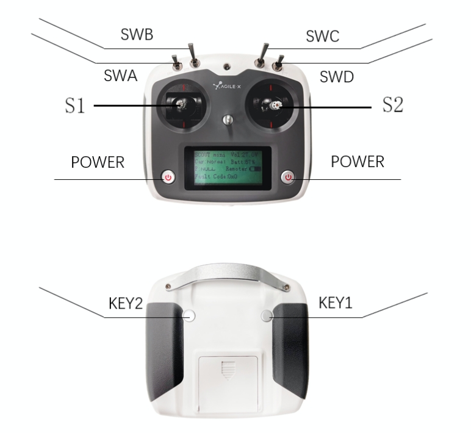
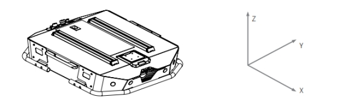

# Tracer Car Remote Control Function

## 1. Remote Control Description

The TRACER universal robot chassis can be easily controlled using the remote control. Its definition and functions are as follows:

**The function of the button is defined as:** SWA and SWD are temporarily not enabled, SWB is the control mode selection button, dialed to the top for command control mode, dialed to the middle for remote control mode; SWC is the light control button; S1 is the throttle button, which controls the forward and reverse movement of the TRACER; S2 controls rotation, and POWER is the power button, which can be turned on and off by pressing and holding them at the same time.

**Remote control interface description:**

| Parameter | Description |
| :------------: | :--------: |
| Tracer | Vehicle type |
| Vol | Battery voltage |
| Car | Chassis status |
| Batt | Chassis power percentage |
| P | Parking |
| Remoter | Remote control power |
| Fault Code | Error message |

## 2. Control instructions and motion instructions

We establish the coordinate reference system of the ground moving vehicle according to the ISO 8855 standard as follows:

The TRACER car body is parallel to the X axis of the established reference coordinate system.

- In the **remote control mode**, the remote control joystick S1 moves forward to move in the positive X direction, and S1 moves backward to move in the negative X direction. When S1 is pushed to the maximum value, the speed of movement in the positive X direction is the maximum, and when S1 is pushed to the minimum value, the speed of movement in the negative X direction is the maximum; the remote control joystick S2 controls the rotation of the car body left and right. When S2 is pushed to the left, the car body rotates from the positive direction of the X axis to the positive direction of the Y axis, and when S2 is pushed to the right, the car body rotates from the positive direction of the X axis to the negative direction of the Y axis. When S2 is pushed to the left to the maximum value, the counterclockwise rotation linear speed is the maximum, and when S2 is pushed to the right to the maximum value, the clockwise rotation linear speed is the maximum.

- In **control command mode**, a positive linear velocity indicates movement in the positive direction of the X axis, and a negative linear velocity indicates movement in the negative direction of the X axis; a positive angular velocity indicates movement from the positive direction of the X axis to the positive direction of the Y axis, and a negative angular velocity indicates movement from the positive direction of the X axis to the negative direction of the Y axis.

**Note: When using the remote control joystick for operation, push the joystick slowly and gently to avoid too fast speed. When there is a load on the top of the car, too fast speed is prone to unstable center of gravity, affecting the stability of motion control.**

## 3. Use and operation

**Inspect**

Check the vehicle status. Check if there is any obvious abnormality in the vehicle; if so, please contact after-sales support.

**Shutdown operation**

Turn the knob switch to cut off the power supply.

**Start**

- Emergency stop switch status. Confirm that the emergency stop buttons are all in the released state;

- Rotate the knob switch. Under normal circumstances, the voltmeter displays the battery voltage normally and the headlights light up normally.

**Emergency stop**

Press the emergency stop switches on the left and right tails of the vehicle.

**Basic operation flow of remote control**

Start the TRACER normally After moving the machine chassis, start the remote control and select the control mode as the remote control mode, and then you can control the movement of the TRACER platform through remote control.

---

[← Previous section](../5.2-SoftwareUsageInstructions/README.md) | [Next Chapter →](../../6-SDKDevelopment/README.md)