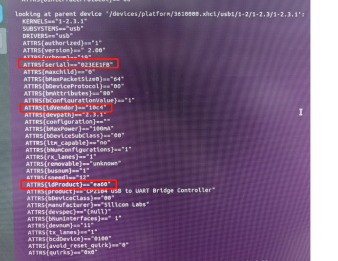
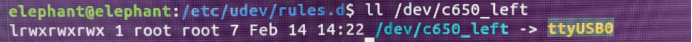

## 绑定步骤（以一台MyArm C650机械臂为例）

### 1. 将机器通过串口的方式连接上电脑

### 2. 确认机械臂串口号
通过输入`ls /dev/tty*`命令，查看串口号，假设串口号为：`/dev/ttyUSB0`

### 3. 通过指令查看串口的详细信息
`udevadm info --name=/dev/ttyUSB0 --attribute-walk`

### 4. 找到第一次出现的serial、idVendor和idProduct对应的数据，并记录下来
  

### 5. 在`/etc/udev/rules.d/`目录下创建一个文件，文件名可以自定义，例如`99-mc-serial-ports.rules`，并添加以下内容：
```
KERNEL=="ttyUSB[0-255]*", SUBSYSTEM=="tty", SUBSYSTEMS=="usb", ATTRS{idVendor}=="10c4", ATTRS{idProduct}=="ea60", ATTRS{serial}=="023EE1FB", MODE:="0777", GROUP:="dialout", SYMLINK+="c650_left"
```
其中，`10c4`和`ea60`分别对应idVendor和idProduct，`023EE1FB`对应serial，`c650_left`为自定义的串口名称，可以根据需要自定义。

### 6. 重新加载udev规则
`sudo udevadm control --reload`

### 7. 重新插拔串口设备，使udev规则生效
`sudo udevadm trigger`

### 8. 查看串口设备是否已经绑定成功(固定成功以后,/dev/c650_left即为该机器的串口号，指向/dev/ttyUSB0)
`ll /dev/c650_left`

  


