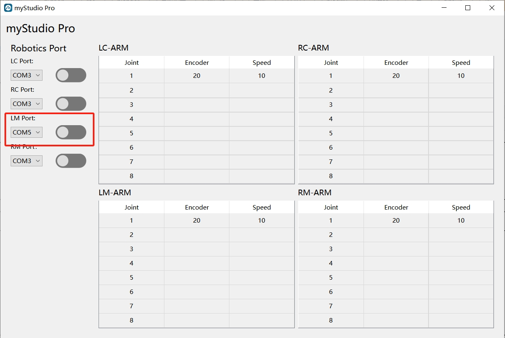
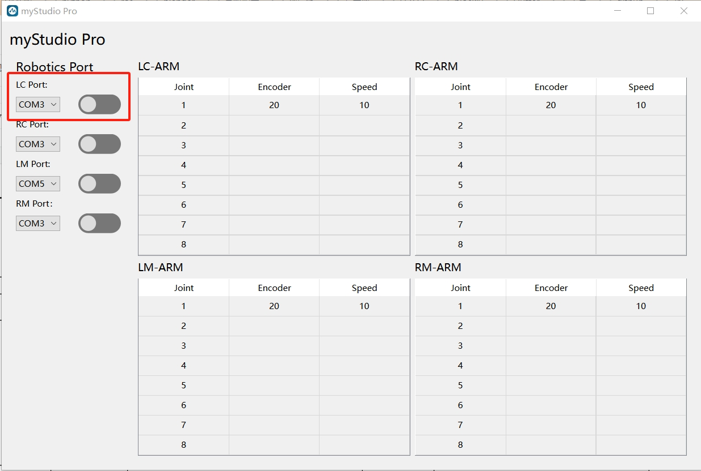

# C650 control M750 program case

## Program address
> https://github.com/elephantrobotics/pymycobot/tree/main/demo/myArm_M%26C_demo_v1.1

## Installation dependency

```shell
pip install -r requirement.txt
```

## Run program

```shell
python main.py
```

## Program instruction

> The serial port is opened in the following order: first open the serial port connection of myArmM, then open the serial port connection of myArmC.





> When both serial ports are open, you can control myArmM movement by moving myArmC.

---
[← Previous](2_API.md) | [Next page →](4_tracer_API.md)