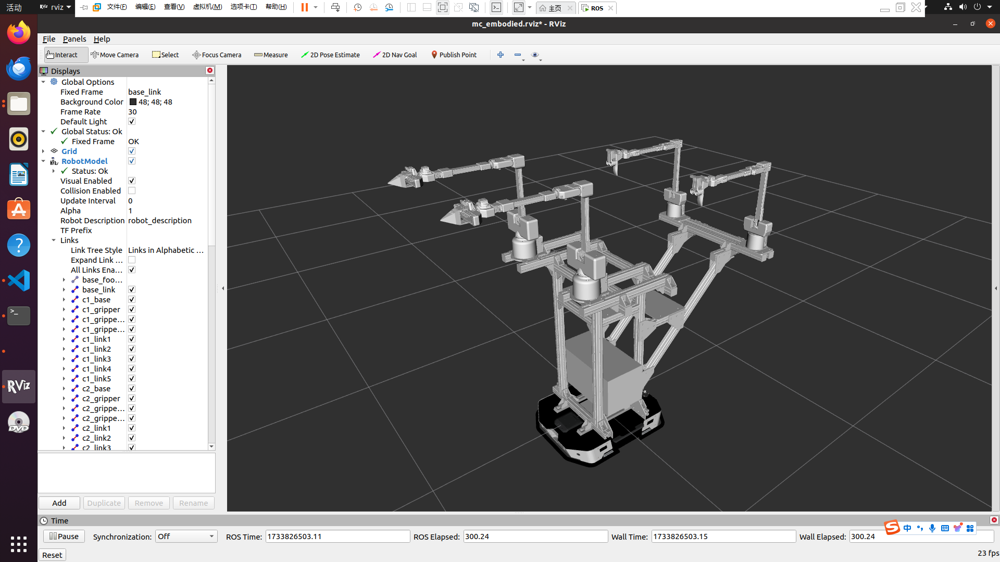
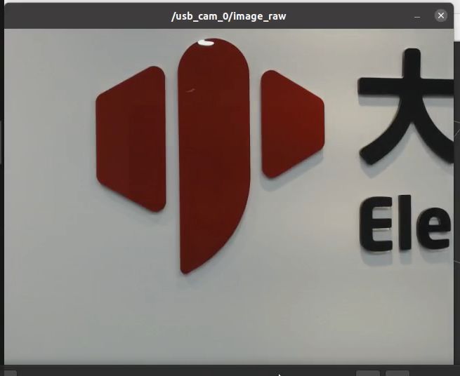
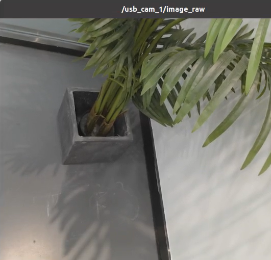

# 1. Simulation

We provide **static simulation** and **dynamic simulation** to interact with MyArm M&C Embodied Human Composite Kit.

## 1.1 Static Simulation
Static simulation refers to interacting with the MyArm M&C Embodied Human Composite Kit in simulation using the slider module in RViz.  
In the workspace, open the terminal and enter the following commands:  
> source devel/setup.bash # Add environment variables  
> roslaunch myarm_m mc_embodied_control.launch  

**This will open RViz and generate the simulation model of the Myarm M&C Embodied Kit.**

  

## 1.2 Dynamic Simulation
Dynamic simulation refers to the interaction between the real-world Myarm M&C Embodied Kit and its simulation counterpart.  

First, connect the MyarmM750 robotic arm to the system using a USB-to-Type-C cable and power it on.  
Select **Transponder** using the buttons and press the "OK" button.  
  

Then the screen will display the following:  
  

You will see the arrow pointing to **"USB UART"**. Press "OK," and it will show **"NO"**. Press the **"Exit"** button to return to the screen where the arrow points to **"USB UART"**. Press "OK" again, and it will display **"OK"**.  
  

Repeat the same steps for the MyarmC650 robotic arm. Connect it via USB-to-Type-C cable, power it on, select **Transponder**, and follow the on-screen prompts:  
  

  

  

#### At this point, MyarmM750 and MyarmC650 have successfully started.
  

This function requires connecting four robotic arms to the system simultaneously via USB. Identify the serial port for each arm by following these steps:  

1. 1. Connect a robot arm and run the `ls /dev/tty` command on the terminal to check the current serial port.  
2. Without disconnecting the first arm, connect another arm and run the command again to identify all four ports.  

Update the corresponding serial ports in the `mc_embodied_kit_ros/myarm_m/scripts/mc_embodied_control.py` file as shown below:  
  

To start the system, open a terminal and run:  
> roscore  
  

Open another terminal and run:  
> roslaunch myarm_m mc_embodied_control.launch  

  

Once the RViz simulation starts, open another terminal and run:  
> rosrun myarm_m mc_embodied_control.py  

You can now use MyarmC650 to control MyarmM750.  
  

At this point, you can move the MyarmC650 with your hand. Both simulated arms in RViz and the physical MyarmM750 will follow the movements (including gripper functionality).  

## At this point, MyarmC650 controlling MyarmM750 is fully implemented.

## 1.3 Starting the Camera Node
### 1.3.1 First, open a terminal and run:
```bash
sudo apt-get update

sudo apt-get install ros-noetic-usb-cam
```
### 1.3.2 Then, open another terminal and run:
```bash
cd mc_embodied_kit_ros

catkin_make

source devel/setup.bash

roslaunch my_camera usb_cam.launch
```
#### After running these commands, you can view the camera feeds:
  ```

---

[← last page](1_download.md) | [next page →](3_ROScode.md)

