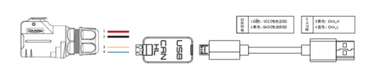
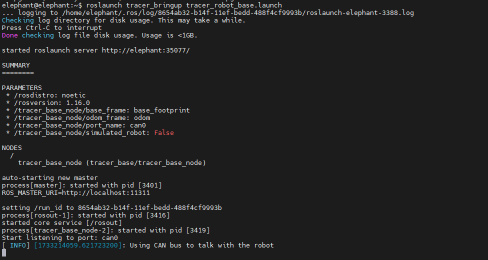
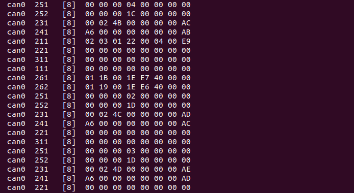
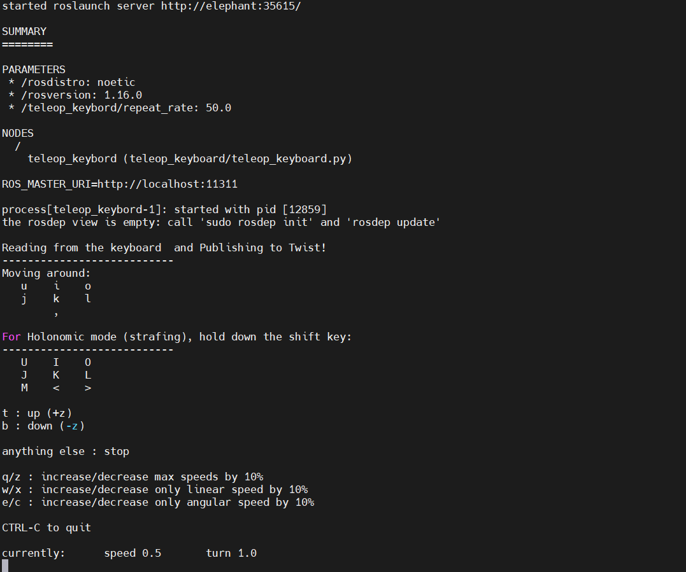

## 1. CAN bus connection

- Lead out the CAN line from the aviation plug on the top of TRACER or the tail plug, and connect the CAN_H and CAN_L in the CAN line to the CAN_TO_USB adapter respectively;
- Turn on the knob switch of the TRACER mobile robot chassis and check whether the emergency stop switches on both sides are released;
- Connect CAN_TO_USB to the USB port of the laptop. The connection diagram is shown in the figure.



## 2. Enable the Tracer chassis node

- To ensure that the CAN bus is enabled, you need to run this command every time you turn on the power and restart the system:

```bash
rosrun tracer_bringup setup_can2usb.bash
```

- Start the chassis car ROS node:

```bash
roslaunch tracer_bringup tracer_robot_base.launch
```



If the can-to-usb has been connected to the TRACER robot, the robot has been powered on, the CAN bus has been enabled, and the chassis node has been turned on, use the following command to monitor the data of the TRACER chassis

```bash
candump can0
```

If the chassis data is normal, the terminal will always output the following data:



## 3. Start the keyboard control node

Open a terminal and enter the following command:

```bash
roslaunch tracer_bringup tracer_teleop_keyboard.launch
```



| Keys | Description |
| :--- | :----------------- |
| i | Move forward |
| , | Move backward |
| u | Rotate counterclockwise |
| o | Rotate clockwise |
| k | Stop |
| q | Increase linear and angular velocity |
| z | Decrease linear and angular velocity |
| w | Increase linear velocity |
| x | Decrease linear velocity |
| e | Increase angular velocity |
| c | Decrease angular velocity |

Now the car can start moving under keyboard control.

---

[← Previous page](./4_communication.md) | [Next page →](./6_tracer_map_navigation.md)