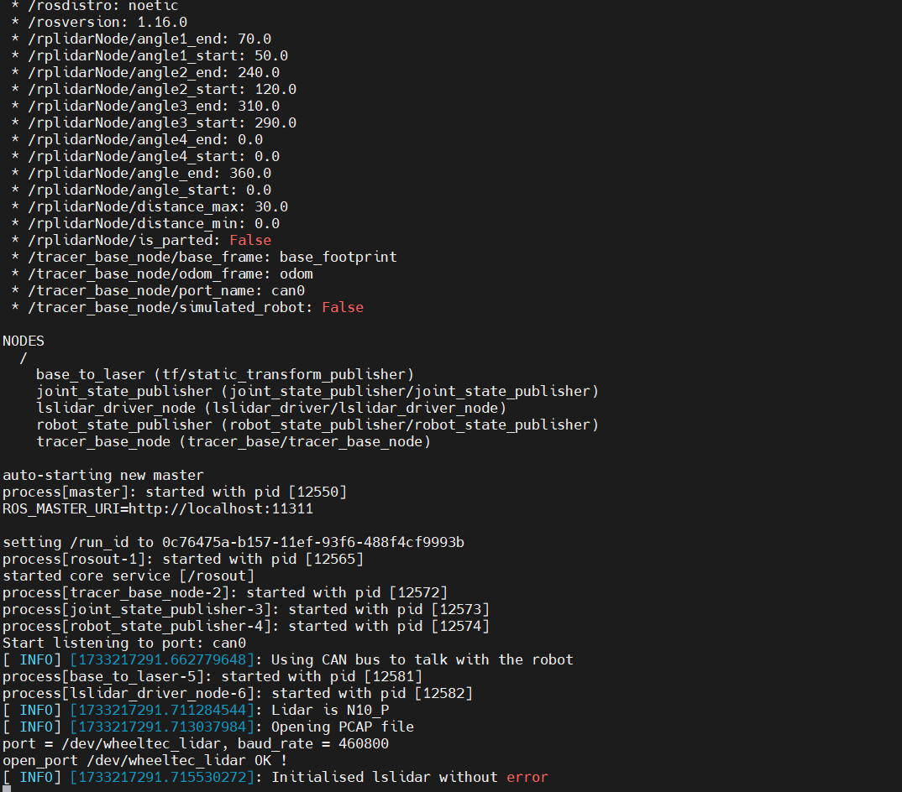
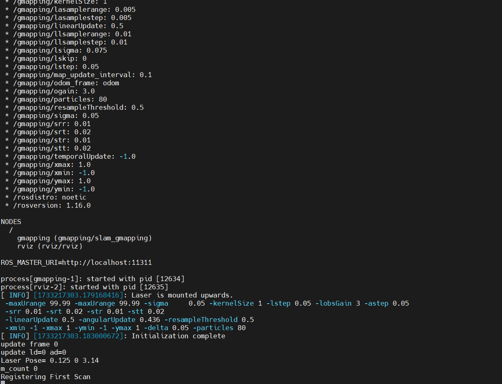
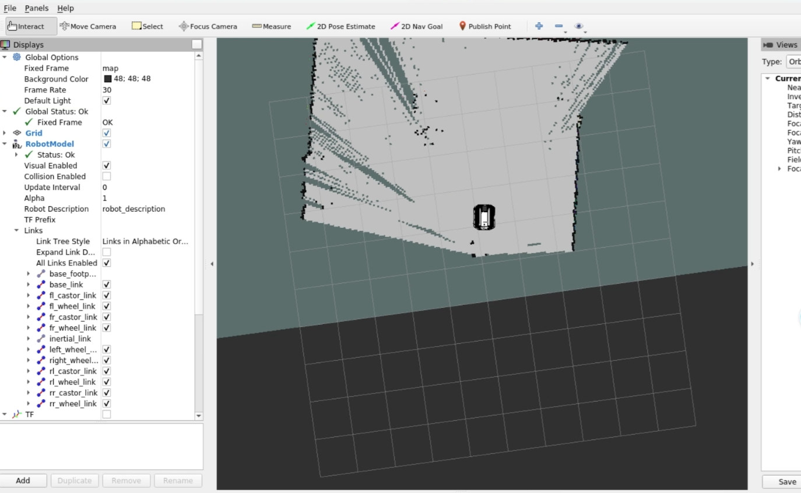
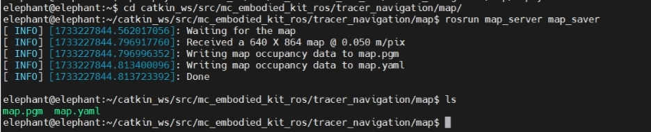
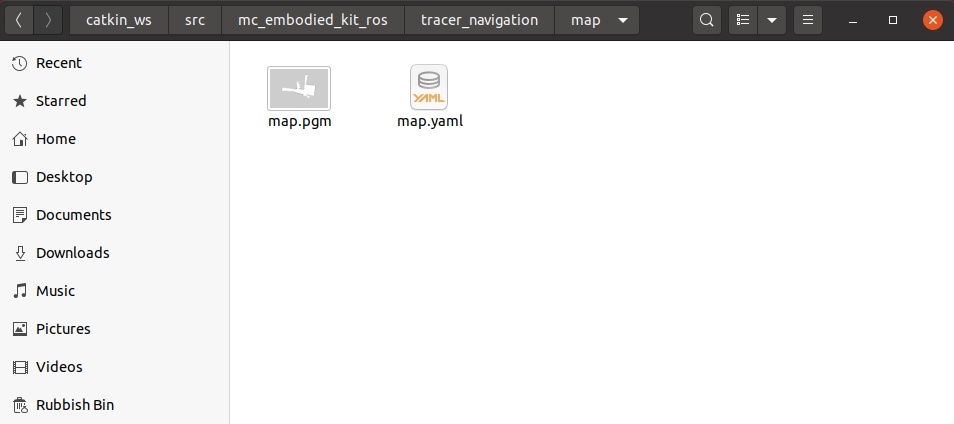
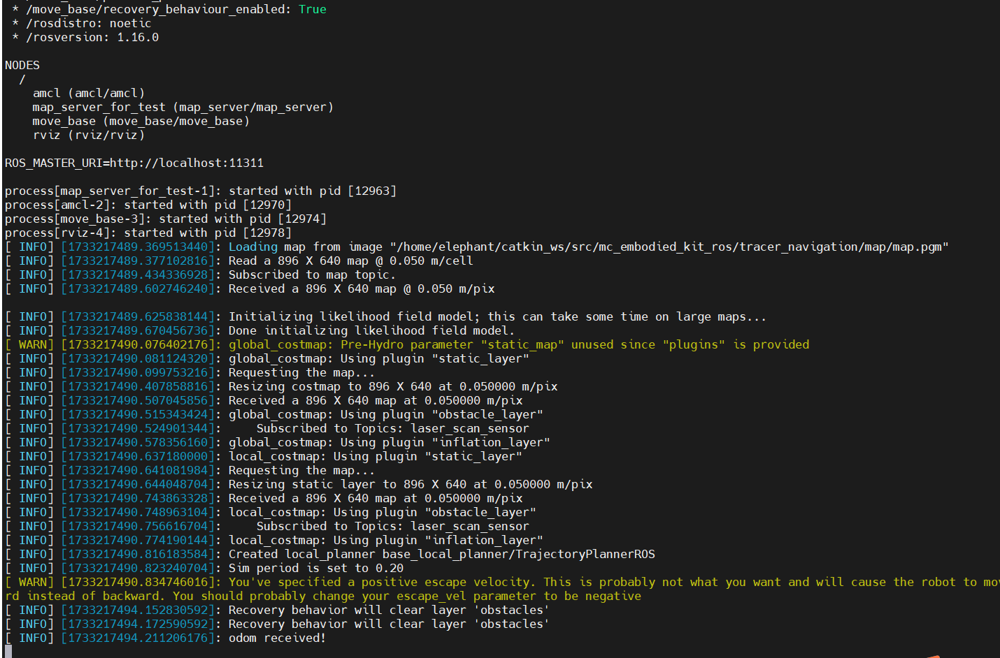
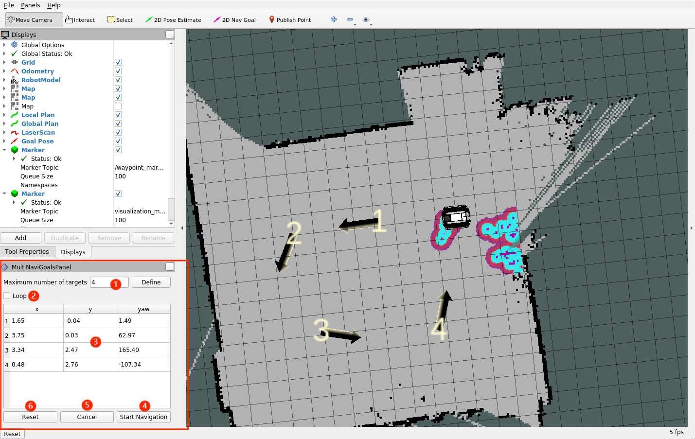
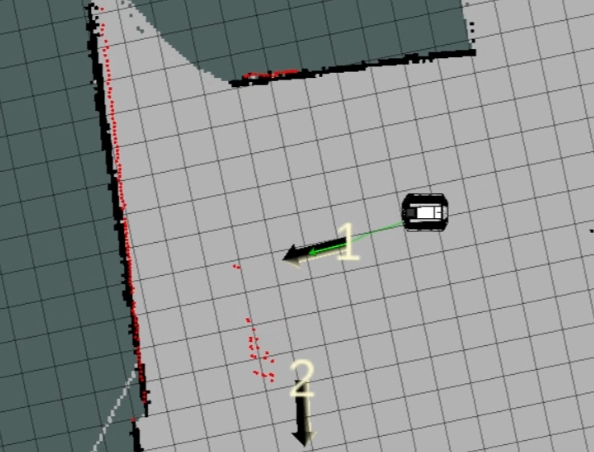

# Tracer chassis navigation implementation

## 1 Radar map construction

### 1.1 CAN bus enable

To ensure that the CAN bus is enabled, you need to run this command every time you turn on the power and restart the system:

```bash
rosrun tracer_bringup setup_can2usb.bash
```

### 1.2 Start the car's underlying communication

Open a terminal and run the following command:

```bash
roslaunch tracer_odometry tracer_active.launch
```



**Note:** Before starting the chassis node, make sure the CAN bus is enabled. When the system is restarted or the CAN bus is replugged, the enable command needs to be executed: `rosrun tracer_bringup setup_can2usb.bash`

### 1.3 Run the map building program

Open a terminal and run the following command:

```bash
roslaunch tracer_navigation mapping.launch
```



### 1.4 Start keyboard control

Open a terminal and run the following command:

```bash
roslaunch tracer_bringup tracer_teleop_keyboard.launch
```


| Button | Description |
| :--- | :----------------- |
| i | Move forward |
| , | Move backward |
| u | Rotate counterclockwise |
| o | Rotate clockwise |
| k | Stop |
| q | Increase linear and angular speed |
| z | Decrease linear and angular speed |
| w | Increase linear speed |
| x | Decrease linear speed |
| e | Increase angular speed |
| c | Decrease angular speed |

### 1.5 Start Mapping

Now the chassis car can move under keyboard control. At the same time, you can observe in the Rviz space that as the car moves, our map is gradually built.

Note: When using the keyboard to operate the car, make sure that the terminal running the `tracer_teleop_keyboard.launch` file is the currently selected terminal; otherwise, the keyboard control program will not recognize the key. In addition, in order to obtain better mapping effects, it is recommended to set the linear speed to 0.2 and the angular speed to 0.3 when controlling with the keyboard, because lower speeds tend to produce better mapping effects.



### 1.6 Save the constructed map

Open another new terminal console and enter the following command in the command line to save the map scanned by the tracer:

```bash
cd ~/catkin_ws/src/mc_mebodied_kit_ros/tracer_navigation/map

rosrun map_server map_saver
```



After successful execution, two default map parameter files, map.pgm and map.yaml, will be generated in the current path (`~/catkin_ws/src/mc_mebodied_kit_ros/tracer_navigation/map`).



The actual effect video of mobile chassis mapping is as follows (**the video has been accelerated**), for reference only:

<video id="my-video" class="video-js" controls preload="auto" width="100%"
poster="" data-setup='{"aspectRatio":"16:9"}'>
  <source src="../../../resources/4-FunctionsAndApplications/6-SDKDevelopment/5.2-DevelopmentAndUseBasedOnROS1/tracer_use/SLAM_mapping.mp4" type='video/mp4' >
</video>

## 2 Map Navigation

>> Note: Before starting navigation, it is recommended to place the initial position of the car at the starting position of the car when drawing the map.

Prior to this, we have successfully created a spatial map and obtained a set of map files, namely map.pgm and map.yaml in the `~/catkin_ws/src/mc_mebodied_kit_ros/tracer_navigation/map` directory.


### 2.1 Start the car's underlying communication

>> Note: If it has already been started, ignore this operation

Open a terminal and run the following command:

```bash
roslaunch tracer_odometry tracer_active.launch
```


### 2.2 Run the navigation program

Open a terminal and enter the following command to run:

```bash
roslaunch tracer_navigation navigation_active.launch
```



`You will see an Rviz simulation window open.

- **Navigation control panel description in the lower left corner**`



① **Maximum number of targets**: Maximum number of target points. You can set the maximum number of target points. The number of target points set cannot exceed this parameter (but can be less than this parameter).

② **Loop**: Loop. If this option is selected, the robot will navigate back to the first target point after navigating to the last target point. For example: 1 -> 2 -> 3 -> 1 -> 2 -> 3 -> ... This option must be selected before starting navigation.

③ **Mission target point list**: Mission target point list, x/y/yaw, the posture of a given target point on the map (xy coordinates and yaw). After setting the maximum number of target points and saving, the list will generate the corresponding number of entries.


Cancel
Reset

④ **Start Navigation**：Start navigation and start the target point navigation task.

⑤ **Cancel**：Cancel the current target point navigation task, the robot will stop moving. Click "Start Navigation" again, the robot will continue to move from the next target point.

For example: 1 -> 2 -> 3. If you click "Cancel" during the process of 1 -> 2, the robot will stop. Click "Start Navigation" again, the robot will move from the current position to 3.

⑥ **Reset**：Reset, clear all current target points.

- **Start Navigation**

Set the number of target points for the mission, click Confirm and Save. Then click "**2D Nav Goal**" on the toolbar to define the target points on the map. (Click "**2D Nav Goal**" every time you set a point). The target points distinguish directions, and the arrow represents the vehicle's heading. Click "Start Navigation" to start navigation. In Rviz, you will see a planned path from the starting point to the target point, and the vehicle will drive along this route to reach the destination.



The navigation effect is as follows (**the video has been accelerated**), for reference only:

<video id="my-video" class="video-js" controls preload="auto" width="100%"
poster="" data-setup='{"aspectRatio":"16:9"}'>
  <source src="../../../resources/4-FunctionsAndApplications/6-SDKDevelopment/5.2-DevelopmentAndUseBasedOnROS1/tracer_use/navigation.mp4" type='video/mp4' >
</video>

---

[← Previous page](./5_tracer_keyboard_control.md) | [Next section →](../5.3-DevelopmentAndUseBasedOnROS2/1_download.md)