# Communication and information commands

TRACER mobile chassis provides CAN interfaces for user development. Users can choose one of the interfaces to command and control the vehicle body.

## CAN interface protocol

The CAN communication standard in TRACER products adopts the CAN2.0B standard, the communication baud rate is 500K, and the message format adopts the MOTOROLA format. The linear speed of the chassis movement and the angular speed of rotation can be controlled through the external CAN bus interface; TRACER will feedback the current motion status information and the status information of the TRACER chassis in real time. The protocol includes system status feedback frame, motion control feedback frame, control frame, and query configuration frame.

### 1 System status feedback frame

The system status feedback command includes the current vehicle status feedback, control mode status feedback, battery voltage feedback, and fault feedback. The protocol content is shown in the table.

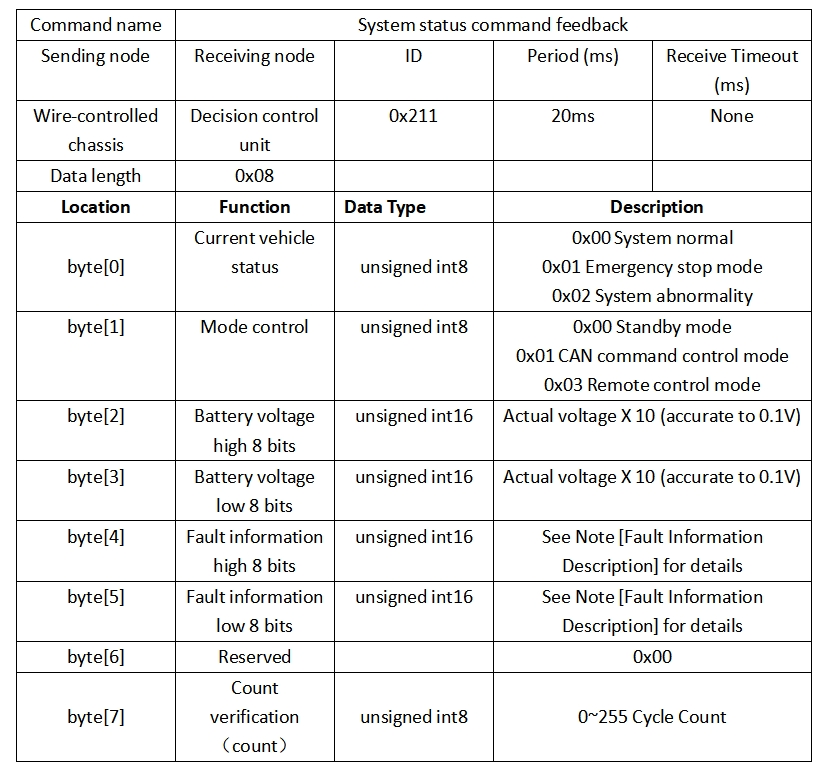

### 2 Fault Information Description

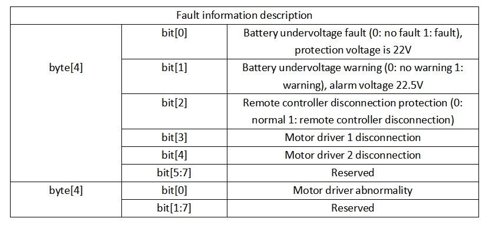

### 3 Motion control feedback frame

The motion control feedback frame command includes the current vehicle's motion linear speed and motion angular speed feedback. The specific contents of the protocol are shown in the table:

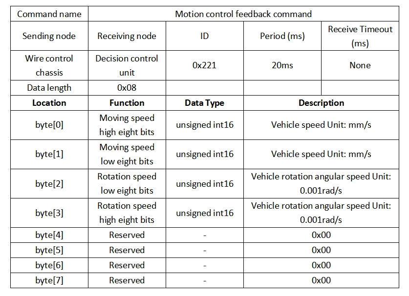

### 4 Command control frame

The control frame includes the linear speed control opening and the angle speed control opening. The specific protocol content is as shown in the table:

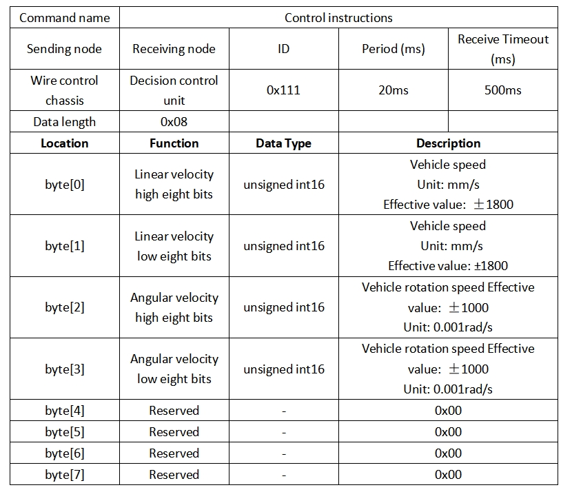

### 5 Lighting control command frame

The lighting control feedback frame command contains the feedback of the current forward lighting status. The specific contents are shown in the table:

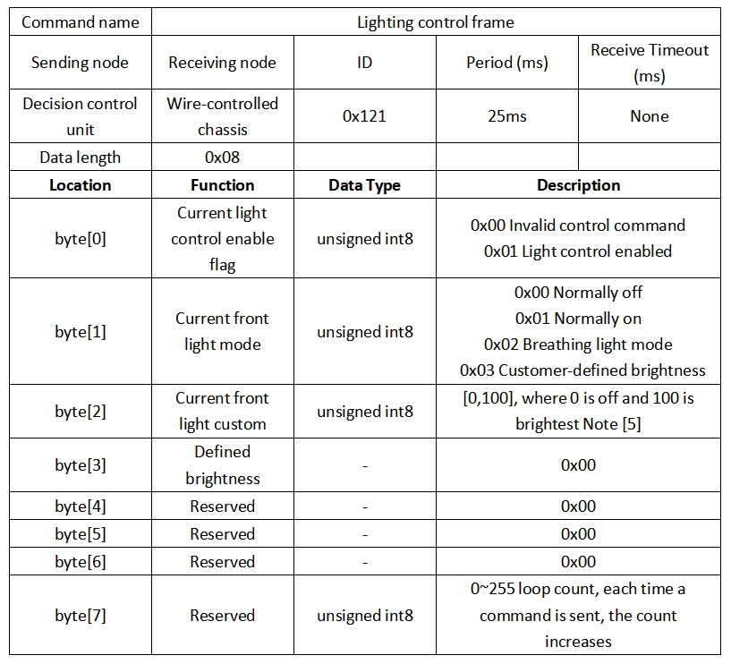

Note [5]: This value is valid in custom mode

### 6 Lighting control feedback frame

The lighting control frame command includes the lighting control mode and opening degree. The specific contents are shown in the table:

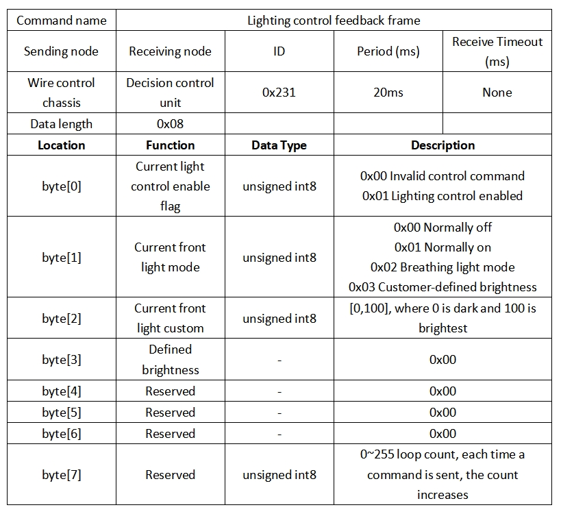

### 7 Control mode frame

The control mode frame package is used to set the control mode of the chassis, as shown in the table below:

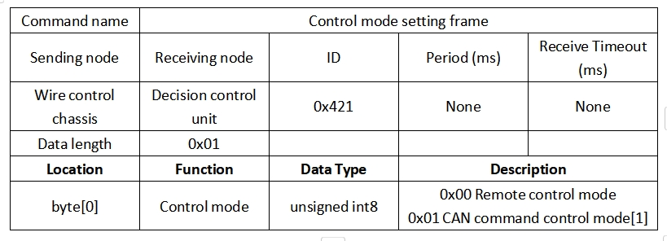

- Note [1] Control mode description
The default mode is standby mode. You need to switch to command mode to send motion control commands. If the remote controller is turned on, the remote controller has the highest authority and can block command control. When the remote controller switches to command mode, you still need to send the control mode setting command before responding to the speed command.

### 8 Status position frame

The status setting frame packet is used to clear error information:

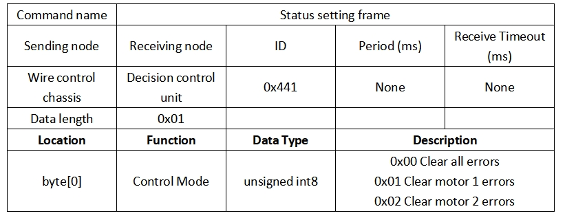

### 9 Odometer feedback frame

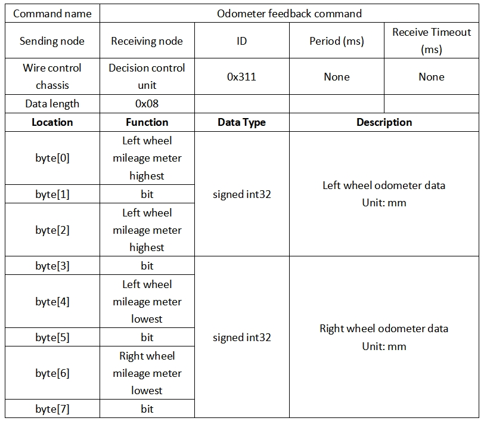

### 10 Motor information feedback frame

In addition to the chassis status information, the chassis feedback also includes motor information. The following frame feedback is motor information feedback: The motor numbers of the two motors in the chassis correspond to the following figure

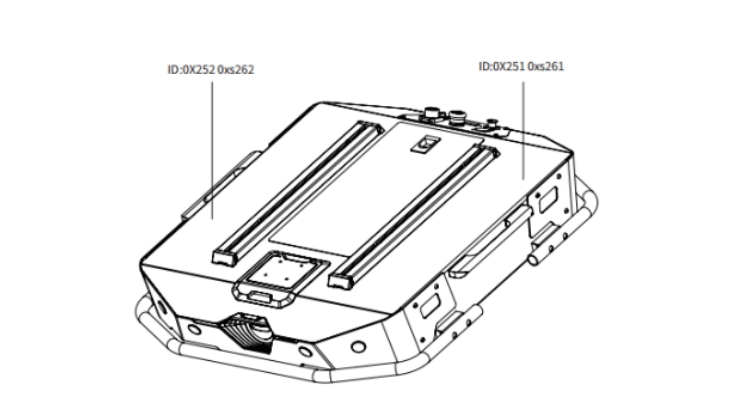

- Motor high speed information feedback frame

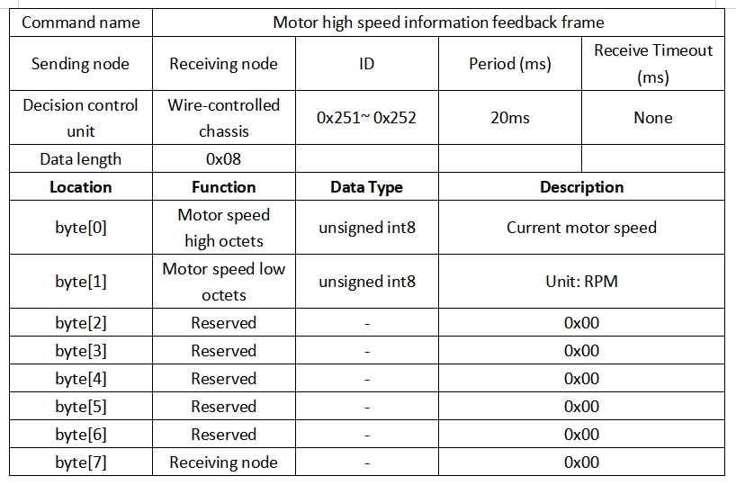

- Motor low speed information feedback frame

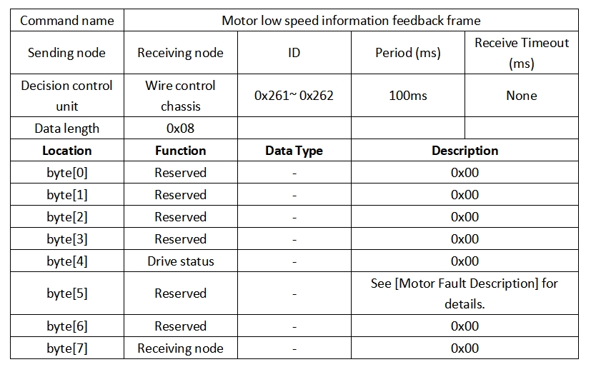
  
- Motor fault information description
  
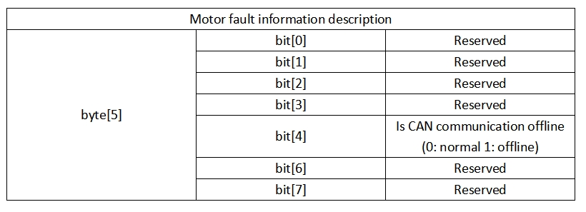

## Implementation of CAN commands

Start the TRACER mobile robot chassis normally, turn on the FS remote controller, and then switch the control mode to command control, that is, turn the FS remote controller SWB mode selection to the top. At this time, the TRACER chassis will accept commands from the CAN interface. At the same time, the host can also analyze the current chassis status through the real-time data fed back by the CAN bus. For specific protocol content, refer to the CAN communication protocol.

---

[← Previous page](./6.4.2-C650-CommunicationDoc.md) | [Next Chapter →](../../7-SuccessfulCases/7-SuccessfulCases.md)