# C650 Controls M750 Program Example

## Program Address
[mc_embodied_control.py](https://github.com/elephantrobotics/mc_embodied_kit_ros/blob/main/myarm_m/scripts/mc_embodied_control.py)

First, connect the MyarmM750 robotic arm to the system using a USB-to-Type-C cable and power it on.  
Select **Transponder** using the button and press "OK".

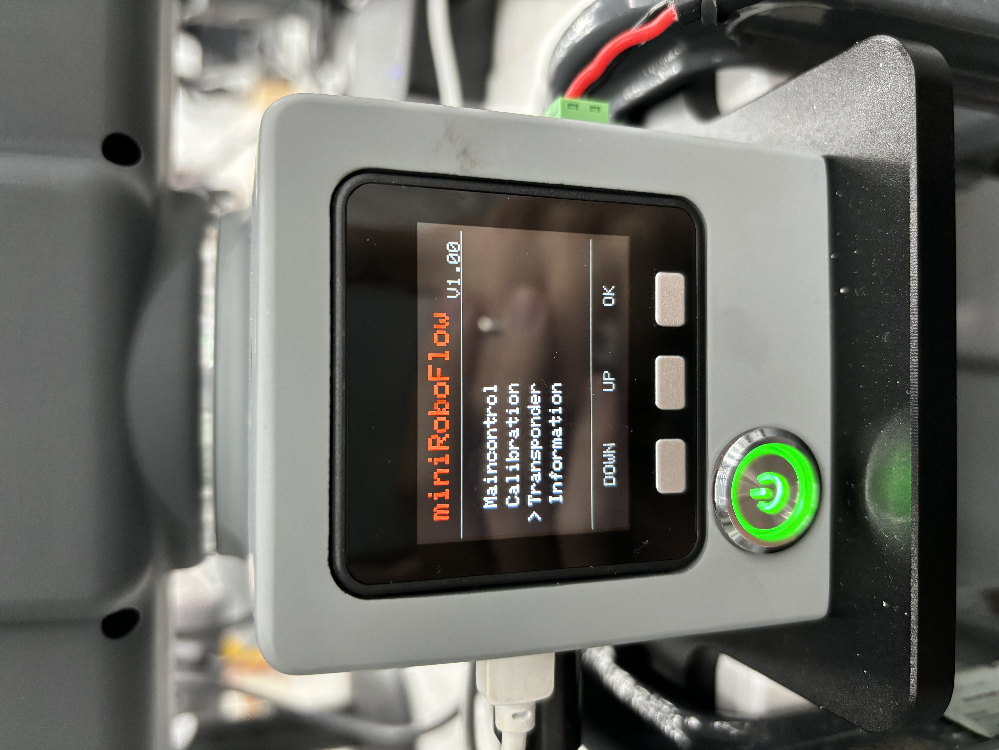

The screen will display the following:  

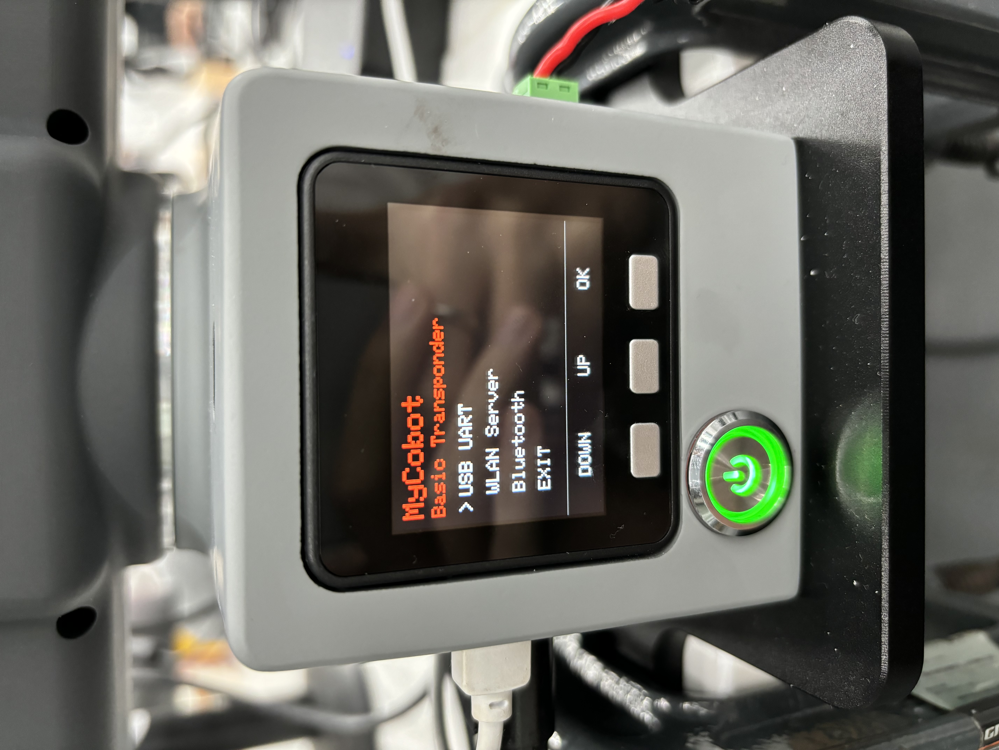

You will see an arrow pointing to **“USB UART”**. Press "OK" to enter, and it will show **“NO”**. Press the **“Exit”** button to return to the screen where the arrow points to **“USB UART”**. Press "OK" again, and this time it will display **“OK”**.

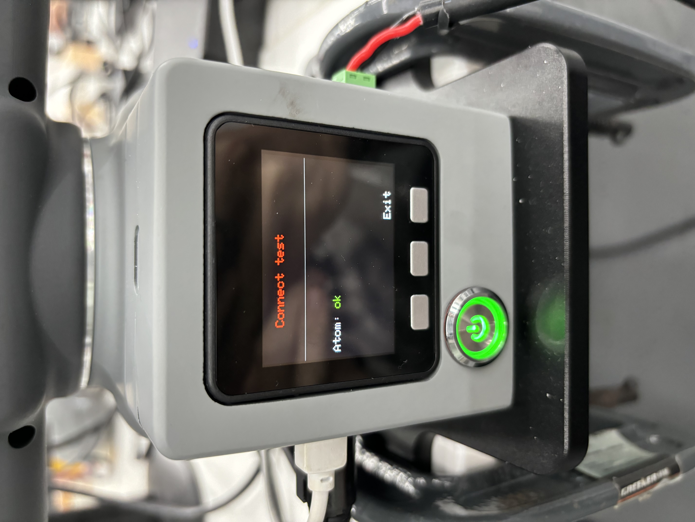

Next, connect the MyarmC650 robotic arm to the system using a USB-to-Type-C cable and power it on.  
Select **Transponder** using the button and press "OK".

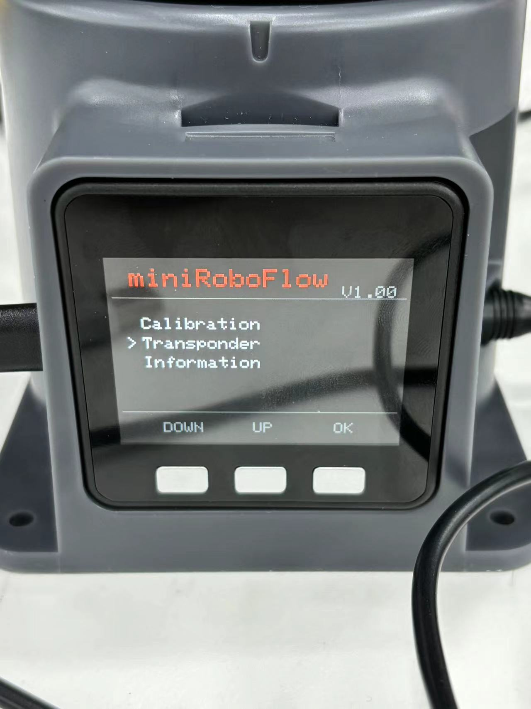

The screen will display the following:

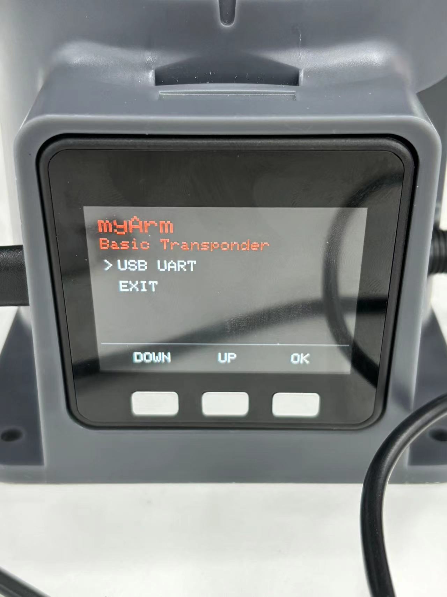

You will see an arrow pointing to **“USB UART”**. Press "OK" to enter, and it will show **“NO”**. Press the **“Exit”** button to return to the screen where the arrow points to **“USB UART”**. Press "OK" again, and this time it will display **“OK”**.

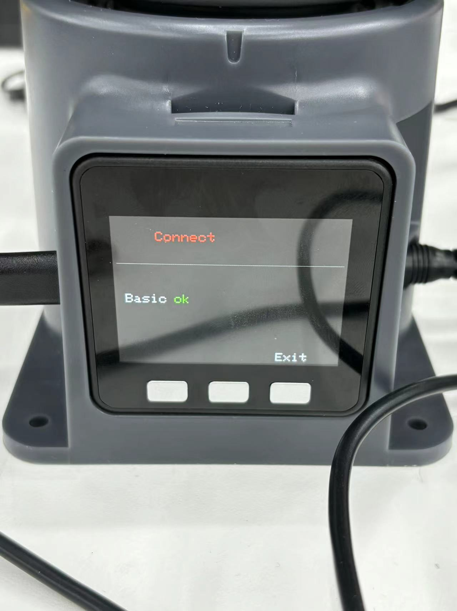

At this point, both the MyarmM750 and MyarmC650 robotic arms are successfully initialized.  

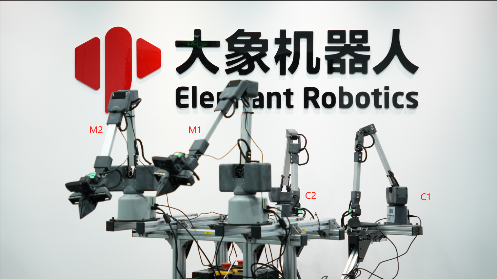

To connect four robotic arms simultaneously via USB, you must distinguish the serial ports for each arm. Open a new terminal and type the following command:

```bash
ls /dev/tty*
```

Press the **TAB key** to view all available serial ports.

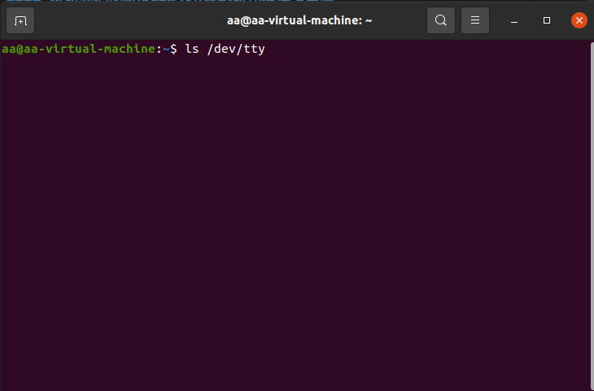  
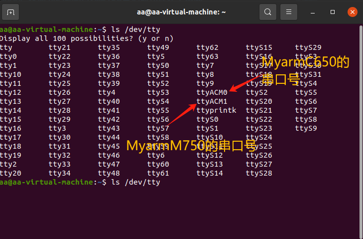

### How to distinguish serial port numbers

1. Connect one robotic arm, then run `ls /dev/tty*` to check the current port.
2. Without disconnecting the first robotic arm, connect the second one and repeat the command.
3. Do this for all four arms.

Modify the serial port numbers in the `mc_embodied_control.py` file located at `mc_embodied_kit_ros/myarm_m/scripts`.

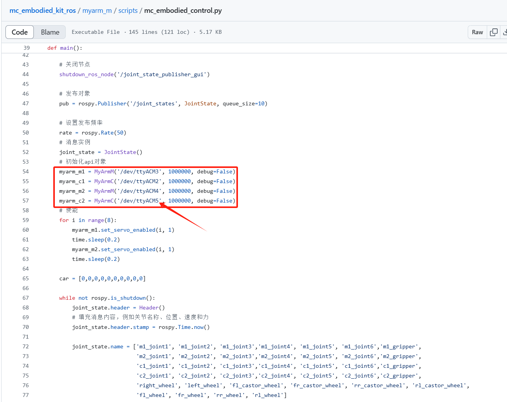

In your workspace, open a new terminal and start the ROS master node with the following command:

```bash
roscore
```

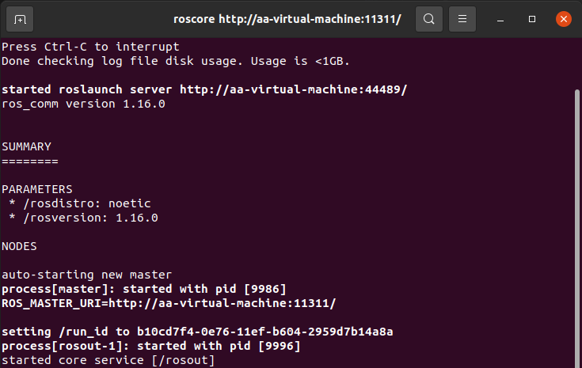

Open another terminal and launch the simulation:

```bash
roslaunch myarm_m mc_embodied_control.launch
```

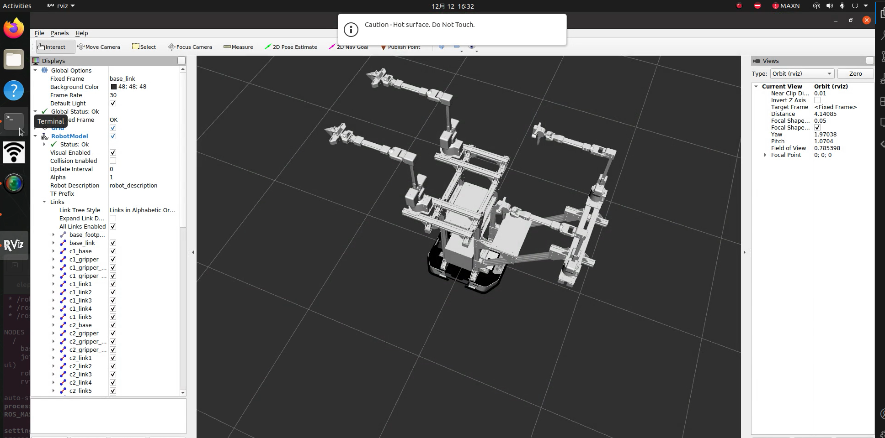

Once RViz is running, open another terminal and run the following command:

```bash
rosrun myarm_m mc_embodied_control.py
```

This allows the MyarmC650 robotic arm to control the MyarmM750.

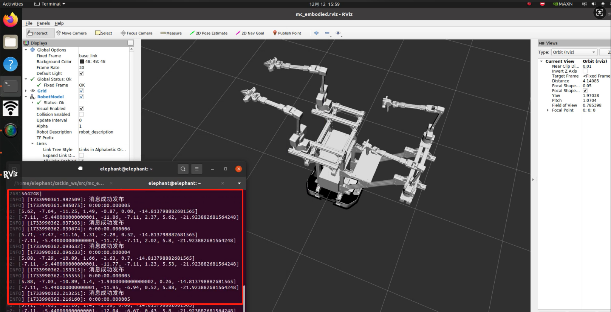

Now, you can move the MyarmC650 manually, and both the RViz simulation and the real-world MyarmM750 will follow its movements (including the gripper functionality).

<video src="../../resources/4-FunctionsAndApplications/6-SDKDevelopment/5.2-DevelopmentAndUseBasedOnROS1/1_download/mc_run.mp4" controls="controls" width="800" height="500"></video>

## At this point, the C650 controlling M750 function is fully implemented.

---

## Example Use Cases for the MyArm M&C Embodied Composite Kit

### Storage

<video src="../../resources/7-SuccessfulCases/收纳.mp4" controls="controls" width="800" height="500"></video>

### Pushing a Chair

<video src="../../resources/7-SuccessfulCases/推椅子.mp4" controls="controls" width="800" height="500"></video>

---