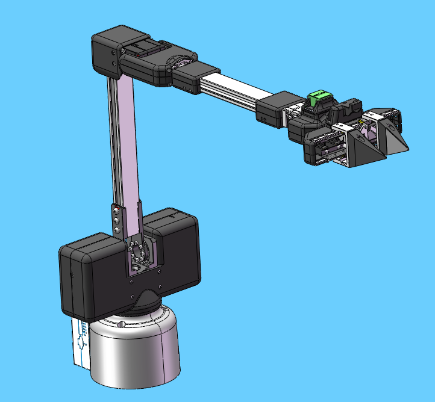
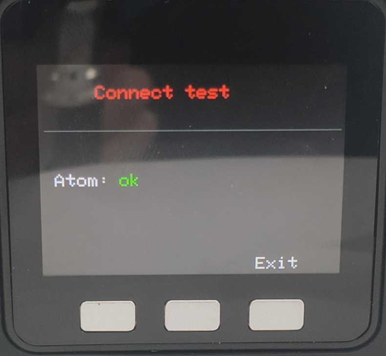
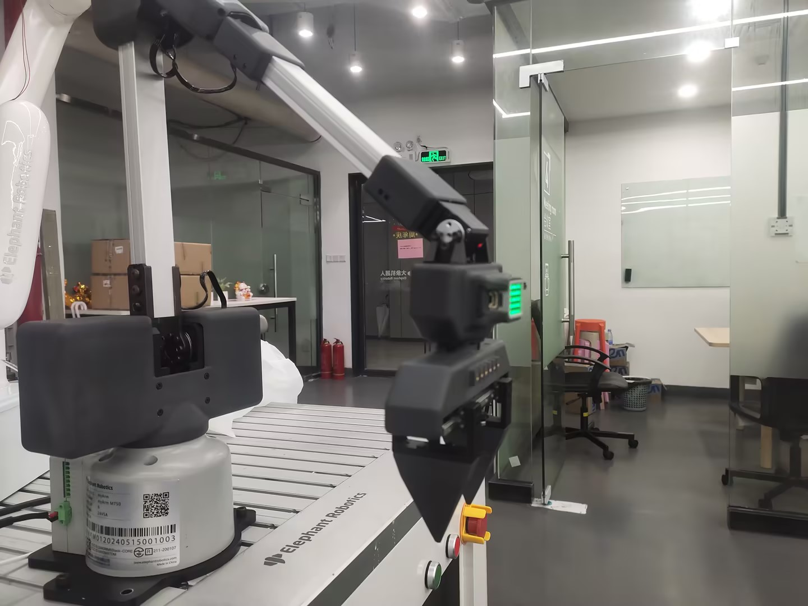
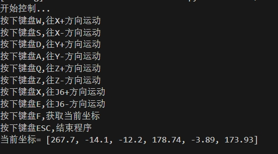
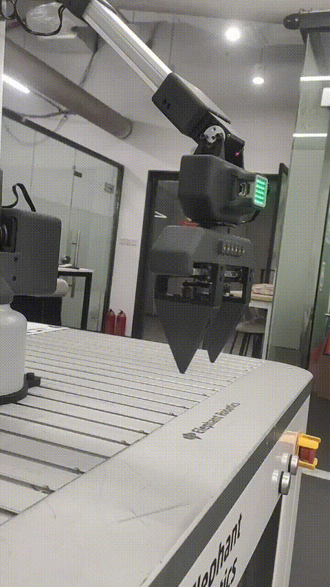

# Keyboard control robot movement case

**Function description**: Based on Cartesian motion, control the robot arm to move in the XYZ direction through the keyboard
## 1 Firmware burning
Since the robot needs to use Cartesian motion, it is necessary to burn the pico firmware and basic firmware that support Cartesian motion. However, the firmware that supports Cartesian motion has not been released on mystudio and can only be obtained by contacting after-sales personnel.

## 2 pymycobot installation
If you want to use Cartesian motion, you need to install or update pynycobot. Open the computer terminal and execute the following command to install or update pymycobot
```bash
pip install pymycobot --upgrade
```

## 3 Preparation
Before connecting the robot arm to 24V, manually adjust the robot arm to the posture shown in the figure below, and then connect the 24V power supply and communication data cable in turn. There should be no debris around the robot arm to avoid collision



Make sure the base screen displays ok



## 4 Case reproduction
After running the following program, the robot arm will first move to an initial position, and then print the key prompt information in the terminal. Press the corresponding key according to the terminal information to control the robot movement




** Note ** : When performing keyboard control, the firmware version of the robot arm cannot use v1.1.

```python
import threading
from pymycobot import MyArmMControl, utils
import keyboard
import time
m = MyArmMControl(utils.get_port_list()[0],1000000)
def init():
    # 设置初始角度
    m.write_angles([-10.19, 8.62, 30.65, 2.19, 50.53, -4.83], 100)
    time.sleep(1)
    m.set_gripper_state(0,100)
    time.sleep(1)

# 用于键盘输入检测的函数
def keyborad_ctrl():
    print("开始控制...")
    print("按下键盘W,往X+方向运动")
    print("按下键盘S,往X-方向运动")
    print("按下键盘D,往Y+方向运动")
    print("按下键盘A,往Y-方向运动")
    print("按下键盘Q,往Z+方向运动")
    print("按下键盘Z,往Z-方向运动")
    print("按下键盘X,往J6+方向运动")
    print("按下键盘E,往J6-方向运动")
    print("按下键盘F,获取当前坐标")
    print("按下键盘G,控制夹爪开合")
    print("按下键盘ESC,结束程序")

    blocked_keys = ['w', 'a', 's', 'd', 'q', 'z', 'f', 'e', 'x', 'g']
    for key in blocked_keys:
        keyboard.block_key(key)
    key_processed = {key: False for key in blocked_keys}
    else_executed = False
    gripper_opened = True  # 默认状态为夹爪打开

    try:
        while True:
            if keyboard.is_pressed('esc'):
                print("退出控制...")
                break
            for key in blocked_keys:
                if keyboard.is_pressed(key) and not key_processed[key]:
                    if key == 'g':  # 特殊处理G键
                        gripper_opened = handle_gripper(gripper_opened)
                    else:
                        threading.Thread(target=handle_key, args=(key,)).start()
                    key_processed[key] = True
                    else_executed = False
            if all(not keyboard.is_pressed(key) for key in blocked_keys) and not else_executed:
                m.stop()
                else_executed = True
            for key in key_processed:
                if not keyboard.is_pressed(key):
                    key_processed[key] = False
            time.sleep(0.01)
    finally:
        keyboard.unhook_all()


def handle_key(key):
    if key == 'w':
        m.jog_coord(1, 1, 60)
    elif key == 'a':
        m.jog_coord(2, 0, 60)
    elif key == 'd':
        m.jog_coord(2, 1, 60)
    elif key == 's':
        m.jog_coord(1, 0, 60)
    elif key == 'q':
        m.jog_coord(3, 1, 60)
    elif key == 'z':
        m.jog_coord(3, 0, 60)
    elif key == 'e':
        m.jog_angle(6, 0, 50)
    elif key == 'x':
        m.jog_angle(6, 1, 50)
    elif key == 'f':
        print("当前坐标=", m.get_coords())


def handle_gripper(gripper_opened):
    if gripper_opened:
        m.set_gripper_state(1, 100)  # 关闭夹爪
        # print("夹爪已闭合")
    else:
        m.set_gripper_state(0, 100)  # 打开夹爪
        # print("夹爪已打开")
    return not gripper_opened  # 切换状态

if __name__ == "__main__": 
    init()
    keyborad_ctrl()  

```

## 5 Effect display

