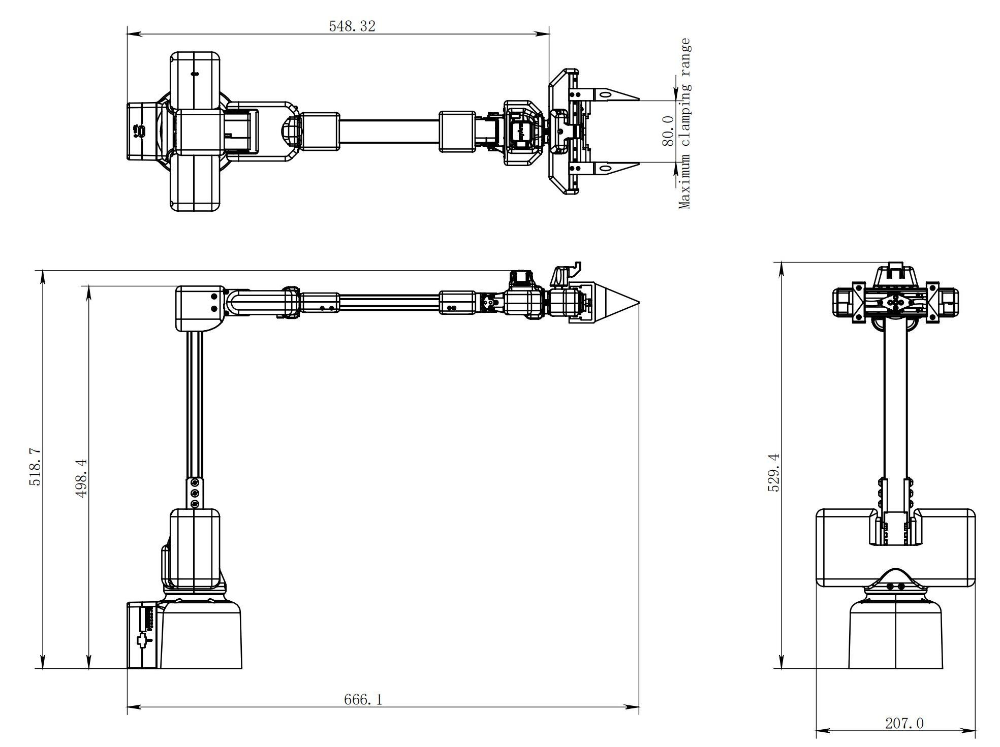
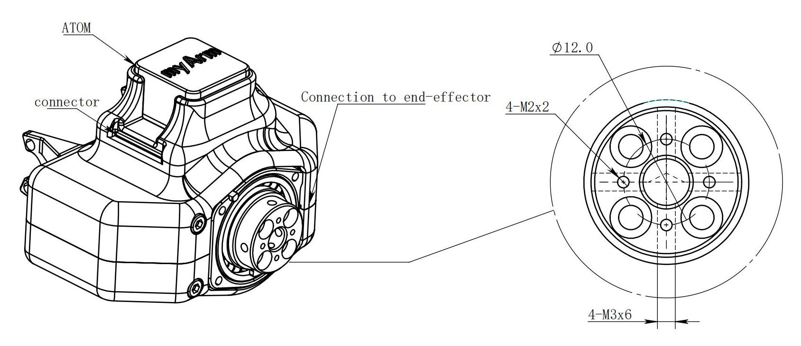
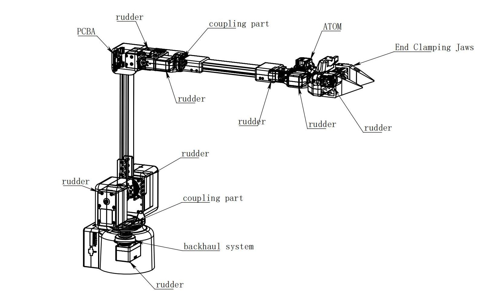
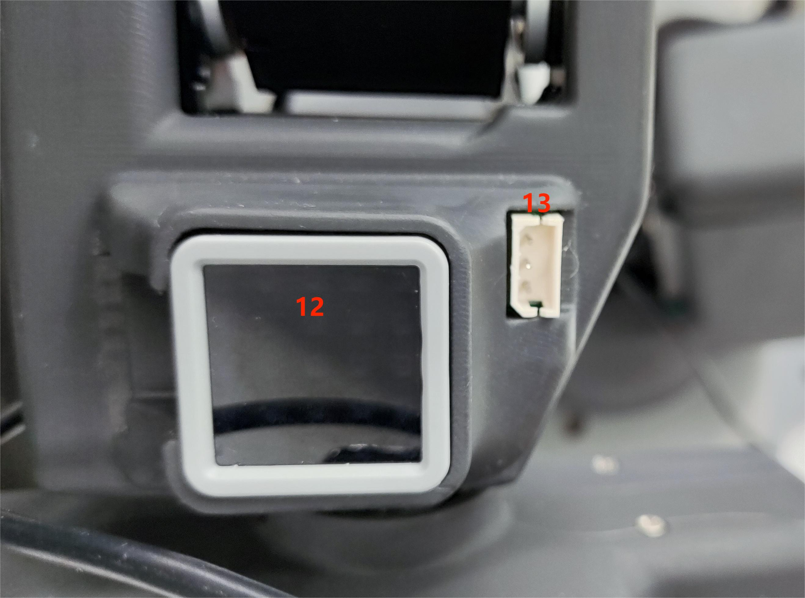

# Parameters of the bot

> In the first chapter, we explore the selling points of the product and its design philosophy, giving you a panoramic view of the high-level understanding of the product. Now, let's move on to the second chapter – Robot Parameter Description. This section will be the key to understanding the technical details of the product. A detailed understanding of these technical specifications will not only help you fully understand the advanced and practical nature of our products, but also ensure that you can use these technologies more effectively to meet your specific needs.

---

# 1 Product Specifications
## 1.1 Machine Parameters

<!--  -->

|     Specifications |      Parameter |
|:--------------|:-----------------|
| Model | myArm  M750    |
|DOF           |	6+1       |
|Horizontal Reach Range	|750            |
|Total span |	1500mm          |
|Self-weight|	3.2kg           |
|Power Specifications	|	24V5A                |
|Repeatability |±1mm |
|Accuracy |	5 - 8mm                |
|Working load |	Rated 500g, peak 1Kg |
|Number of servos |8 |
|Servo type|Industrial-grade high-precision digital servo motor|
|Rotation capacity |+/- 180° |
|End effector|Parallel gripper, optional camera adaptation|
|USB connection |Type-C	                   |
|Atom end |5*5 LED light matrix |
|Communication frame rate |>50Hz |

## 1.2 Software Basic Function Support

| Function/Development Environment | Usage |
| :------------: | :--------: |
| Joint Movement | Yes |
| Cartesian Movement | Yes |
| Wireless control | Yes |
| Emergency stop | Yes |
| Windows      | Yes |
| Linux        | Yes |
| MAC          | Yes |
| ROS        | Yes |
| Python       | Yes |
| myblockly    | Yes |
| mystudio     | Yes |
| Serial Port Control Protocol | Yes |

---

# 2 Control core parameters

## 2.1 Master Controller Spec Sheet

| **Indicators** | **Parameters** |
| :------- | :---------------------------------------------------------------- |
| Master Control | M5Stack-basic                                                     |
| Master Model | ESP32                                                             |
| CPU      | 240MHz dual core.   600 DMIPS、520KB SRAM。   Wi-Fi, dual-mode Bluetooth |
| Bluetooth | 2.4G/5G                                                 |
| Wireless | 2.4G 3D Antenna                                                   |
| Enter | IN1, IN2, IN3, IN4, IN5, IN6                                      |
| Output | OUT1, OUT2, OUT3, OUT4, OUT5, OUT6                                |

## 2.2 Secondary Controller 1 Spec Sheet

| **Indicators** | **Parameters** |
| :----------------- | :-------------------------------------------------------------- |
| Auxiliary Control | Atom                                                            |
| Auxiliary Control Model | ESP32                                                           |
| Auxiliary controller core parameter | 240MHz dual-core.   600 DMIPS，520KB SRAM。   Wi-Fi, dual-mode Bluetooth |
| Auxiliary controller flash | 4MB                                                             |
| LCD display | 2.0"@320*240 ILI9342C IPS panel,  max brightness 853nit |
| Type C | *1                                                             |

## 2.3 Secondary Controller 2 Spec Sheet

| **Indicators** | **Parameters** |
| :----------------- | :-------------------------------------------------------------- |
| Auxiliary Control | Pico                                                            |
| Auxiliary Control Model | ESP32                                                           |
| Auxiliary controller core parameter | 240MHz dual-core.   600 DMIPS，520KB SRAM。 Wi-Fi,  dual-mode Bluetooth|
| Secondary controller flash | 4MB                                                             |
| TypeC              | *1                                                             |

---

# 3 Structural Dimension Parameters

> ！ This chapter is in millimeters of distance and degrees of angle.

## 3.1 Product Dimensions and Workspace

## 3.2 Base Mounting Dimensions

- The base needs to be flanged and can be fixed to the corresponding mounting base using M6 screws.
- Before use, please confirm that the installed base can bear 3 times the weight of the body to prevent damage to the product caused by loosening of the product due to the increase in movement speed during use.

Figure 1 Front view of the base

## 3.3 End of arm

- The end of the arm is compatible with LEGO component holes and threaded holes.

## 3.4 Products

<!-- [PDF Views](<../../resources/2-ProductFeature/320%202022款技术图示(1).pdf>)  -->

## 3.5 3D Model Download

Provide a 3D model of the product for your customers' reference.

<!-- Download link: [https://download.elephantrobotics.com/Product_3d_files/myCobot_320_M5_2022v1.2_230708.STEP](https://download.elephantrobotics.com/Product_3d_files/myCobot_320_M5_2022v1.2_230708.STEP) -->

<!-- <iframe
    src=""
    width="100%"
    height="600px"
    allowfullscreen="true"
    webkitallowfullscreen="true"
    mozallowfullscreen="true"
    frameborder="0">
</iframe> -->

---

# 4 Electrical Characteristic Parameters

## 4.1 Overview of the Electrical Interface of the Base

  
Figure 1 Front view of the base

  
Figure 2 Left side of the base

  
Figure 3 Right side of the base

| No. | Interface name | Define | Features | Note |
| :--- | :--------------- | :--------- | :--------------- | :------------------ |
| 1    | Type C           | Communication Interface | Communicate with a PC | Development and use |
| 2    | Screen | Show | Use | with buttons                     |
| 3    | Press | Press the key A | Use | with the display                     |
| 4    |                  | Press the B |                  |                     |
| 5    |                  | Press the C |                  |                     |
| 6    | Switch | Power switch | Control the input power on and off | With light (light on) |
| 7    | DC/IO interface | GND        | GND              |                     |
|      |                  | IN6        | Digital input signal 1~6 | only in NPN mode
|      |                  | IN5        |                  |                     |
|      |                  | IN4        |                  |                     |
|      |                  | IN3        |                  |                     |
|      |                  | IN2        |                  |                     |
|      |                  | IN1        |                  |                     |
|      |                  | 24V        | DC24V            |                     |
| 8    | Type C           | Communication Interface | Communicate with a PC | Development and use |
| 9    | Power DC input interface | DC24V input | DC24V input |                     |
| 10   | DC/IO interface | 24V        | DC24V            |                     |
|      |                  | OUT1       | Digital output signal 1~6 | only in PNP mode
|      |                  | OUT2       |                  |                     |
|      |                  | OUT3       |                  |                     |
|      |                  | OUT4       |                  |                     |
|      |                  | OUT5       |                  |                     |
|      |                  | OUT6       |                  |                     |
|      |                  | GND        | GND              |                     |
| 11   | E-stop interface | STOP       | Emergency stop circuit interface |                     |

#### 4.1.1 Type C: The Type-C interface is used to connect and communicate with PCs and can be used by developers.

#### 4.1.2 Screen: The screen is used to display the communication status of myArm and calibrate the robot to the starting point through a 2-inch IPS screen.

#### 4.1.3 Keys A, B, and C are used to operate the screen in a coordinated manner.

#### 4.1.4 Power Switch: The power switch is used to control the main power input. If it is turned off, the controller will also lose power.

#### 4.1.5 24V output: Built-in DC24V, available for user use.

#### 4.1.6 Digital Inputs/Outputs: Includes 6 digital input signals and 6 digital output signals for interaction with other devices and together with other devices form an important part of the automation system.

Digital Inputs/Outputs: Includes 6 digital input signals and 6 digital output signals to interact with other devices and together with other devices form an important part of the automation system.

It is important to note that the output signal is in PNP form and the input signal is in NPN form. Here is the external wiring diagram:

 

 

#### 4.1.7 Power DC input interface: KPPX-4P R7BFDC power socket. The 24V 9.2A DC power adapter from the manufacturer can also be used to power the myCobot320.

#### 4.1.8 The emergency stop circuit terminal is connected to the emergency stop button box and can be used to control the emergency stop of the robot.

> **NOTE**: The emergency stop switch must be connected when using the robot and ensure that the emergency stop switch circuit is always connected.

## 4.2 Mechanical Wall End Electrical Interface

#### 4.2.1 Introduction to the end of the robotic arm

A. The side interface at the end of the robotic arm is shown in Figure 2-1.

 

 

Figure 2-1 End of the robotic arm

| No. | Interface name | Define | Features | Note |
| :--- | :--------------- | :--------- | :--------------- | :------------------ |
| 9   | End IO interface | End Tool IO Interface | Interact with external devices | Development and use |
| 10    | End Grove Interface |       |   |                     |
| 11   | Type C interface |    |It can be used to connect and communicate with the PC and update the firmware                     ||
| 12   | End Atom | LED   | For 5X5 RGB LED (G27) display and key function (G39) ||
| 13   | Servo interface | Connect the servo | Connect an external device servo |                     |

#### 4.2.2 End Interface Description

A. Table 2-1 defines the terminal IO port.

| Tag name | Signal name | Features | Note |
| ------ | ------ | ------------------------------- | ---- |
| 5V0    | 5V     | 5V Power Supply |      |
| GND    | GND    | Motherboard power signal ground |      |
| 3V3    | 3V3    | 3.3V Power Supply |      |
| G22    | G22    | 3.3V-OUT-PIN output/3.3V-INT input |      |
| G19    | G19    | 3.3V-OUT-PIN output/3.3V-INT input |      |
| G23    | G23    | 3.3V-OUT-PIN output/3.3V-INT input |      |
| G33    | G33    | 3.3V-OUT-PIN output/3.3V-INT input |      |

Table 2-1 Terminal IO port

B. End Grove Interface: The Grove interface 4 definition is shown in Figure 2-2

 

> Figure 2-2 End Grove Interface

C. Type C interface: It can be used to connect and communicate with the PC and update the firmware.

D. Atom: for 5X5 RGB LED (G27) display and key function (G39)

E. Servo interface: used for terminal expansion grippers, currently supporting the use of matching adaptive grippers.

<!-- --- -->

# 5 Cartesian Coordinate System

## 5.1 Joint Coordinate System
The joint coordinate system is a coordinate system based on the rotation joints of the robot arm. The white dotted lines in the figure below represent the rotation axes of each joint, the red arrows represent the rotation directions of the joints, and q1-q6 represent the 1-6 joint coordinate systems.

 

## 5.2 Base Coordinate System

The base coordinate system is a coordinate system fixed at the bottom of the robot arm. Its origin and coordinate axis directions are determined when the kinematic algorithm is modeled. Generally, the origin is set at the center point of the base.

 

## 5.3 Tool Coordinate System

The tool coordinate system is a coordinate system fixed at the end of the robot arm. Its origin and coordinate axis direction are determined during the kinematic algorithm modeling. Generally, the origin is set at the center point of the flange at the end of the robot arm.

 

## 5.4 Kinematic model
The figure below shows the kinematic model of the robot arm. The position shown is the zero point on the algorithm model
 

### 5.4.1 Zero point calibration
In the kinematic model, the actual zero point has some offset on joints 2 and 3. Considering the convenience of calibration, users can align the scale line when using zero point calibration, without aligning the actual zero point on the model.
 
 

### 5.4.2 MDH parameters

DH parameters are used to describe the relative relationship between adjacent links:

- a_i: along x_i: the distance from z_i to z_i+1

- alpha_i: around x_i: from z_i to z_i+1

- d_i: represents the distance from x_i-1 to x_i along z_i

- θ_i: around z_i: from x_i-1 to The angle of x_i

<!-- Here is an article to refer to
[https://blog.csdn.net/hitgavin/article/details/104442034](https://blog.csdn.net/hitgavin/article/details/104442034) -->

### 5.4.3 MDH parameter list

| Joint | alpha_i-1 | a_i-1    | d     | theta   | offset |
| :--- | :---- | :--- | :---- | :------ | :----- |
| 1    | 0     | 0    | 173.9 | theta_1 | 0      |
| 2    | -PI/2  | 0    | 0     | theta_2 | -PI/2  |
| 3    | 0     | 308.315 | 0     | theta_3 | 0      |
| 4    | -PI/2     | 0 |327.91    | theta_4 | 0  |
| 5    | PI/2  | 0    | 0 | theta_5 | 0      |
| 6    | -PI/2 | 0    | 197.1  | theta_6 | PI      |

---

[← Previous chapter](../1-ProductIntroduction/1-ProductIntroduction.md) | [Next chapter →](../../3-BasicSettings/3-UserInstructions/3-UserInstructions.md)

