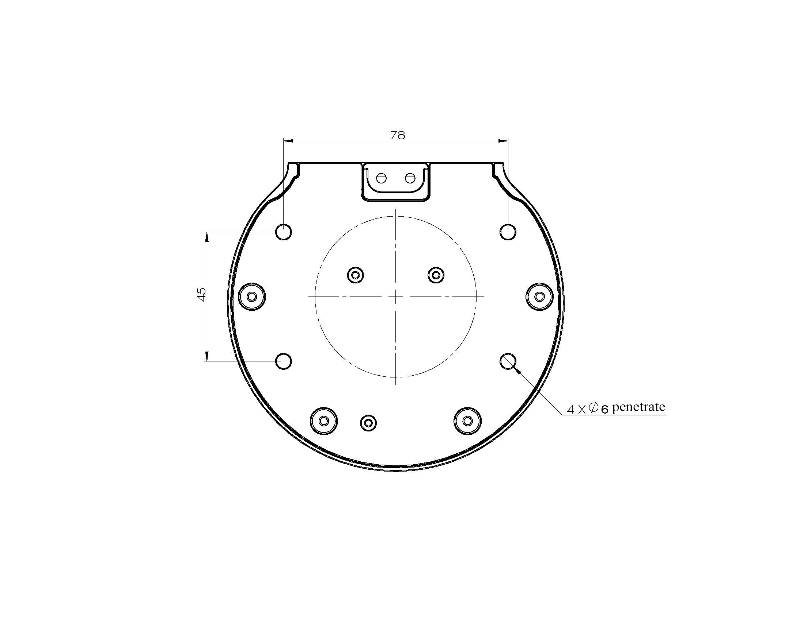
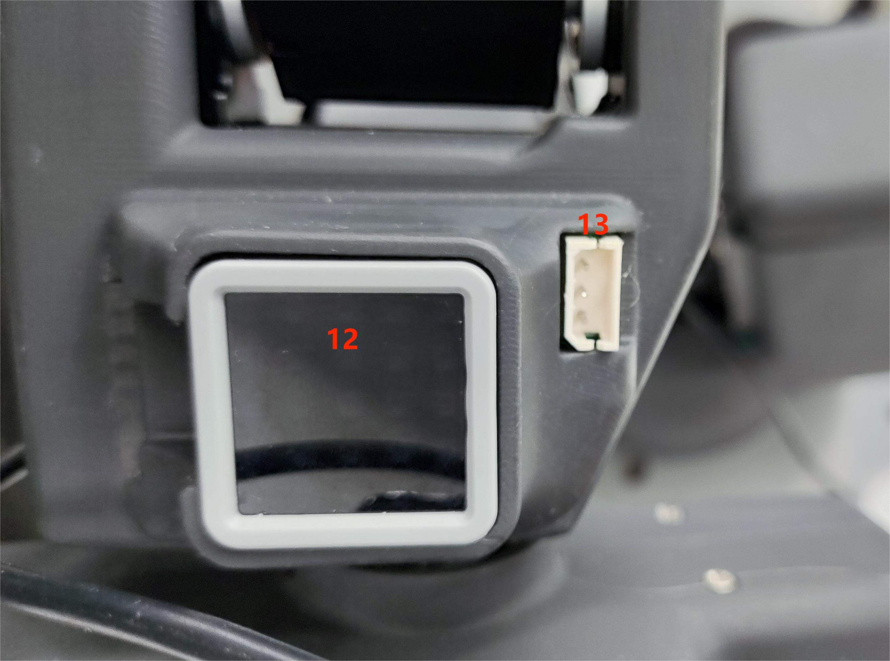

# Parameters of the bot

> In the first chapter, we explore the selling points of the product and its design philosophy, giving you a panoramic view of the high-level understanding of the product. Now, let's move on to the second chapter – Robot Parameter Description. This section will be the key to understanding the technical details of the product. A detailed understanding of these technical specifications will not only help you fully understand the advanced and practical nature of our products, but also ensure that you can use these technologies more effectively to meet your specific needs.

---

# 1 Product Specifications
## 1.1 Machine Parameters

<!--  -->

|     Specifications |      Parameter |
|:--------------|:-----------------|
| Model | myArm  M750    |
|DOF           |	6+1       |
Horizontal Reach Range	750            |
Total span |	1500mm          |
|Self-weight|	3.2kg           |
Power Specifications		24V5A                |
Repeatability |±1mm |
Accuracy |	5 - 8mm                |
Working load |	Rated 500g, peak 1Kg |
|Number of servos |8 |
|Servo type|Industrial-grade high-precision digital servo motor|
Rotation capacity |+/- 180° |
|End effector|Parallel gripper, optional camera adaptation|
|USB connection |Type-C	                   |
|Atom end |5*5 LED light matrix |
Communication frame rate |>50Hz |

## 1.2 Software Basic Function Support

| Function/Development Environment | Usage |
| :------------: | :--------: |
| Joint Movement | Yes |
| Cartesian Movement | Yes |
| Wireless control | Yes |
| Emergency stop | Yes |
| Windows      | Yes |
| Linux        | Yes |
| MAC          | Yes |
| ROS        | Yes |
| Python       | Yes |
| C++          | Yes |
| C#           | Yes |
| JavaScript   | Yes |
| myblockly    | Yes |
| Arduino      | Yes |
| mystudio     | Yes |
| Serial Port Control Protocol | Yes |
| TCP/IP       | Yes |
| MODBUS       | Yes |

## 1.3 Extended Development Capabilities
| Expansion Interface | Extend the way you develop |
| :------------: | :--------: |
| ROS  |    |
| Python  |     |

---

# 2 Control core parameters

## 2.1 Master Controller Spec Sheet

| **Indicators** | **Parameters** |
| :------- | :---------------------------------------------------------------- |
| Master Control | M5Stack-basic                                                     |
| Master Model | ESP32                                                             |
| CPU      | 240MHz dual core.   600 DMIPS、520KB SRAM。   Wi-Fi, dual-mode Bluetooth |
| Bluetooth | 2.4G/5G                                                 |
| Wireless | 2.4G 3D Antenna                                                   |
| Enter | IN1, IN2, IN3, IN4, IN5, IN6                                      |
| Output | OUT1, OUT2, OUT3, OUT4, OUT5, OUT6                                |

## 2.2 Secondary Controller 1 Spec Sheet

| **Indicators** | **Parameters** |
| :----------------- | :-------------------------------------------------------------- |
| Auxiliary Control | Atom                                                            |
| Auxiliary Control Model | ESP32                                                           |
| Auxiliary controller core parameter | 240MHz dual-core.   600 DMIPS，520KB SRAM。   Wi-Fi, dual-mode Bluetooth |
| Auxiliary controller flash | 4MB                                                             |
| LCD display | 2.0"@320*240 ILI9342C IPS panel,  max brightness 853nit |
| Type C | *1                                                             |

## 2.3 Secondary Controller 2 Spec Sheet

| **Indicators** | **Parameters** |
| :----------------- | :-------------------------------------------------------------- |
| Auxiliary Control | Pico                                                            |
| Auxiliary Control Model | ESP32                                                           |
| Auxiliary controller core parameter | 240MHz dual-core.   600 DMIPS，520KB SRAM。 Wi-Fi,  dual-mode Bluetooth|
| Secondary controller flash | 4MB                                                             |
| TypeC              | *1                                                             |

---

# 3 Structural Dimension Parameters

> ！ This chapter is in millimeters of distance and degrees of angle.

## 3.1 Product Dimensions and Workspace

## 3.2 Base Mounting Dimensions

- The base needs to be flanged and can be fixed to the corresponding mounting base using M6 screws.
- Before use, please confirm that the installed base can bear 3 times the weight of the body to prevent damage to the product caused by loosening of the product due to the increase in movement speed during use.

Figure 1 Front view of the base

## 3.3 End of arm

- The end of the arm is compatible with LEGO component holes and threaded holes.

## 3.4 Products

<!-- [PDF Views](<../../resources/2-ProductFeature/320%202022款技术图示(1).pdf>)  -->

## 3.5 3D Model Download

Provide a 3D model of the product for your customers' reference.

<!-- Download link: [https://download.elephantrobotics.com/Product_3d_files/myCobot_320_M5_2022v1.2_230708.STEP](https://download.elephantrobotics.com/Product_3d_files/myCobot_320_M5_2022v1.2_230708.STEP) -->

<!-- <iframe
    src=""
    width="100%"
    height="600px"
    allowfullscreen="true"
    webkitallowfullscreen="true"
    mozallowfullscreen="true"
    frameborder="0">
</iframe> -->

---

# 4 Electrical Characteristic Parameters

## 4.1 Overview of the Electrical Interface of the Base

Figure 1 Front view of the base

Figure 2 Left side of the base

Figure 3 Right side of the base

| No. | Interface name | Define | Features | Note |
| :--- | :--------------- | :--------- | :--------------- | :------------------ |
| 1    | Type C           | Communication Interface | Communicate with a PC | Development and use |
| 2    | Screen | Show | Use | with buttons                     |
| 3    | Press | Press the key A | Use | with the display                     |
| 4    |                  | Press the B |                  |                     |
| 5    |                  | Press the C |                  |                     |
| 6    | Switch | Power switch | Control the input power on and off | With light (light on) |
| 7    | DC/IO interface | GND        | GND              |                     |
|      |                  | IN6        | Digital input signal 1~6 | Enter | only in NPN mode
|      |                  | IN5        |                  |                     |
|      |                  | IN4        |                  |                     |
|      |                  | IN3        |                  |                     |
|      |                  | IN2        |                  |                     |
|      |                  | IN1        |                  |                     |
|      |                  | 24V        | DC24V            |                     |
| 8    | Type C           | Communication Interface | Communicate with a PC | Development and use |
| 9    | Power DC input interface | DC24V input | DC24V input |                     |
| 10   | DC/IO interface | 24V        | DC24V            |                     |
|      |                  | OUT1       | Digital output signal 1~6 | Outputs | only in PNP mode
|      |                  | OUT2       |                  |                     |
|      |                  | OUT3       |                  |                     |
|      |                  | OUT4       |                  |                     |
|      |                  | OUT5       |                  |                     |
|      |                  | OUT6       |                  |                     |
|      |                  | GND        | GND              |                     |
| 11   | E-stop interface | STOP       | Emergency stop circuit interface |                     |

#### 4.1.1 Type C: The Type-C interface is used to connect and communicate with PCs and can be used by developers.

#### 4.1.2 Screen: The screen is used to display the communication status of myCobot and calibrate the robot to the starting point through a 2-inch IPS screen.

#### 4.1.3 Keys A, B, and C are used to operate the screen in a coordinated manner.

#### 4.1.4 Power Switch: The power switch is used to control the main power input. If it is turned off, the controller will also lose power.

#### 4.1.5 24V output: Built-in DC24V, available for user use.

#### 4.1.6 Digital Inputs/Outputs: Includes 6 digital input signals and 6 digital output signals for interaction with other devices and together with other devices form an important part of the automation system.

Digital Inputs/Outputs: Includes 6 digital input signals and 6 digital output signals to interact with other devices and together with other devices form an important part of the automation system.

It is important to note that the output signal is in PNP form and the input signal is in NPN form. Here is the external wiring diagram:

 

 

#### 4.1.7 Power DC input interface: KPPX-4P R7BFDC power socket. The 24V 9.2A DC power adapter from the manufacturer can also be used to power the myCobot320.

#### 4.1.8 The emergency stop circuit terminal is connected to the emergency stop button box and can be used to control the emergency stop of the robot.

> **NOTE**: The emergency stop switch must be connected when using the robot and ensure that the emergency stop switch circuit is always connected.

## 4.2 Mechanical Wall End Electrical Interface

#### 4.2.1 Introduction to the end of the robotic arm

A. The side interface at the end of the robotic arm is shown in Figure 2-1.

 

 

Figure 2-1 End of the robotic arm

| No. | Interface name | Define | Features | Note |
| :--- | :--------------- | :--------- | :--------------- | :------------------ |
| 9   | End IO interface | End Tool IO Interface | Interact with external devices | Development and use |
| 10    | End Grove Interface |       |   |                     |
| 11   | Type C interface |    |It can be used to connect and communicate with the PC and update the firmware                     |
| 12   | End Atom | LED   | For 5X5 RGB LED (G27) display and key function (G39) |
| 13   | Servo interface | Connect the servo | Connect an external device servo |                     |

#### 4.2.2 End Interface Description

A. Table 2-1 defines the terminal IO port.

| Tag name | Signal name | Features | Note |
| ------ | ------ | ------------------------------- | ---- |
| 5V0    | 5V     | 5V Power Supply |      |
| GND    | GND    | Motherboard power signal ground |      |
| 3V3    | 3V3    | 3.3V Power Supply |      |
| G22    | G22    | 3.3V-OUT-PIN output/3.3V-INT input |      |
| G19    | G19    | 3.3V-OUT-PIN output/3.3V-INT input |      |
| G23    | G23    | 3.3V-OUT-PIN output/3.3V-INT input |      |
| G33    | G33    | 3.3V-OUT-PIN output/3.3V-INT input |      |

Table 2-1 Terminal IO port

B. End Grove Interface: The Grove interface 4 definition is shown in Figure 2-2

 

> Figure 2-2 End Grove Interface

C. Type C interface: It can be used to connect and communicate with the PC and update the firmware.

D. Atom: for 5X5 RGB LED (G27) display and key function (G39)

E. Servo interface: used for terminal expansion grippers, currently supporting the use of matching adaptive grippers.

---

# 5 Cartesian coordinate system

## 5.1 Joint Coordinate System

## 5.2 User Coordinate System

The user coordinate system is a user-defined workbench coordinate system or workpiece coordinate system, and its origin and axis direction can be determined according to actual needs, which is convenient for measuring the position of each point in the working area and arranging tasks. The default user coordinate system is determined from the center point of the base of the robotic arm, and the positive direction of the Y axis is the direction of the overload line.

<!--  -->

## 5.3 Tool Coordinate System

A tool coordinate system is a coordinate system that defines the position of the tool center point (TCP) and the attitude of the tool, and its origin and orientation are constantly changing with the position and angle of the final workpiece. The default tool coordinate system is determined from the tool flange center point, with the positive direction of the Y axis being opposite to the direction of the aero slot.

<!--  -->

## 5.4 Joint Linkage Parameter Specifications

<!--  -->

### 5.4.1 DH range

<!--
对于旋转关节 n，设置 0=0.0，其中 X 轴与 X 轴方向一致，并选择坐标系的原点位置（N）以满足 d.=0.0。对于移动关节 n，设置 8 轴的方向，使其满足 0.=0.0。当 d.=0.0 时，将坐标系（N）的原点选择在 XN-1 轴与关节轴 n 的交点处。

联动坐标系中联动参数的归纳 如果根据上述规定将联动坐标系固定在联动装置上，则联动参数可定义如下：

- a_i-1：沿 x_i-1：从 z_i-1 到 z_i 的距离

- alpha_i-1：绕 x_i-1：从 z_i-1 到 z_i

- d_i: 表示沿 z_i 从 x_i-1 到 x_i 的距离

- θ_i：围绕 z_i：从 x_i-1 到 x_i 的角度

Here is an article to refer to
[https://blog.csdn.net/hitgavin/article/details/104442034](https://blog.csdn.net/hitgavin/article/details/104442034) -->

### 5.4.2 DH Parameter List

<!-- | 关节 | alpha | a    | d     | theta   | offset |
| :--- | :---- | :--- | :---- | :------ | :----- |
| 1    | 0     | 0    | 173.9 | theta_1 | 0      |
| 2    | PI/2  | 0    | 0     | theta_2 | -PI/2  |
| 3    | 0     | -135 | 0     | theta_3 | 0      |
| 4    | 0     | -120 | 95    | theta_4 | -PI/2  |
| 5    | PI/2  | 0    | 87.78 | theta_5 | 0      |
| 6    | -PI/2 | 0    | 65.5  | theta_6 | 0      | -->

---

[← Previous](../1-ProductIntroduction/1-ProductIntroduction.md) | [Next →](../../3-BasicSettings/3-UserInstructions/UserInstructions.md)

