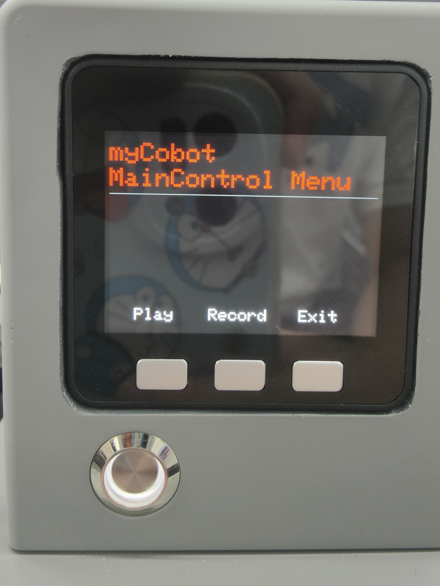
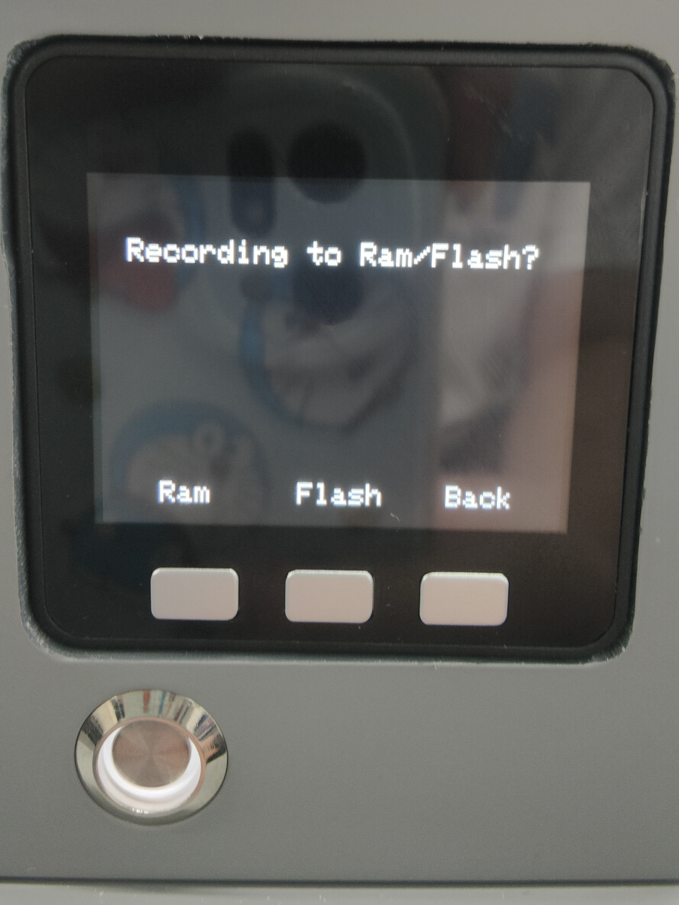
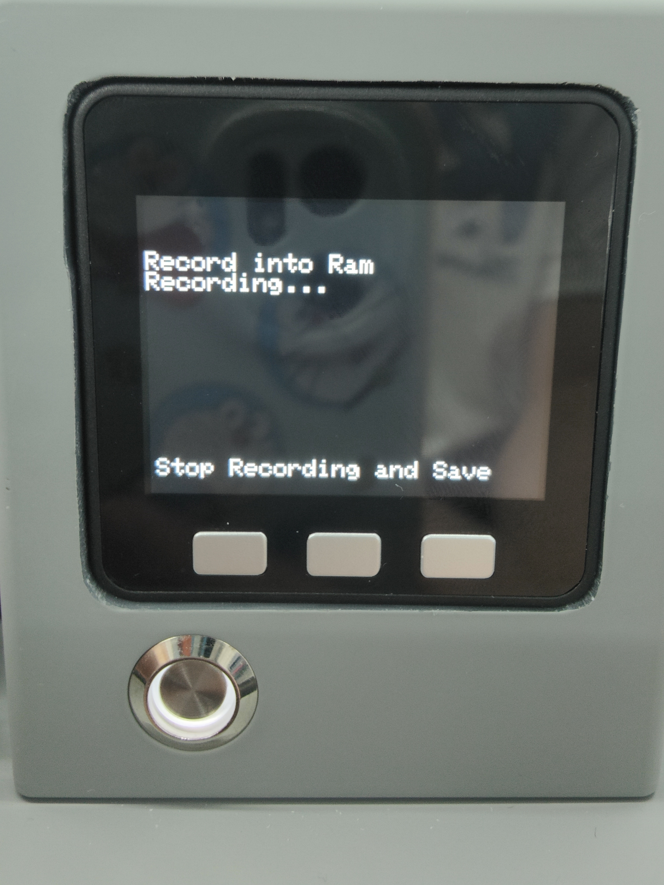
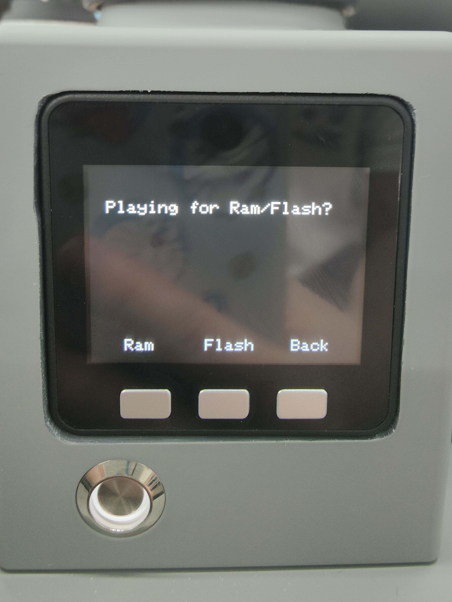
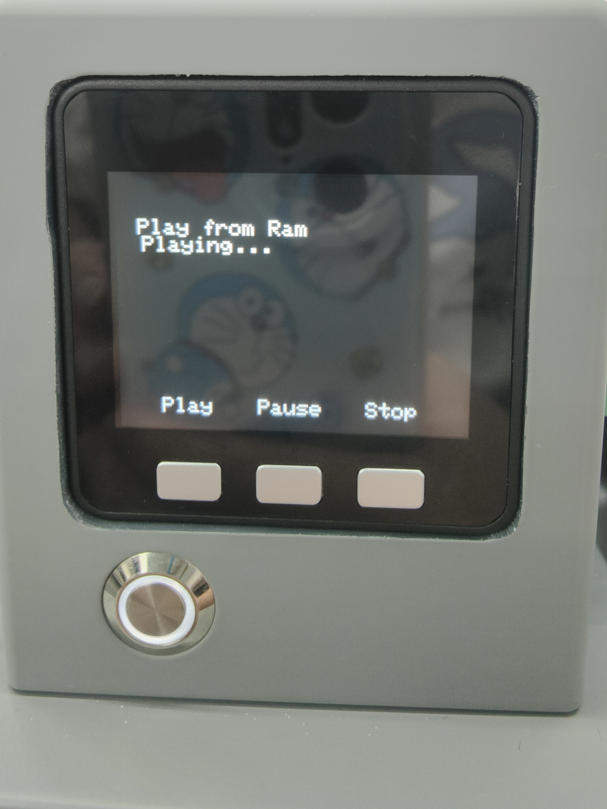

#拖动示教

Step 1:选中Maincontrol点击OK进入拖动示教界面。

Step 2: 按下录制按钮Record。

Step 3: 选择储存路径，按下Ram。

Step 4: 拖动机械臂各关节，移动至您预想的位置，完成一组运动。

Step 5: 按下任意键停止录制，保存记录。

Step 6: 按下播放按钮Play。

Step 7: 按下Ram，机械臂开始播放已保存的记录。

Step 8: 按下Pause可暂停运动，按下Stop可停止运动，按下Play可恢复运动。

