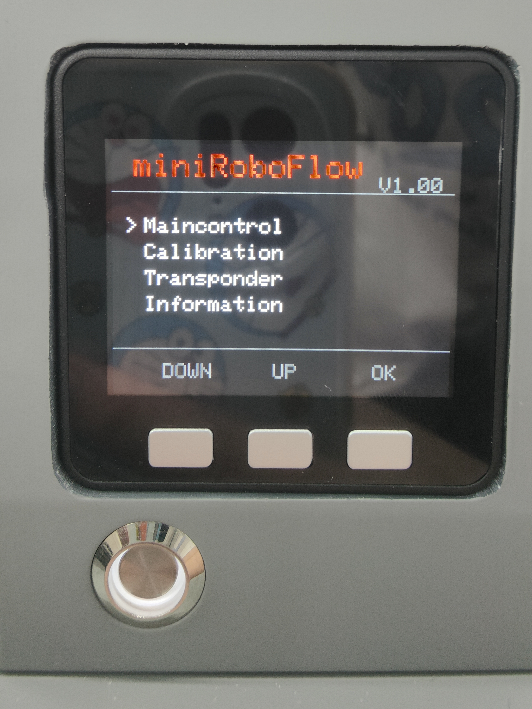
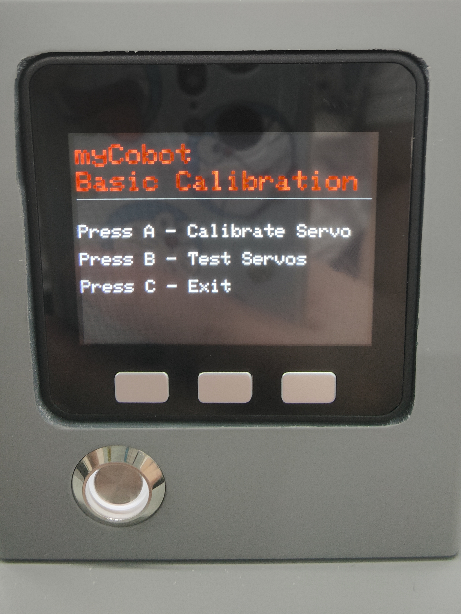
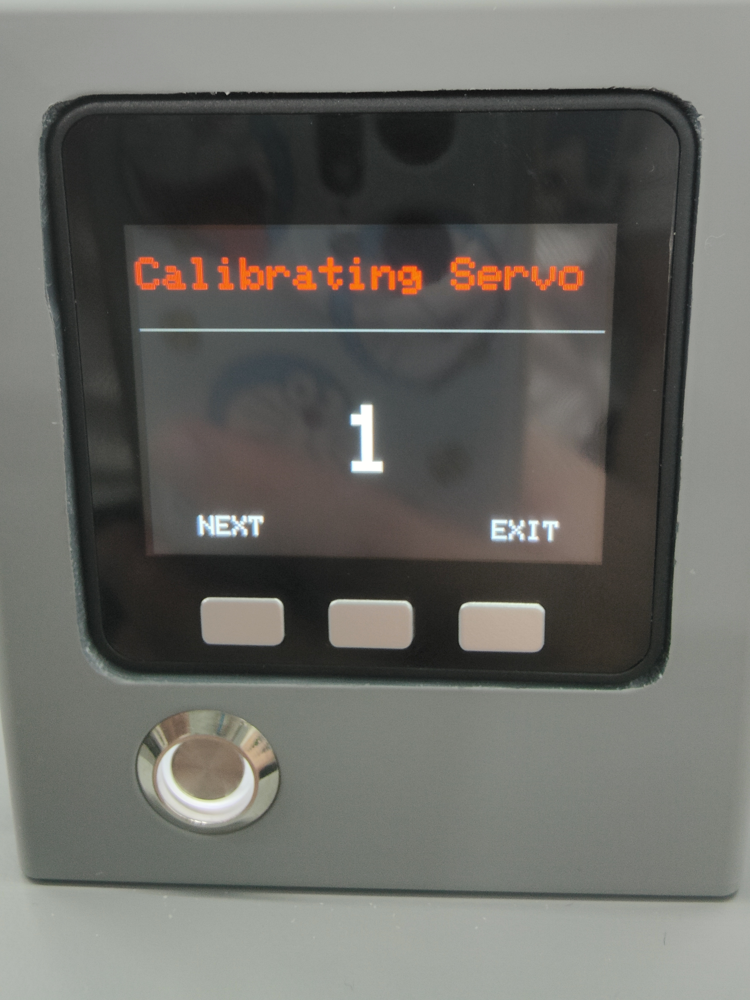
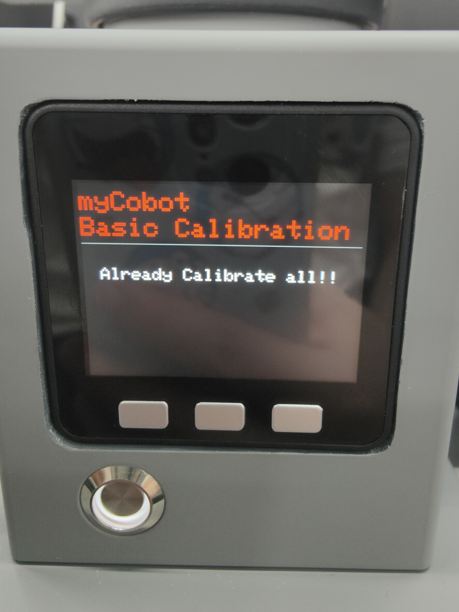

#零位校准

Step 1: 选中Calibration，点击OK进入零位校准界面。

Step 2: 按下A键 ，开始校准机械臂。

Step 3: 首先拖动机械臂使一号关节到达零位状态（零位刻度线对齐）。

Step 4: 按照屏幕提示的关节序号(1-7),拖动机械臂使每个关节到达零位（零位刻度线对齐）。

Step 5: 依次按下NEXT，进入下一个电机校准，直至出现Already Calibrate all!! ，即完成校准。

Step 6: 按下EXIT ,可退出校准。

Step 7: 按下B键，测试机械臂各关节零位,此时机械臂会进行小幅度的运动。

Step 8: 按下C键，退出此功能。

