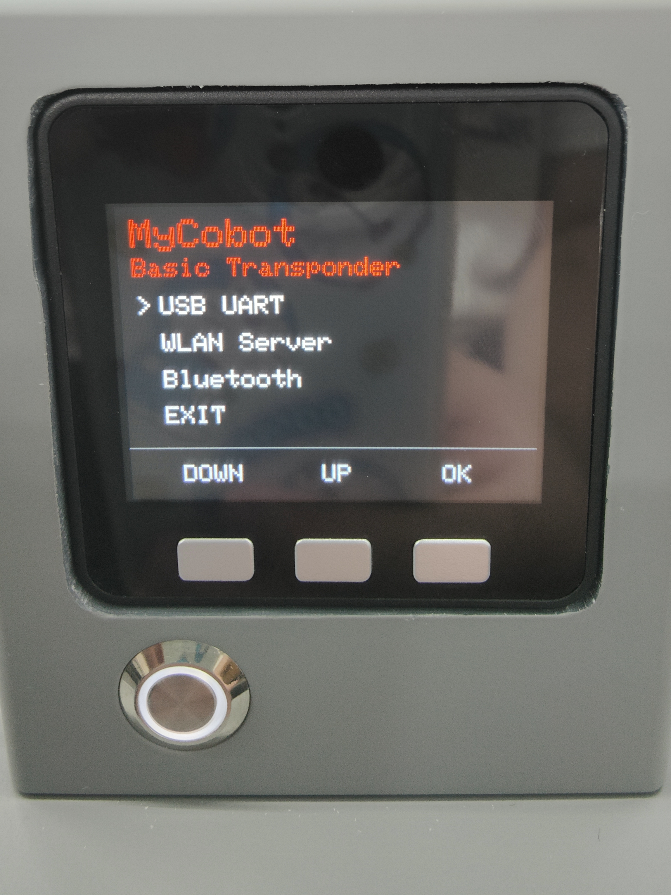
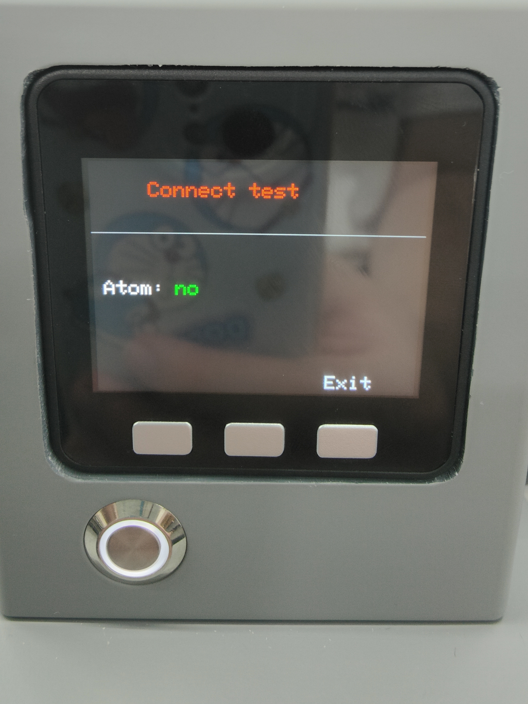
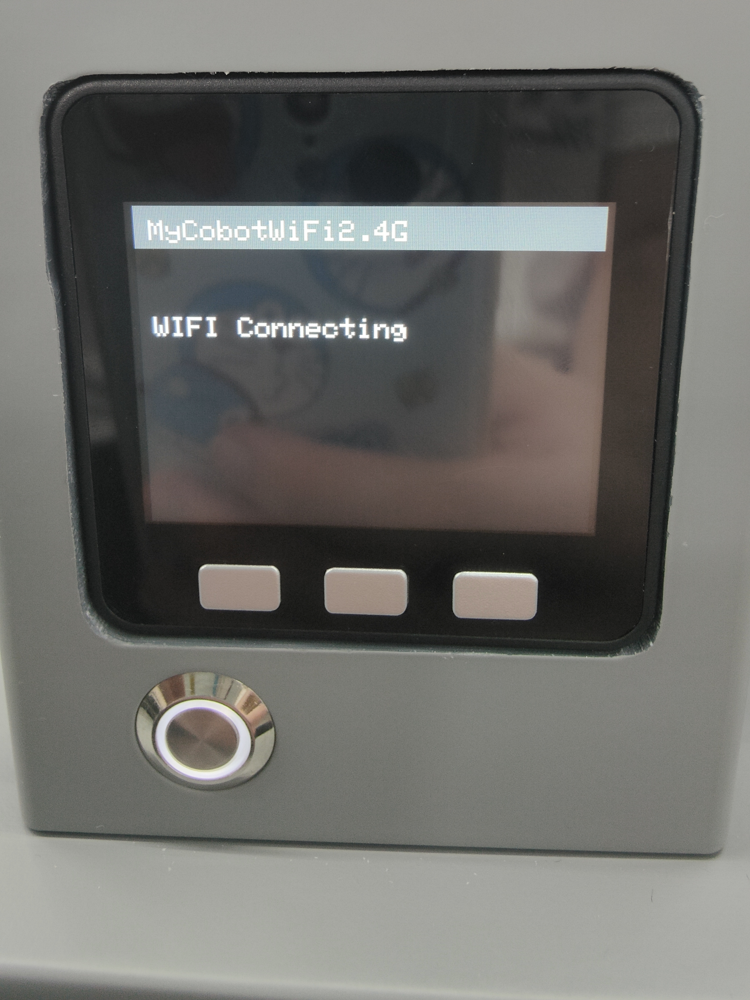

#通信转发

Step 1: 确认Type-C正确连接你的设备，选中Transponder点击OK进入通信转发界面。

Step 2: 使用串口连接，选中USB UART点击OK进入串口界面。串口界面检测Atom的连接(ok表示连接正常，否则显示no)。

Step 3: 使用WiFi连接，需要将WiFi名称设置为：MyCobotWiFi2.4G，密码设置为：mycobot123。选中WiFi点击OK自动搜索WiFi并连接。

Step 4: 点击Exit退出此功能。