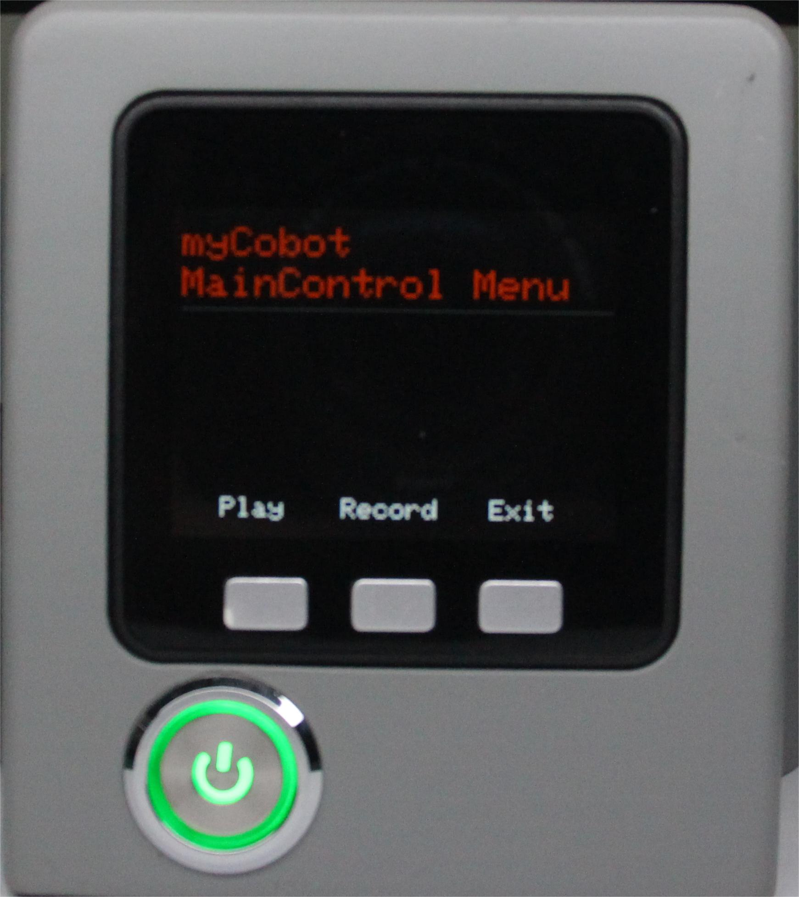
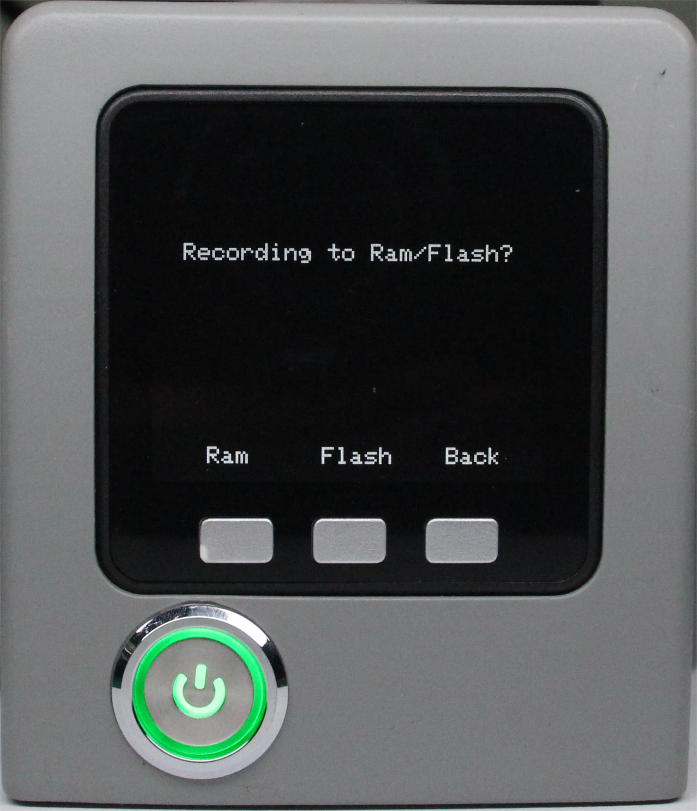
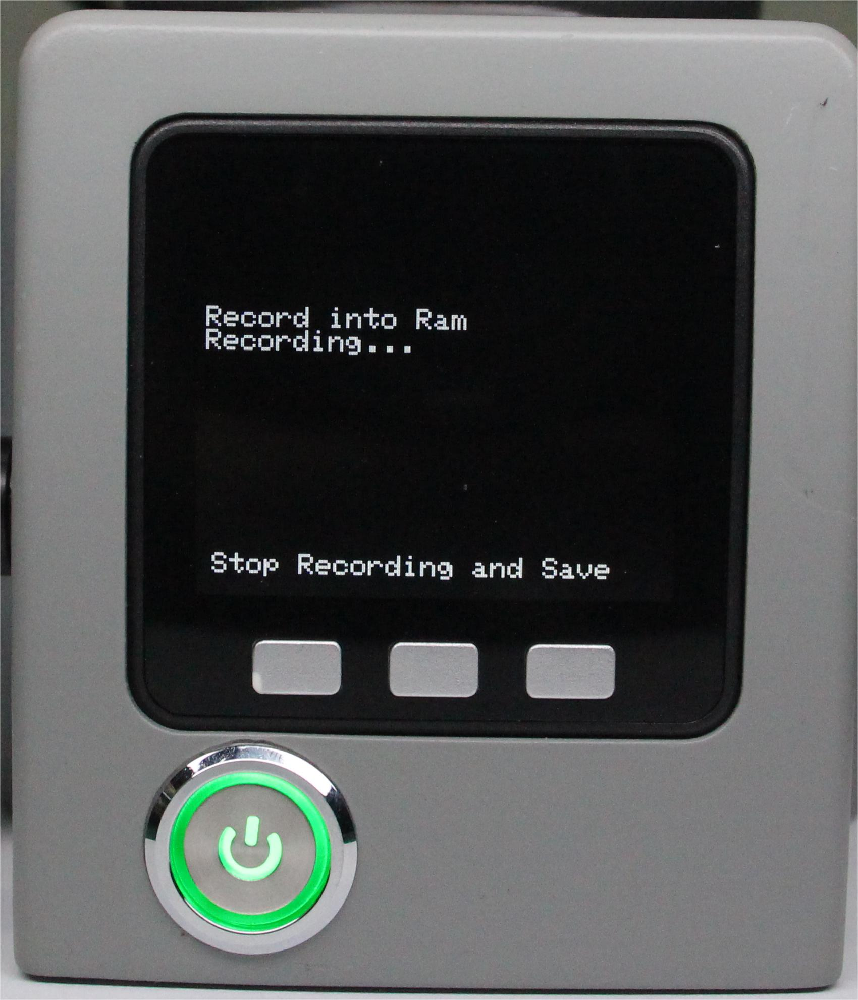
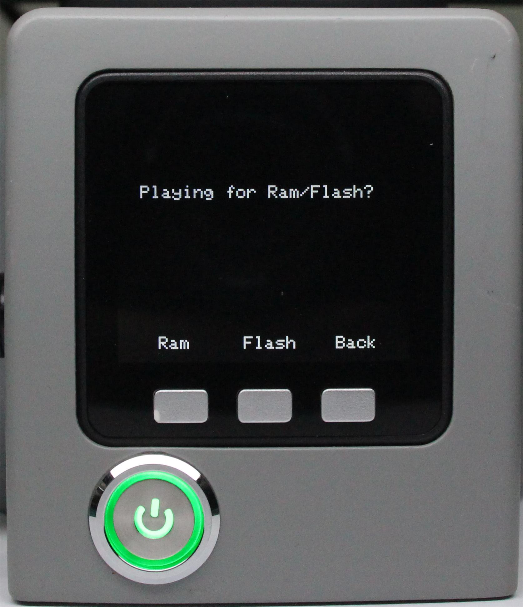
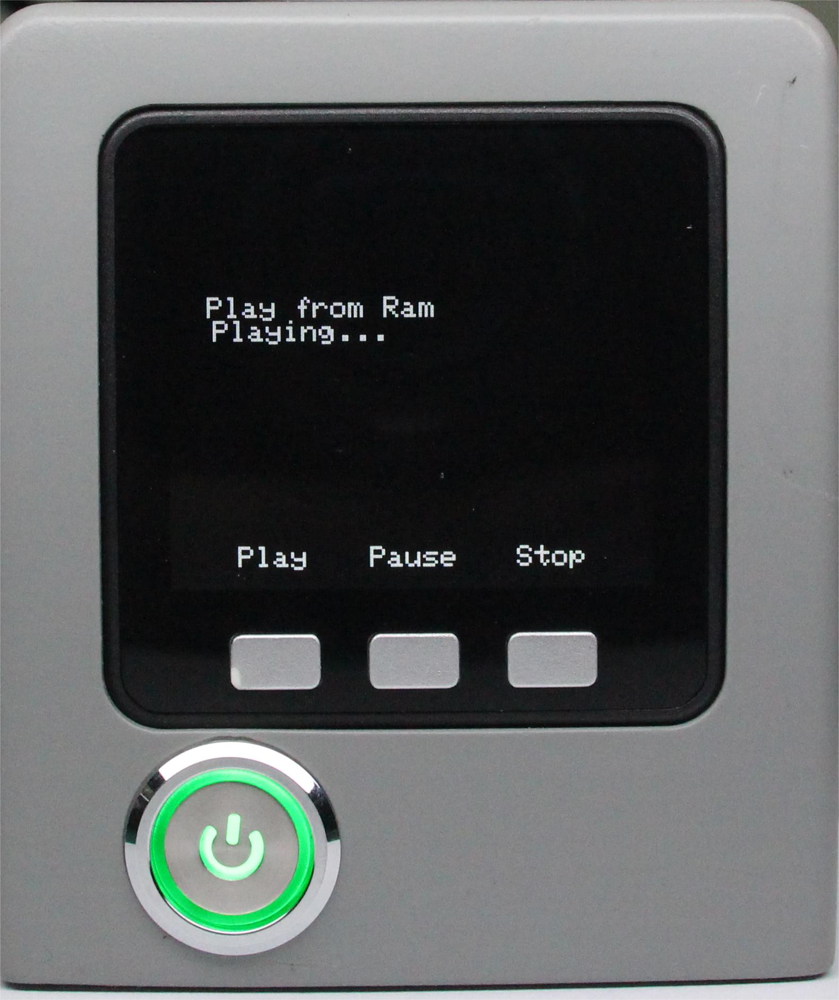

# Drag the teach-in

Robot drag teaching means that the operator can directly drag the joints of the robot to make an ideal posture, and then record accordingly.

Cobot was one of the earliest systems to have this feature. This teaching method avoids the disadvantages of traditional teaching and is a forward-looking technology for robot application.

In this chapter, we'll teach you how to get started with it and experience the fun of cobot dragging.

The approximate steps for them are as follows:
**Step 1**: Select Maincontrol and click OK to enter the drag teaching interface.

**Step 2**: Press the Record button.

**Step 3**: Select the storage path and press Ram.

**Step 4**: Drag the joints of the robotic arm to move to your desired position to complete a set of movements.

**Step 5**: Press any key to stop recording and save the record.

**Step 6**: Press the play button Play.

**Step 7**: Press Ram and the robotic arm will start playing the saved recording.

**Step 8**: Press Pause to pause, Stop to stop, Play to resume.

**Step 9**: Click Exit to exit this feature. 

---

[← Previous page](./5.1.1-MinirobotGuide.md) | [Next page →](./5.1.3-calibrate.md)