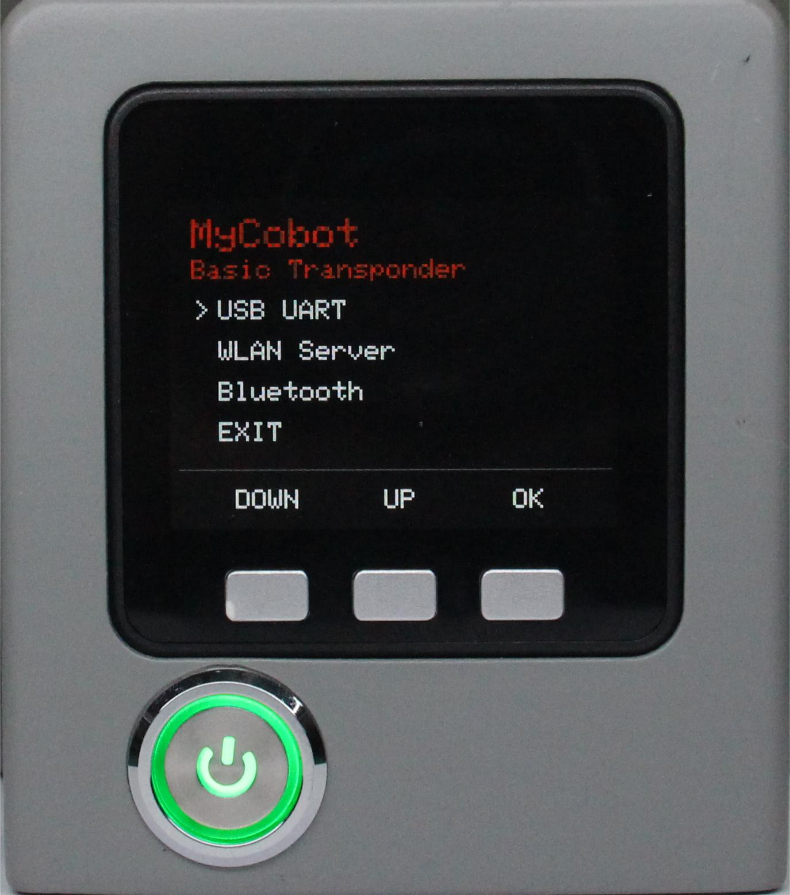
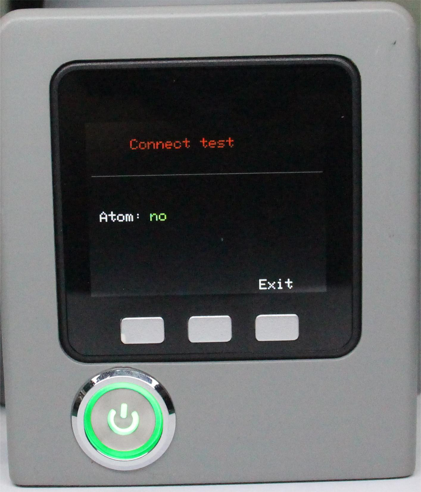
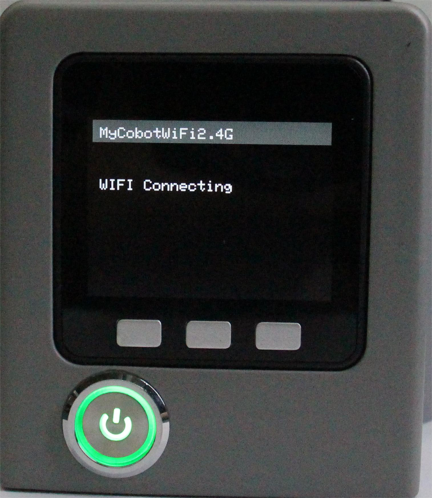

# Communication forwarding

This chapter describes how to use the extended development capabilities of the built-in software. This feature allows you to expand the connectivity options of your devices and supports different development environments and methods.

Currently, there are three connection methods supported for communication forwarding: USB, Wi-Fi, and Bluetooth. They are suitable for different functional development scenarios.

- USB and Wi-Fi are used to connect to other master devices, and the robot can be controlled to execute the corresponding commands through the robot communication protocol.
- Bluetooth is used to connect to mobile control software, which can be controlled quickly by mobile phone.
- **Step 1**: Confirm that Type-C is correctly connected to your device, select Transponder and click OK to enter the communication forwarding interface.
- 

**Step 2**: Use the serial port connection, select the USB UART and click OK to enter the serial port interface. The serial interface detects the connection of the Atom (ok indicates that the connection is normal, otherwise no is displayed).

**Step 3**: To use the WiFi connection, you need to set the WiFi name to: MyCobotWiFi2.4G and the password to: mycobot123. Select WiFi and click OK to automatically search for WiFi and connect.

**Step 4**: Click Exit to exit this feature.

[← Previous](./5.1.3-calibrate.md) | [Next →](./5.1.5-information.md)