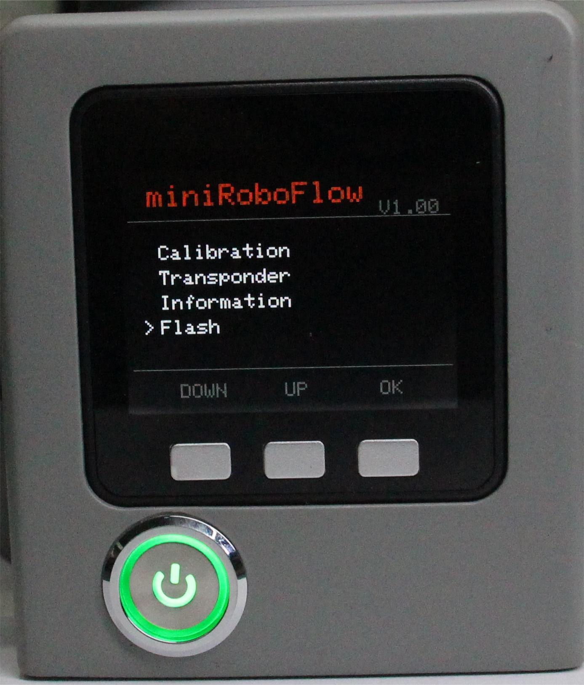
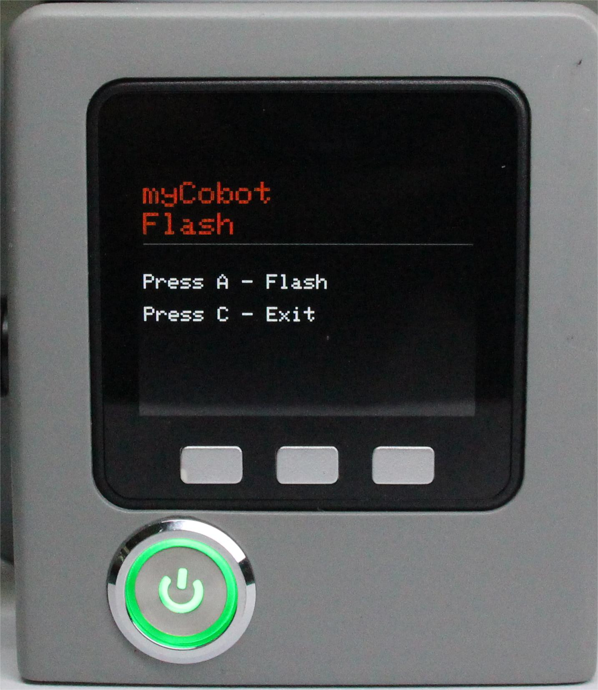

# Burning

This chapter describes how to use the programming function of the built-in software, which is mainly used to update the firmware version.

**Step 1**: Select Flash and click OK to enter the burning interface.

**Step 2**: Press the A button to prepare for burning. The machine will reboot within a period of time, during which the pico firmware will be burned, note that the pico firmware will start when the flash is pressed.

**Step 3**: Press the C key to exit this function.

---

[← Previous page](./5.1.5-information.md) | [Next Section →](../5.3-FirmwareFunctionDescription/README.md)