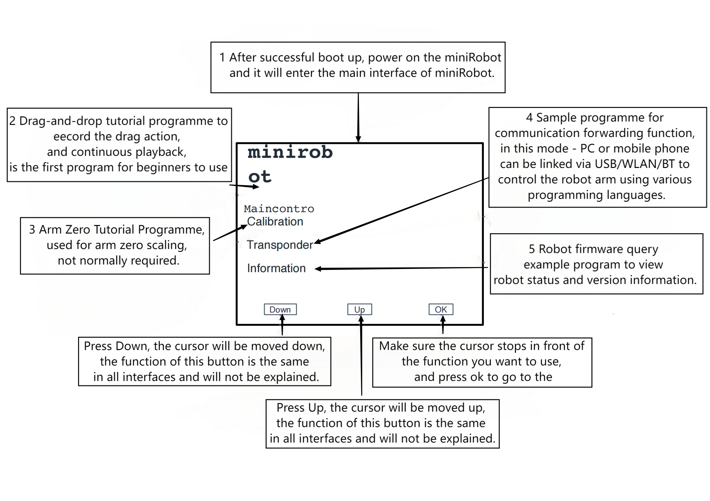

# Factory Firmware Introduction

The MyArm M750 version comes with the miniRoboflow application software developed independently by Elephant Robotics. Functions such as drag-and-drop teaching, communication forwarding, status checking and zero calibration can be achieved through simple push-button interaction.

The user interface of the built-in software is simple and easy to use. The communication forwarding function allows you to control the robot using a variety of programming languages and development environments, making robot control easy.

## miniRoboFlow

**miniRoboFlow** It has six main chapters:

- [**User Guide**](5.1.1-MinirobotGuide.md) 
    - Minirobot is an application for controlling the MyArm robotic arm by combining the 3 buttons on the base of the robotic arm and the on-screen display. (It has functions such as drag and drop demonstration, communication forwarding, zero calibration, status messages, etc.) to facilitate the operator's interaction with and proper use of the Elephant Robot.
- [**Drag-and-drop teaching**](5.1.2-maincontrol.md) 
    - Robot drag-and-drop teaching: the operator can directly drag the robot joints to make the desired posture, and then save the movement in the robot by **button** operation. cobot is an early system with this function. This type of teaching method avoids the disadvantages of traditional teaching and has a broad development prospect.  This teaching method avoids the disadvantages of traditional teaching methods and is a forward-looking technology for robot applications. 
- [**Zero Calibration**](5.1.3-calibrate.md) 
    - Calibrating the robot arm is a prerequisite for precise control of the robot arm, while setting the joint zeros and initialising the motor potentials are basic tasks for subsequent advanced development.
- [**Communication Transponder**](5.1.4-transponder.md) 
    - For microcontroller robotic arms, the timeliness of communication is critical. For this type of robotic arm, we often send control commands to the **M5Stack-basic** at the bottom. Through communication forwarding, the end-effector analyses the commands and then executes the target action. Currently, the **MyArm M750** has three communication methods: **Serial, Bluetooth, and WIFI**. 
- [**Status Information**](5.1.5-information.md) 
    - Link Test is a detection function that utilises the connection status of the motors in the robot arm and the **Atom**. This function allows the user to easily troubleshoot the device. During the link test, the connection status of the robotic arm device can be seen, including the connection of the **Server** and the communication status of the **Atom**. In microcontroller devices, M5Stack-basic displays its current firmware version. 
- [**Burn Function**](5.1.6-flash.md) 
    - Describes how to use the built-in software's burn function, which is mainly used to update the firmware version.

---

[← Previous chapter](../../../3-BasicSettings/4-FirstTimeInstallation/FirstTimeInstallation.md) | [Next chapter →](../../6-SDKDevelopment/README.md)