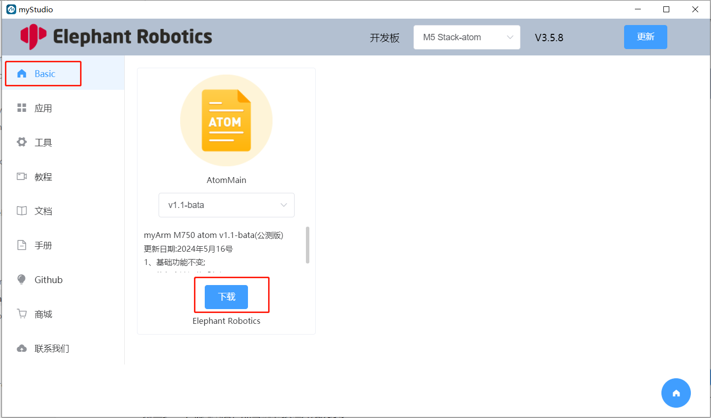
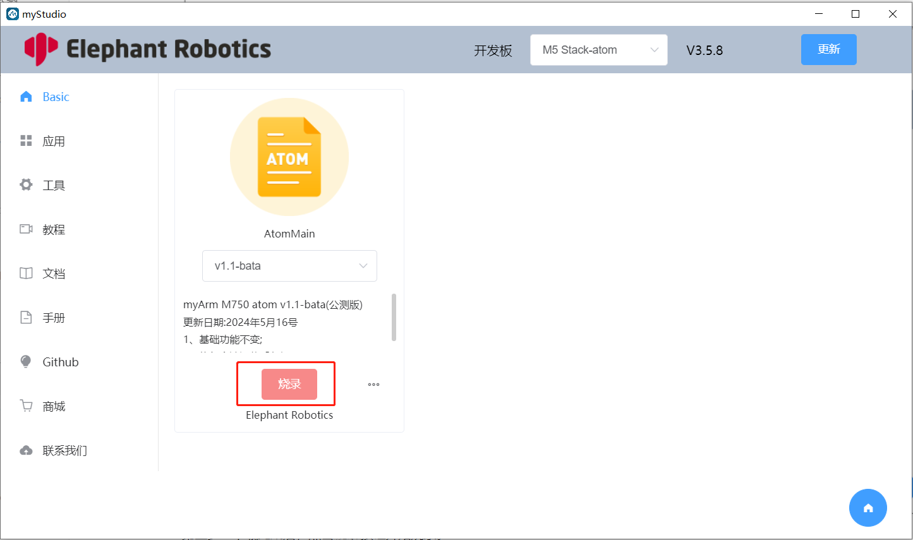
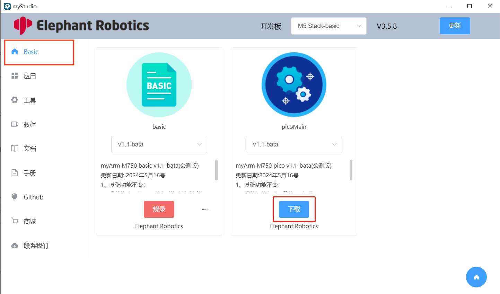

# Burn and update firmware

**[myStudio video tutorial](https://www.bilibili.com/video/BV1Qr4y1N7B5/)**

## Burn Atom firmware

Step 1: Connect to the computer. Connect the terminal Atom with Type-C.

Step 2: Select the robot `myArm M750` and click the `Login` button

Step 2: Select `ATOM` in the `Board` column, and the Atom firmware will appear in the sidebar `Basic`. Atom only has one firmware, just click `Download`.

Step 3: After the download is completed, click the `Flash` button to start burning.

### Burn basic firmware

Step 1: Connect M5Stack-Basic to PC using Type-C.

Step 2: Select the robot `myArm M750` and click the `Login` button.

Step 3: After logging in, click `Basic`, select `basic`, click `Download` and then `Flash` to burn.

### Burn pico firmware

Step 1: Connect M5Stack-Basic to PC.

Step 2: Select Flash mode in the robot base (you can choose to press the "UP" key once or press the "Down" key four times), and then the base will sleep with a black screen for about 30 seconds.

Step 3: Enter the `myStudio` firmware burning page and select `picoMain` firmware burning.

> **Note**: Burning pico firmware requires selecting Flash mode, that is, burning in sleep state. If the sleep time is exceeded, the base monitor will reboot and then burning the pico firmware will fail.

  - Select the robot `myArm M750` and click the `Login` button. 

  - After logging in, click `Basic`, select `picoMain`, click `Download`, and then click `Flash` to burn. 

---

[← Previous page](5.2.2-install_driver.md) | [Next section →](../5.3-FirmwareFunctionDescription/README.md)