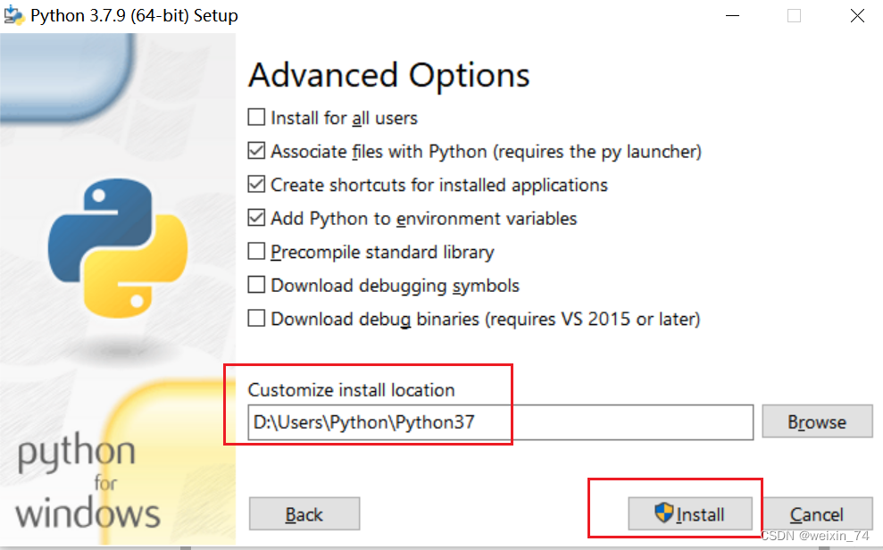
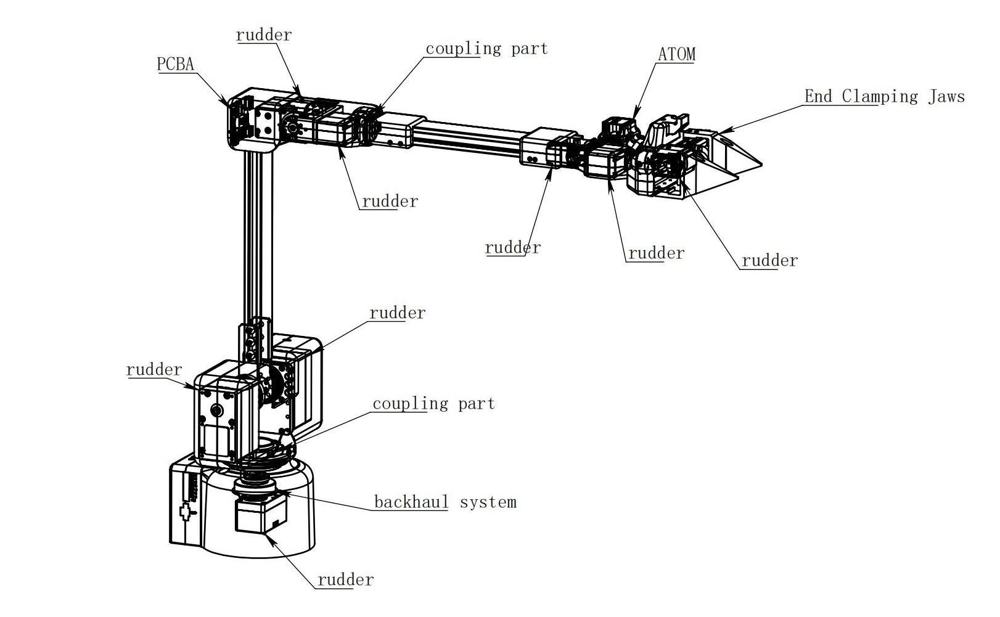
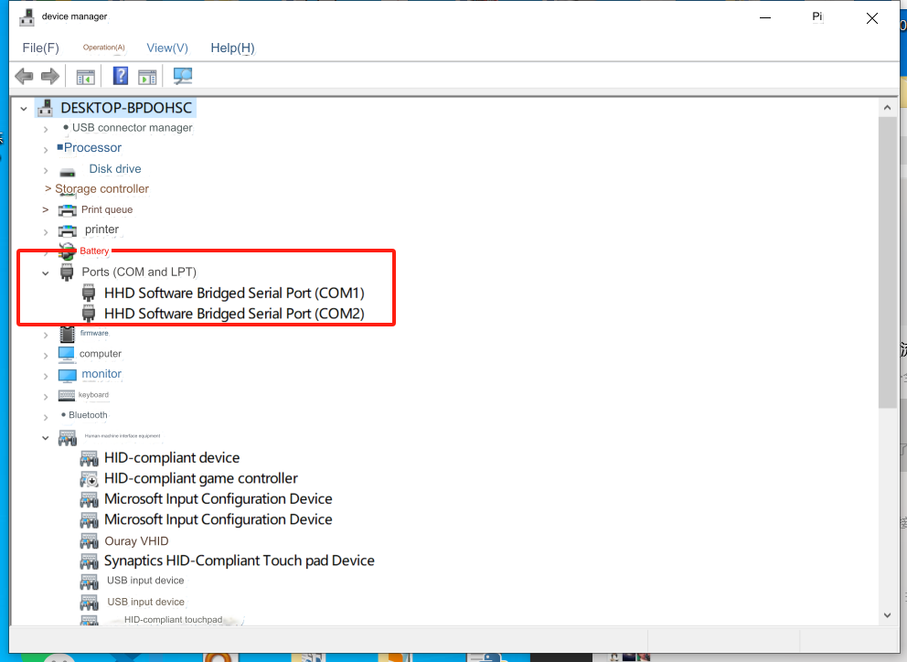

# MyArm MC remote operation case
The effect of this case is that the M750 will follow the C650 to move in the corresponding action
## 1 Environment configuration

### 1.1 Download python
[Download address](https://www.python.org/downloads/windows/)


Select the version you want to install, it is recommended to install version 3.7 or above


After double-clicking the installation package


Keep the default configuration and click Next directly

If you select a custom software installation location, click Install
(It is recommended that the file path for installation is a full English path, because some software installations will not open when encountering Chinese)




After the installation is complete, you can exit the current page, then press the Windows key + r on the keyboard and enter cmd

pymycobot installation
```python
pip install pymycobot --upgrade --user
```


### 1.2 Download the case program
[Download the program address:](https://github.com/elephantrobotics/pymycobot/tree/main)https://github.com/elephantrobotics/pymycobot/tree/main


Download the program to the local


Unzip the file and enter the path where the case program is located

> Note: Firmware v1.1 and above should use the examples in the `myArm_M&C_demo_v1.1` folder


## 2 Case reproduction
After fixing the two robotic arms, first manually adjust the M750 to the posture shown in the figure below, then connect 24V, and then connect the USB data cable to the computer


Make sure that the display screens of both robotic arm bases show OK
C650

M750


Then use the device manager to confirm the serial port numbers corresponding to the two robotic arms. You can confirm the serial port numbers by plugging and unplugging the USB data cable


Then run the myarm_m.py program, fill in the serial port number of the M750, and press the Enter key on the keyboard.


Then adjust the C650 hand to the posture shown in the figure below.


Finally, run the myarm_c.py program, fill in the serial port number of the C650, and press the Enter key on the keyboard.


---
[← Previous Chapter](./7-SuccessfulCases.md) | [Next Chapter →](../../5-SupportAndService/5-SupportAndService.md)