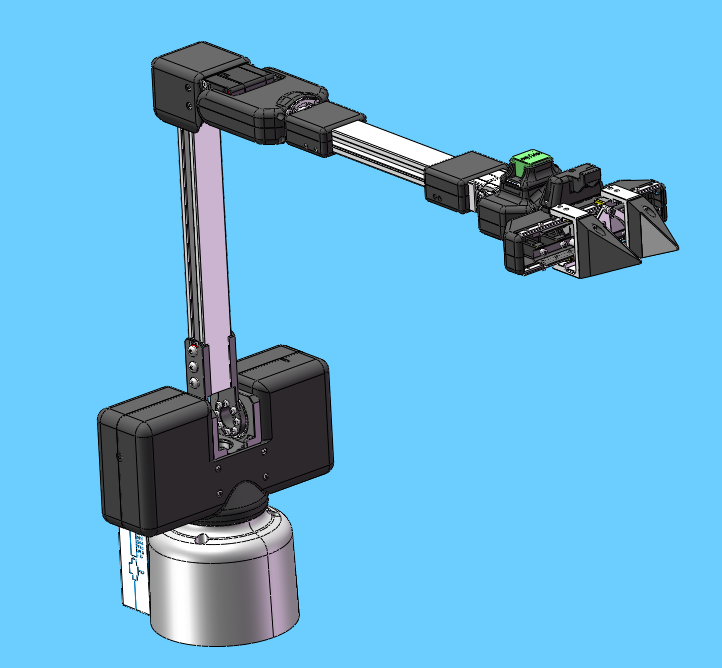
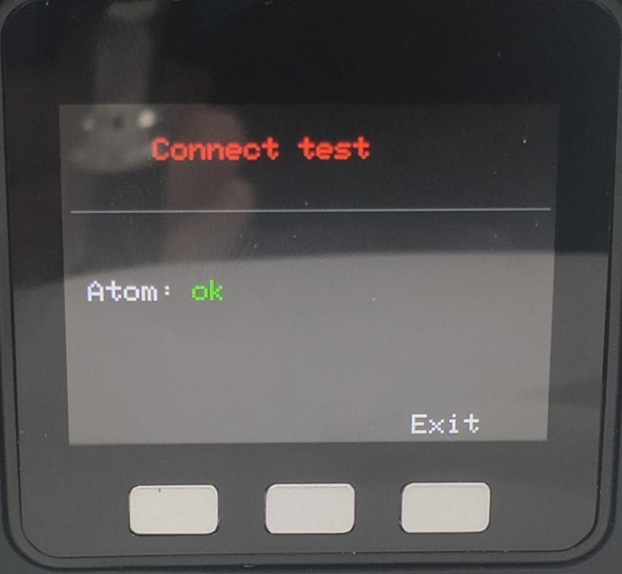
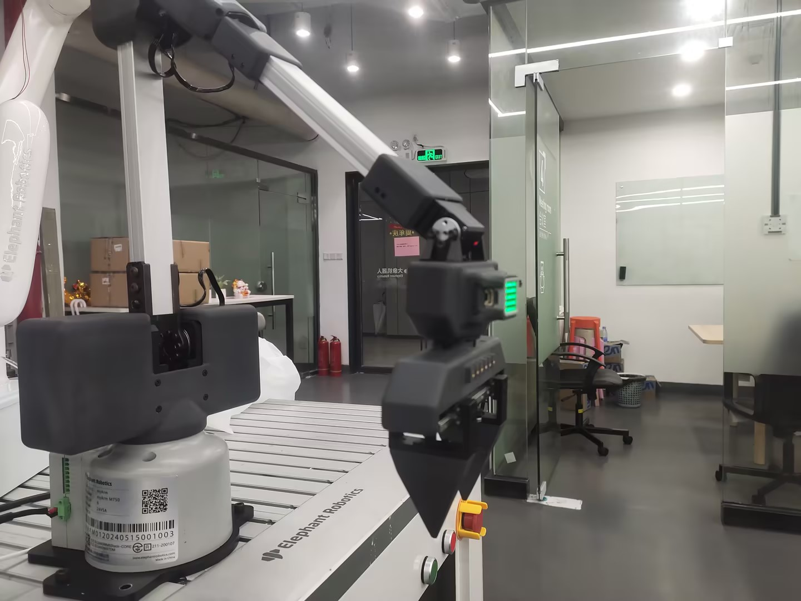
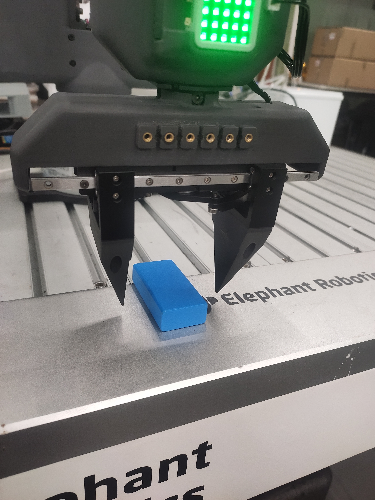
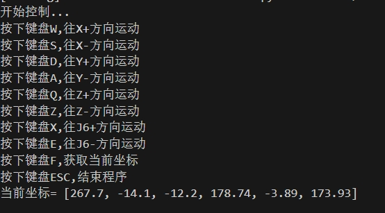

# Robot palletizing and handling case

**Function description**: The robot moves the wood block from point A to point B

## 1 Firmware burning
Since the robot needs to use Cartesian motion, it is necessary to burn the pico firmware and basic firmware that support Cartesian motion. However, the firmware that supports Cartesian motion has not been released on mystudio and can only be obtained by contacting after-sales personnel.

## 2 pymycobot installation
If you want to use Cartesian motion, you need to install or update pynycobot. Open the computer terminal and execute the following command to install or update pymycobot
```bash
pip install pymycobot --upgrade
```

## 3 Preparation
Before connecting the robot arm to 24V, manually adjust the robot arm to the posture shown in the figure below, and then connect the 24V power supply and communication data cable in turn. There should be no debris around the robot arm to avoid collision



Make sure the base screen displays ok



## 4 Keyboard control
After running the following program, the robot arm will first move to an initial position, and then print the key prompt information in the terminal. Press the corresponding key according to the terminal information to control the robot movement



```python
import threading
from pymycobot import MyArmMControl, utils
import keyboard
import time
m = MyArmMControl(utils.get_port_list()[0],1000000)
def init():
    # 设置初始角度
    m.write_angles([-10.19, 8.62, 30.65, 2.19, 50.53, -4.83], 100)
    time.sleep(1)
    m.set_gripper_state(0,100)
    time.sleep(1)

# 用于键盘输入检测的函数
def keyborad_ctrl():
    print("Start control...")
    print("Press the W keyboard to move in the X+ direction")
    print("Press the S keyboard to move in the X- direction")
    print("Press the D keyboard to move in the Y+ direction")
    print("Press the A keyboard to move in the Y- direction")
    print("Press the Q keyboard to move in the Z+ direction")
    print("Press the Z keyboard to move in the Z- direction")
    print("Press the X keyboard to move in the J6+ direction")
    print("Press the E keyboard to move in the J6- direction")
    print("Press the F keyboard to get the current coordinates")
    print("Press the ESC keyboard to end the program")
    blocked_keys = ['w', 'a', 's', 'd', 'q', 'z','f','e','x']
    for key in blocked_keys:
        keyboard.block_key(key)   
    key_processed = {
        'w': False,
        'a': False,
        's': False,
        'd': False,
        'q': False,
        'z': False,
        'f':False,
        'e': False,
        'x':False,
    }
    else_executed = False  
    try:
        while True:
            if keyboard.is_pressed('esc'):
                print("Exit control...")
                break           
            for key in blocked_keys:
                if keyboard.is_pressed(key) and not key_processed[key]:
                    threading.Thread(target=handle_key, args=(key,)).start()
                    key_processed[key] = True
                    else_executed = False            
            if all(not keyboard.is_pressed(key) for key in blocked_keys) and not else_executed:
                m.stop()
                else_executed = True      
            for key in key_processed:
                if not keyboard.is_pressed(key):
                    key_processed[key] = False
            time.sleep(0.01)      
    finally:
        keyboard.unhook_all()

def handle_key(key):
    if key == 'w':
        m.jog_coord(1, 1, 60)
    elif key == 'a':
        m.jog_coord(2, 0, 60)
    elif key == 'd':
        m.jog_coord(2, 1, 60)
    elif key == 's':
        m.jog_coord(1, 0, 60)
    elif key == 'q':
        m.jog_coord(3, 1, 60)
    elif key == 'z':
        m.jog_coord(3, 0, 60)
    elif key == 'e':
        m.jog_angle(6,0,50)   
    elif key == 'x':
        m.jog_angle(6,1,50)
    elif key == 'f':
        print("Current coordinates=",m.get_coords())

if __name__ == "__main__": 
    init()
    keyborad_ctrl()
```
When the robot reaches the target point, record the current coordinates and close the program





## 5 Case reproduction

```python
from pymycobot import MyArmMControl, utils
import time
init_angles=[-10.19, 8.62, 30.65, 2.19, 50.53, -4.83]#6 joint angles at the initial position
target_point=[277.7, -14.6, -7.5, 178.74, -2.04, 174.17]#Coordinate position of the gripping target
m = MyArmMControl(utils.get_port_list()[0],1000000)
if __name__=="__main__":
    m.set_gripper_state(0,100)#Open the gripper first
    time.sleep(1)
    m.write_angles(init_angles,100)#Move to the initial position
    time.sleep(2)
    m.write_coords([target_point[0],target_point[1],target_point[2]+50,target_point[3],target_point[4],target_point[5]],100,1)#Move to 50mm above the gripping point
    time.sleep(2)
    m.write_coords([target_point[0],target_point[1],target_point[2],target_point[3],target_point[4],target_point[5]],100,1)#Move to the gripping point
    time.sleep(2)
    m.set_gripper_state(1,100)#Gripper closed
    time.sleep(1)
    m.write_coords([target_point[0],target_point[1],target_point[2]+50,target_point[3],target_point[4],target_point[5]],100,1)#Move to 50mm above the gripping point
    time.sleep(2)
    
    m.write_coords([target_point[0],target_point[1]+100,target_point[2]+50,target_point[3],target_point[4],target_point[5]],100,1)#Move to 50mm above the placement point
    time.sleep(2)
    m.write_coords([target_point[0],target_point[1]+100,target_point[2],target_point[3],target_point[4],target_point[5]],100,1)#Move to the placement point
    time.sleep(2)
    m.set_gripper_state(0,100)#Gripper open
    time.sleep(1)
    m.write_coords([target_point[0],target_point[1]+100,target_point[2]+50,target_point[3],target_point[4],target_point[5]],100,1)#Move to 50mm above the placement point
    time.sleep(2)
```

## 6 Effect display


