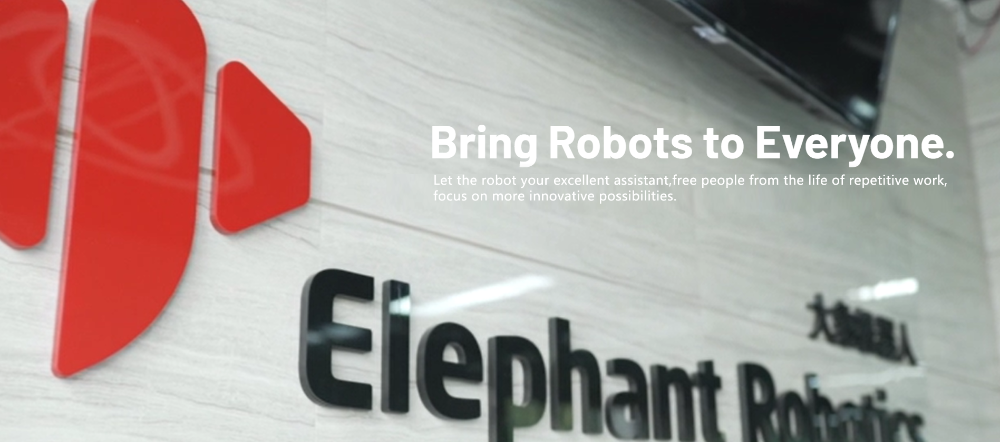

# Elephant Robotics

 

## 1. Company Introduction

Elephant Robotics, based in Shenzhen, China, is a high-tech enterprise specializing in robot research and development and automation solutions.

We are committed to providing highly flexible collaborative robots, easy-to-learn operating systems, and intelligent automation solutions for robot education and research institutions, commercial scenarios, and industrial production. Its product quality and intelligent solutions have been widely recognized and praised by factories of many Fortune 500 companies from South Korea, Japan, the United States, Germany, Italy, Greece, and other countries.

With the vision of "Enjoy Robots World," Elephant Robotics advocates for the collaboration between humans and robots, making robots a good helper for human work and life, helping people break free from simple, repetitive, and tedious work, fully leveraging the advantages of human-robot collaboration to improve work efficiency, and helping humans create a better new life.

In the future, Elephant Robotics hopes to promote the development of the robotics industry through cutting-edge technology and work together with customer partners to open a new era of automation and intelligence.

---

 

## 2. Development History

  - 2016.08 ----- Elephant Robotics Co., Ltd. officially established
  - 2016.08 ----- Entered HAX incubator and received SOSV seed round investment
  - 2016.08 ----- Started developing Elephant S industrial collaborative robots
  - 2017.01 ----- Awarded "CES China's Top 10 Most Innovative Enterprises"
  - 2017.04 ----- Attended Hannover Messe and Korea Automation Exhibition
  - 2017.07 ----- Two founders selected as "30 Under 30 Business Elites in Asia" by Forbes
  - 2017.10 ----- The fifth-generation single-arm industrial collaborative robot Elephant S was launched
  - 2018.04 ----- Received investment from "Angel Round of Cloud Angel Fund"
  - 2018.06 ----- Made its debut at Hannover Messe 2018 for the first time
  - 2018.06 ----- Won the "Smart Manufacturing Entrepreneur MBA Award" from Cheung Kong Graduate School of Business
  - 2018.06 ----- Won the "X-elerator Award" from Tsinghua SEM "Entrepreneurship Accelerator"
  - 2018.11 ----- Won the second prize in the Shenzhen Division of the Asia Intelligent Hardware Competition
  - 2018.11 ----- Won the "Most Investable Enterprise Award" of Gao Gong Jin Qiu
  - 2019.03 ----- Won the "Leadership Award" of Gao Gong Jin Qiu
  - 2019.04 ----- Catbot won the "Industrial Robot Innovation Award" in March 2019
  - 2019.09 ----- Attended Huawei Europe Eco-Connect (HCE) and officially became a member of the Huawei ecosystem
  - 2019.11 ----- Elephant Robotics and Harbin Institute of Technology attended the IROS International Conference on Intelligent Robots and Systems
  - 2019.12 ----- Elephant Robotics-South China University of Technology "Intelligent Robot Joint Development Laboratory" officially unveiled
  - 2019.12 ----- Won the "Innovative Technology Award" of Gao Gong 2019
  - 2019.12 ----- Won the "Top Ten Fast-Growing Enterprises" of Gao Gong 2019
  - 2019.12 ----- Won the "New Enterprise Award" in the Shenzhen Equipment Industry-Industrial Robot Sub-Sector
  - 2019.12 ----- The world's first bionic robot cat MarsCat was born
  - 2020.05 ----- Founder won the "Shenzhen Robot Rising Star Award" for 2019
  - 2020.10 ----- The world's lightest and smallest six-axis collaborative robot myCobot was born
  - 2021.03 ----- The smallest collaborative robot myCobotPro 320 for scientific research was born
  - 2021.05 ----- The MarsCat bionic cat received extensive coverage from Xinhua Finance, China Daily, Nanjing Daily, and Harbin Daily
  - 2021.07 ----- Released the smallest composite robot chassis - Little Elephant Mobile Robot myAGV
  - 2021.09 ----- The world's first fully enclosed four-axis mechanical arm - Little Elephant Palletizing Robot myPalletizer was born

## 3. Related Links  
### Purchase Links
  - Taobao: https://shop504055678.taobao.com
  - Shopify: https://shop.elephantrobotics.com/
  - AliExpress: https://elephantrobotics.aliexpress.com/store/1101941423
### Other Information
- Official Website: https://www.elephantrobotics.com
- Videos
  - Bilibili: https://space.bilibili.com/2126215657
  - Youtube: https://www.youtube.com/c/Elephantrobotics
- Facebook: https://www.facebook.com/mycobotcreator/
- Linkedin: https://www.linkedin.com/company/18319865
- Twitter: https://twitter.com/CobotMy
- Discord: https://discord.gg/2MAherp7nt
- Hackster: https://www.hackster.io/elephant-robotics

## 4. Contact Us
---

> Our working hours are Chinese working days, from 10:00 a.m. to 6:00 p.m. Beijing time.

  - If you have any other questions, please contact us via the following methods.  
[E-mail](support@elephantrobotics.com) :

<pre>
<code class="copyable">
support@elephantrobotics.com
</code>
</pre>
  - If you have purchase intentions or any parameter questions, please send an email to this email address.  
[E-mail](sales@elephantrobotics.com) :

<pre>
<code class="copyable">
sales@elephantrobotics.com
</code>
</pre>

  - If the listed questions cannot help you solve the problem, and you have more after-sales questions, please send an email to this email address.  
[E-mail](support@elephantrobotics.com) :

<pre>
<code class="copyable">
support@elephantrobotics.com
</code>
</pre>

We will reply within 1-2 working days;

**WeChat**:  
We only provide one-on-one service for users who purchase myArm M&C series products through WeChat.

 

---

[← Previous Chapter](../4-FunctionsAndApplications/7-SuccessfulCases/7-SuccessfulCases.md) | [Next Chapter →](../6-Acknowledgments/6-Acknowledgments.md)